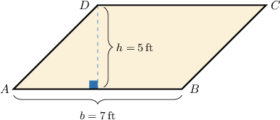
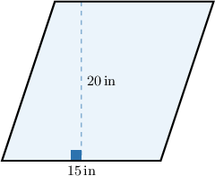
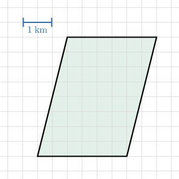
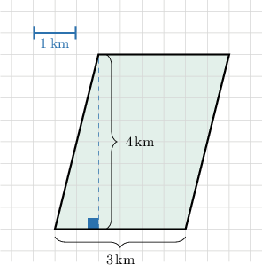
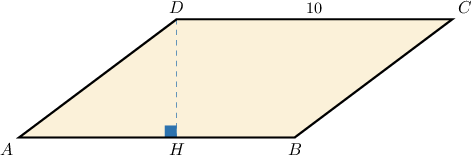
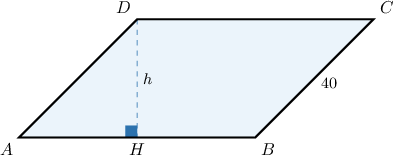
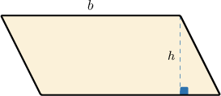
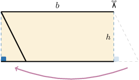

# Areas of Parallelograms

Source: https://www.mathacademy.com/topics/1399?courseId=120
Topic ID: 1399

## Prerequisites

- [Areas of Rectangles and Squares](../grade-7/1352-areas-of-rectangles-and-squares.md)

## Lesson

### Introduction

The **area of a parallelogram** is given by the formula

$$

\mathcal{A} = b \cdot h,

$$

where $b$ is the **base** and $h$ is the **height** of the parallelogram. The height of a parallelogram is the length of a perpendicular segment drawn from the base to the opposite side.

To demonstrate, let's use the above formula to compute the area of the parallelogram $ABCD$ shown below.

From the picture above, we have

$$

\begin{aligned}A & =𝑏⋅ℎ \\ & =7⋅5 \\ & =35\,ft^{2}.\end{aligned}

$$

### Example: Calculating the Area of a Parallelogram

#### Question

The length of a side of a parallelogram is $15\,\textrm{in}$ and the shortest distance from this side to the opposite side is $20\,\textrm{in}.$ What is the area of this parallelogram?

#### Explanation

From the given information, we have that

- the base of our parallelogram is $b=15\,\textrm{in},$ and

- the corresponding height is $h=20\,\textrm{in}.$

Therefore, the area of the parallelogram is

$$

\begin{aligned}A & =𝑏⋅ℎ \\ & =15⋅20 \\ & =300\,in^{2}.\end{aligned}

$$

### Example: Calculating the Area of a Parallelogram Using a Key

#### Question

What is the area of the field shown below?

#### Explanation

Note that the length of a side of a cell is

$$

\dfrac{1}{2} \cdot 1\,\textrm{km}=0.5\,\textrm{km}.

$$

Let the bottom side be our base. It is $6$ cells long, which means that

$$

b = 6 \cdot 0.5 = 3\,\textrm{km}.

$$

Next, we notice that there are $8$ cells from the chosen base to the opposite side, which means that the height is

$$

h= 8 \cdot 0.5 = 4\,\textrm{km}.

$$

Therefore, the area of the parallelogram is

$$

\begin{aligned}A & =𝑏⋅ℎ=3⋅4=12\,km^{2}.\end{aligned}

$$

### Example: Determining the Height of a Parallelogram Given Its Area and Its Base or Height

#### Question

Find the height $DH$ of the parallelogram $ABCD$ given that its area is $75$ square units.

#### Explanation

In the parallelogram $ABCD,$ we are told that the base is

$$

b = AB = CD=10,

$$

the corresponding height is

$$

h = DH,

$$

and the area is

$$

\mathcal{A} = 75.

$$

So, we can calculate the measure of $\overline{DH}$ using the formula for the area of a parallelogram, as follows:

$$

\begin{aligned}A & =𝑏⋅ℎ \\ A & =𝐴𝐵⋅𝐷𝐻 \\ 75 & =10⋅𝐷𝐻 \\ 𝐷𝐻 & =\frac{75}{10} \\ 𝐷𝐻 & =7.5.\end{aligned}

$$

### Example: Connecting the Area of a Parallelogram to Other Attributes

#### Question

Find the height $h$ of the parallelogram $ABCD$ given that its perimeter is $176$ units and its area is $\mathcal{A} = 1\,536$ square units.

#### Explanation

From the figure, we have ${BC} = 40.$ Let's also denote $AB=x.$

Since the perimeter $p$ of the parallelogram $ABCD$ is $p = 176,$ we obtain

$$

\begin{aligned}𝑝 & =𝐴𝐵+𝐵𝐶+𝐶𝐷+𝐷𝐴 \\ 𝑝 & =2𝐴𝐵+2𝐵𝐶 \\ 176 & =2𝑥+2(40) \\ 176 & =2𝑥+80 \\ 2𝑥 & =96 \\ 𝑥 & =48.\end{aligned}

$$

So, we have ${AB} = 48.$

The area of a parallelogram is given by $\mathcal{A} = b \cdot h,$ where $b$ is the base and $h$ is the height. We'll choose $AB$ as the base, so

$$

b = AB = 48.

$$

We also know that the area is $\mathcal{A} = 1\,536.$ Therefore,

$$

\begin{aligned}1\,536 & =48⋅ℎ \\ ℎ & =\frac{1\,536}{48} \\ ℎ & =32.\end{aligned}

$$

### Deriving the Area Formula

We'll now derive the formula for the area of a parallelogram. Consider a parallelogram with base $b$ and height $h,$ as shown above.

Let's now cut the small triangle along the height on the right-hand side and place it on the other side of the original figure.

We now have a rectangle with a base of length $b$ and a height of $h.$ The area of this rectangle equals the area of our parallelogram:

$$

\textrm{Area of Parallelogram} = \textrm{Area of Rectangle} = \textrm{base} \times \textrm{height} = b \times h

$$
