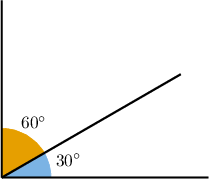
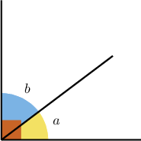
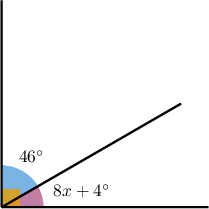
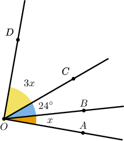
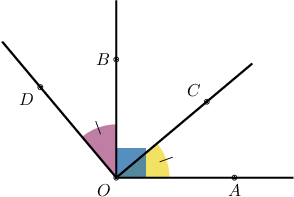

# Complementary Angles

Source: https://www.mathacademy.com/topics/1639?courseId=120
Topic ID: 1639

## Prerequisites

- [Distributing the Negative Sign in a Linear Expression](../grade-7/137-distributing-the-negative-sign-in-a-linear-expression.md)
- [Solving Problems With Angles](../grade-7/1437-solving-problems-with-angles.md)

## Lesson

### Introduction

**Complementary angles** are two angles whose measures have a sum of $90^\circ,$ a right angle.

For example, the angles in the diagram above are complementary because the sum of their measures is $90^\circ\mathbin{:}$

$$

60^\circ +30^\circ = 90^\circ

$$

### Example: Finding an Unknown Complementary Angle

#### Question

The angles $\angle a$ and $\angle b$ are complementary angles. If $m \angle a = 37^\circ,$ what is the measure of $\angle b?$

#### Explanation

Since $\angle a$ and $\angle b$ are complementary, the sum of their measures is equal to $90^\circ.$ So, we have:

$$

\begin{aligned}𝑚∠𝑎+𝑚∠𝑏 & =90^{∘} \\ 37^{∘}+𝑚∠𝑏 & =90^{∘} \\ 𝑚∠𝑏 & =90^{∘}−37^{∘} \\ 𝑚∠𝑏 & =53^{∘}\end{aligned}

$$

### Working With Diagrams

Now, consider the following diagram.

Let's solve for $x$ given the figure above.

From the diagram, we have two complementary angles, so

$$

46^\circ + (8x + 4^\circ) = 90^\circ.

$$

Hence, we can solve for $x$ as follows:

$$

\begin{aligned}46^{∘}+(8𝑥+4^{∘}) & =90^{∘} \\ 8𝑥+50^{∘} & =90^{∘} \\ 8𝑥 & =40^{∘} \\ 𝑥 & =5^{∘}\end{aligned}

$$

### Example: Finding an Unknown Quantity Using Complementary Angles

#### Question

Solve for $x$ in the figure above given that $\angle AOC$ is complementary to $\angle COD.$

#### Explanation

From the diagram, we have

$$

m\angle AOC=x + 24^{\circ}

$$

and

$$

m\angle COD=3x.

$$

Since $\angle AOC$ is complementary to $\angle COD,$ we have:

$$

\begin{aligned}(𝑥+24^{∘})+3𝑥 & =90^{∘} \\ 4𝑥+24^{∘} & =90^{∘} \\ 4𝑥 & =66^{∘} \\ 𝑥 & =16.5^{∘}\end{aligned}

$$

### Example: Solving Multi-Step Problems Involving Complementary Angles

#### Question

In the figure below, $\angle AOC$ and $\angle COB$ are complementary angles. If $\angle AOC \cong \angle BOD$ and $m \angle COB = 50^\circ,$ find $m \angle AOD.$

#### Explanation

Since $\angle AOC$ and $\angle COB$ are complementary angles, we have:

$$

\begin{aligned}𝑚∠𝐴𝑂𝐶+𝑚∠𝐶𝑂𝐵 & =90^{∘} \\ 𝑚∠𝐴𝑂𝐶+50^{∘} & =90^{∘} \\ 𝑚∠𝐴𝑂𝐶 & =40^{∘}\end{aligned}

$$

Now, since $\angle AOC \cong \angle BOD,$ we have

$$

m \angle BOD = m \angle AOC=40^\circ .

$$

Therefore,

$$

\begin{aligned}𝑚∠𝐴𝑂𝐷 & =𝑚∠𝐴𝑂𝐶+𝑚∠𝐶𝑂𝐵+𝑚∠𝐵𝑂𝐷 \\ & =40^{∘}+50^{∘}+40^{∘} \\ & =130^{∘}.\end{aligned}

$$
