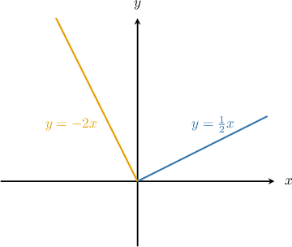
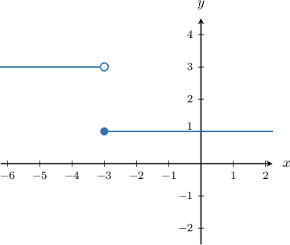
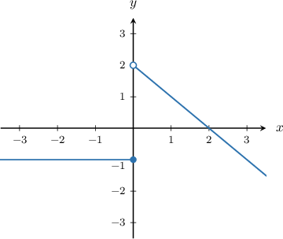
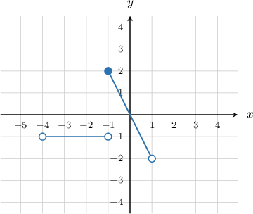

# Piecewise Functions

Source: https://www.mathacademy.com/topics/165?courseId=120
Topic ID: 165

## Prerequisites

- [Equations of Lines in Point-Slope Form](../algebra-i/418-equations-of-lines-in-point-slope-form.md)
- [The Domain of a Function](../algebra-i/802-the-domain-of-a-function.md)

## Lesson

### Introduction

A **piecewise function** is a function that is defined differently in different parts of the function's domain.

For example, consider the piecewise function defined as follows: A plot of the function is given below:

The function has two distinct branches, one for and one for. The function is a piecewise function because it has different definitions depending on where we are in the domain.

Suppose that we want to calculate For this, we'd use the left branch because On this branch, the function definition is so we have

Similarly, if we want to calculate, we'd use the right branch because On this branch, the function definition is so we have

### Example: Evaluating Piecewise Functions

#### Question

For the function $g(x)$ defined on the set of integers, find $g(-12)$ and $g(3),$ where $g(x)$ is the following piecewise function:

$$

\begin{aligned}2𝑥\,,\, & 𝑥<1 \\ 3𝑥\,,\, & 𝑥≥1\end{aligned}

$$

#### Explanation

- First, we compute $g(-12).$ Since $-12 < 1,$ we use the first branch:

- Next, we compute $g(3).$ Since $3 \geq 1,$ we use the second branch:

### Example: Graphing a Piecewise Step Function

#### Question

Given that

$$

\begin{aligned}3,\, & 𝑥<−3 \\ 1,\, & 𝑥≥−3\end{aligned}

$$

what is the graph of $y=f(x)?$

#### Explanation

We will graph each branch separately.

- On the interval $(-\infty, -3),$ we have $f(x) = 3,$ so the graph is a horizontal line that ends at $(-3,3),$ excluding this point.

- On the interval $[-3, \infty)$, we have $f(x) = 1,$ so the graph is a horizontal line that begins at $(-3,1),$ including this point.

Therefore, the graph of the given function is as follows:

### Example: Graphing a Piecewise Function

#### Question

If $f$ is the piecewise function

$$

\begin{aligned}−1,\, & 𝑥≤0 \\ −𝑥+2,\, & 𝑥>0\end{aligned}

$$

what is the graph of $y=f(x)?$

#### Explanation

We will graph each branch separately.

- On the interval $(-\infty, 0],$ we have $f(x) = -1$, so the graph is a horizontal line that ends at $(0,-1),$ including this point.

- On the interval $(0, \infty)$, we have $f(x) = - x+2$, so the graph is a straight line of slope $-1$ that starts from $(0,2),$ not including this point.

Therefore, the graph of the given function is as follows:

### Example: The Domain of a Piecewise Function

#### Question

What is the domain of the function shown below?

#### Explanation

The function is defined for values between $-4$ and $1.$

- Since there is an open circle at $x=-4,$ this point is not included in the domain.

- Since there is a closed circle at $x=-1,$ this point is included in the domain.

- Since there is an open circle at $x=1,$ this point is not included in the domain.

So, the function $f(x)$ above is defined for values between $x=-4$ and $x=1,$ not including $x=-4$ and $x=1$ but including $x=-1.$

Therefore, the domain is

$$

x\in (-4,1)

$$

Note that the function is defined at the point $x=-1,$ even though the function jumps at that point. The function value at $x=-1$ is $2.$
