# Graphing Elementary Cubic Functions

Source: https://www.mathacademy.com/topics/1653?courseId=120
Topic ID: 1653

## Prerequisites

- [Even and Odd Functions](../algebra-ii/725-even-and-odd-functions.md)
- [Vertical Reflections of Functions](../algebra-ii/1150-vertical-reflections-of-functions.md)
- [Horizontal Translations of Functions](../algebra-ii/1584-horizontal-translations-of-functions.md)
- [End Behavior of Functions](../algebra-i/2048-end-behavior-of-functions.md)

## Lesson

### Introduction

Let's plot the graph of $y=x^3.$ First, we create a table of values:

Now, we can plot the graph:

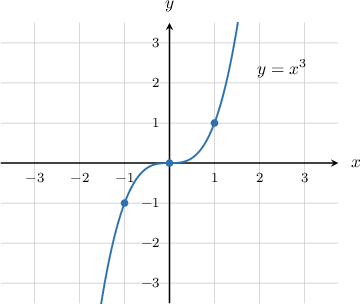

Here are some key points to note about this curve:

- The graph passes through the origin $(0,0).$

- For $x>0,$ the graph grows very rapidly as we increase $x.$ We say that $y \rightarrow \infty$ as $x \rightarrow \infty.$

- For $x<0,$ the graph decreases very rapidly as we decrease $x.$ We say that $y \rightarrow -\infty$ as $x \rightarrow -\infty.$

- The domain is $x \in (-\infty, \infty),$ and the range is $y \in (-\infty, \infty).$

- The function is a strictly increasing function.

- The function is an odd function.

### The Graph of an Elementary Negative Cubic Curve

Now, let's plot the graph of $y=-x^3.$ As we did before, we first create a table of values:

Now, we can plot the graph:

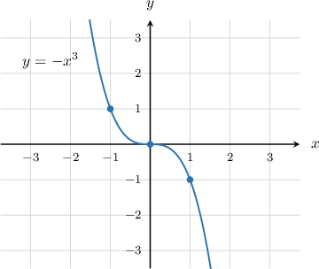

Here are some key points to note about this curve:

- The graph passes through the origin $(0,0).$

- For $x>0,$ the graph decreases very rapidly as we increase $x.$ We say that $y \rightarrow -\infty$ as $x \rightarrow \infty.$

- For $x<0,$ the graph increases very rapidly as we decrease $x.$ We say that $y \rightarrow \infty$ as $x \rightarrow -\infty.$

- The domain is $x \in (-\infty,\infty),$ and the range is $y \in (-\infty,\infty).$

- The function is a decreasing function.

- The function is an odd function.

We can see from the graph below that $y=-x^3$ is the reflection of the curve $y=x^3$ over the $x$ axis. This is because the negative sign changes the sign of the $y$-values.

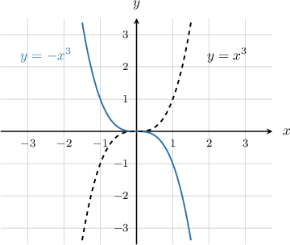

### Example: Identifying a Graph of an Elementary Cubic Function

#### Question

Which of the following plots is the graph of $y = -x^3?$

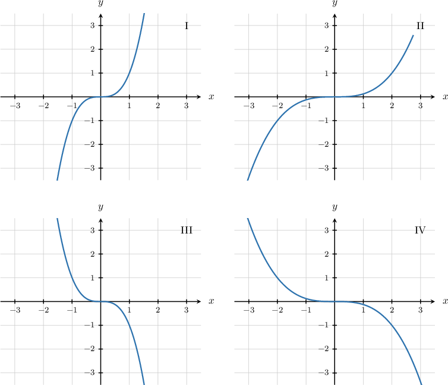

#### Explanation

First, remember that for $x>0,$ the graph of $y=-x^3$ decreases very rapidly as we increase $x.$ We say that $y \rightarrow -\infty$ as $x \rightarrow \infty.$ The only graphs that exhibit this decreasing property are III and IV.

Now, we need to choose between graphs III and IV. To do this, let's evaluate $y=-x^3$ at some value of $x,$ say $x=1.$ Substituting $x=1$ into the function, we get

$$

y = -(1)^3 = -1,

$$

so the correct graph must pass through the point $(1,-1).$ Only graph III satisfies this criterion.

Therefore, graph III corresponds to the graph of $y=-x^3.$

### Vertical Translations of an Elementary Cubic Curve

Now that we know the graph of $y=x^3,$ we can plot vertical translations of this function. In general, the graph of

$$

y=x^3+k

$$

is a vertical translation of the graph of $y=x^3$ by $k$ units up.

For example, to plot the function

$$

y=x^3 \, {\color{blue} \, +\, 3},

$$

we translate the original curve *up* by $\color{blue}3$ units:

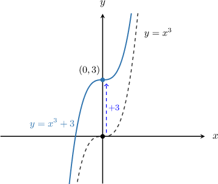

Similarly, to plot the function

$$

y=x^3 \, {\color{red} - \, 2},

$$

we translate the original curve *down* by $\color{red}2$ units:

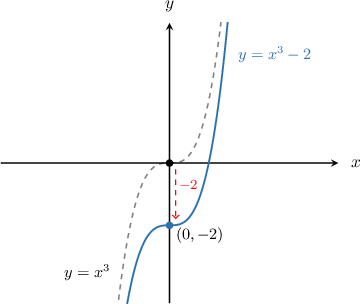

### Vertical Translations of an Elementary Negative Cubic Curve

We also know the graph of $y=-x^3,$ so we can plot vertical translations of this function as well.

For example, to plot the graph of

$$

y=-x^3 \, {\color{blue}+ \, 2.5},

$$

we translate the original curve *up* by $\color{blue}2.5$ units:

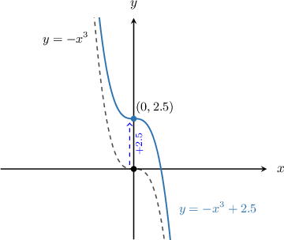

### Example: Graphing Vertical Translations of Elementary Cubic Functions

#### Question

Sketch the graph of $y=x^3+2.$

#### Explanation

Since we have $y=x^3{\color{blue}\,+\,2},$ we need to translate the graph of $y=x^3$ ** by $\color{blue}2$ units.

So, the graph of $y=x^3+2$ looks as follows:

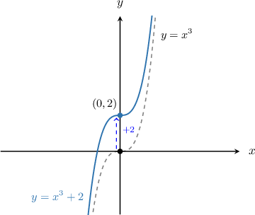

### Horizontal Translations of Elementary Cubic Functions

Because we know how to plot the graph of $y=x^3,$ we can also plot horizontal translations of this graph. In general, the graph of

$$

y=(x-h)^3

$$

is a horizontal translation of the graph of $y=x^3$ by $h$ units *right*.

For example, to plot the graph of

$$

y=(x {\color{blue} \, - \, 4})^3,

$$

we translate the original curve horizontally by $\color{blue}4$ units *right*:

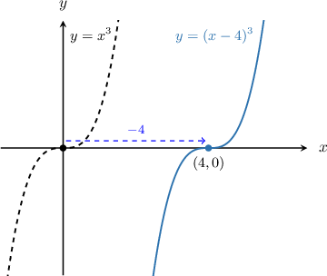

The graph of

$$

y=(x+h)^3

$$

is a horizontal translation of the graph of $y=x^3$ by $h$ units *left*.

For example, to plot the graph of

$$

y=(x{\color{red} \, + \, 2})^3,

$$

we translate the original curve by $\color{red}2$ units *left*:

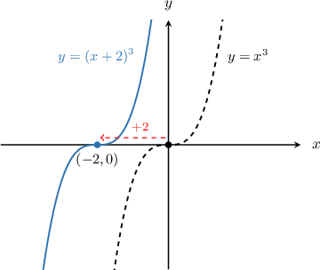

**Watch out!** Horizontal translations are always counter-intuitive. The translation $y=(x-h)^3$ is to the right and the translation $y=(x+h)^3$ is to the left, even though it seems like it should be the other way around.

### Example: Graphing Horizontal Translations of Elementary Cubic Functions

#### Question

Sketch the graph of $y=(x-2)^3.$

#### Explanation

Since we have $\color{blue}-2$ inside the brackets, we translate the graph of $y=x^3$ by $\color{blue}2$ units to the **.

So, the graph of $y=(x-2)^3$ looks as follows:

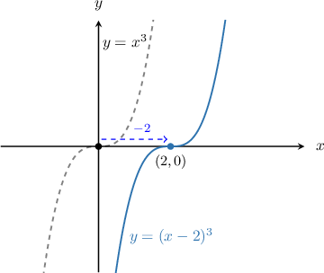

### Combinations of Horizontal and Vertical Translations

We can combine horizontal and vertical translations of cubic functions.

In general, the graph of

$$

y = (x-h)^3 + k

$$

can be obtained from the graph of $y=x^3$ by translating it

- horizontally by $h$ units to the right, and

- vertically by $k$ units up.

Let's see an example of this.

### Example: Combining Horizontal and Vertical Translations of Elementary Cubic Functions

#### Question

Plot the graph of $y=-(x+1)^3-3.$

#### Explanation

The given function can be obtained by translating $y=-x^3$ both horizontally and vertically.

We have two translations:

- the $\color{red}+1$ inside the parentheses means a horizontal translation of $1$ unit to the **, and

- the $\color{blue}-3$ outside the parentheses means a vertical translation of $3$ units **.

So, the new graph looks as follows:

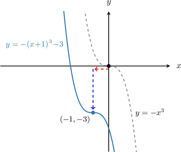
