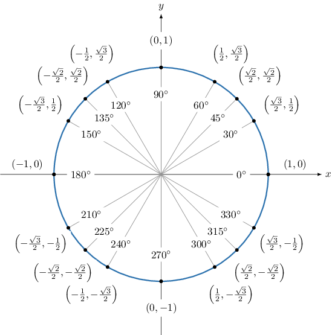

# Further Extensions of the Special Trigonometric Ratios

Source: https://www.mathacademy.com/topics/1844?courseId=120
Topic ID: 1844

## Prerequisites

- [Trigonometric Ratios of Quadrantal Angles Outside the Standard Range](../algebra-ii/3568-trigonometric-ratios-of-quadrantal-angles-outside-the-standard-range.md)
- [Evaluating Trigonometric Expressions](../algebra-ii/3766-evaluating-trigonometric-expressions.md)
- [Extending the Trigonometric Ratios to Large Angles](../algebra-ii/3829-extending-the-trigonometric-ratios-to-large-angles.md)

## Lesson

### Introduction

We can use the unit circle to find the sine and cosine of the special *negative* angles. We do this by first finding a coterminal special angle that lies in the range $[0^\circ, 360^\circ),$ and then using $x = \cos(\theta)$ and $y = \sin(\theta)$ as we did before.

For example, to find $\cos(-225^\circ),$ first, we find an angle that's coterminal with $-225^\circ$ that lies in the range $[0,360^\circ).$

$$

-225^\circ + 360^\circ = 135^\circ\quad{\color{green}{\checkmark}}

$$

Therefore, $\cos\left(-225^\circ\right) = \cos 135^\circ.$

From the unit circle, we see that the angle $135^\circ$ corresponds to the point $\left(-\dfrac{\sqrt{2}}{2}, \dfrac{\sqrt{2}}{2} \right).$

Since the cosine of the angle corresponds to the $x$-coordinate, we have $\cos 135^\circ = -\dfrac{\sqrt{2}}{2}.$

Therefore, $\cos \left(-225^\circ\right) =-\dfrac {\sqrt{2}}{2}.$

### Example: Finding the Sine or Cosine of a Negative Special Angle

#### Question

Find the value of $\sin (-120^\circ).$

#### Explanation

First, we find an angle that's coterminal with $-120^\circ$ that lies in the range $[0,360^\circ).$

$$

-120^\circ + 360^\circ = 240^\circ\quad{\color{green}{\checkmark}}

$$

Therefore, $\sin\left(-120^\circ\right) = \sin 240^\circ.$

Let's remind ourselves of the special trigonometric ratios, as given by the unit circle.

From the unit circle, we see that the angle $240^\circ$ corresponds to the point $\left(-\dfrac{1}{2}, -\dfrac{\sqrt{3}}{2} \right).$

Since the sine of the angle corresponds to the $y$-coordinate, we have $\sin 240^\circ = -\dfrac{\sqrt{3}}{2}.$

Therefore, $\sin \left(-120^\circ\right) =-\dfrac {\sqrt{3}} 2.$

### Example: Finding a Reciprocal Trigonometric Ratio of a Negative Special Angle

#### Question

$\sec(-210^\circ) =$

#### Explanation

First, we find an angle that's coterminal with $-210^\circ$ that lies in the range $[0^\circ,360^\circ).$

$$

-210^\circ + 360^\circ = 150^\circ\quad{\color{green}{\checkmark}}

$$

Therefore, $\sec\left(-210^\circ\right) = \sec (150^\circ).$

Let's remind ourselves of the special trigonometric ratios, as given by the unit circle.

From the unit circle, we see that the angle $150^\circ$ corresponds to the point $\left(-\dfrac{\sqrt{3}}{2}, \dfrac{1}{2} \right).$

Since the cosine of the angle corresponds to the $x$-coordinate, we have $\cos (150^\circ) = -\dfrac{\sqrt 3}{2}.$

Therefore, using the fact that $\sec\theta = \dfrac{1}{\cos\theta},$ we have

$$

\begin{aligned}sec⁡(150^{∘}) & =\frac{1}{cos⁡(150^{∘})} \\ & =\frac{1}{(−\frac{\sqrt{√3}}{2})} \\ & =−\frac{2}{\sqrt{√3}} \\ & =−\frac{2\sqrt{√3}}{3}.\end{aligned}

$$

Therefore, $\sec \left(-210^\circ\right) = -\dfrac{2\sqrt 3}{3}.$

### Example: Finding the Tangent or Cotangent of a Negative Special Angle

#### Question

Determine the value of $\tan\left(-\dfrac{7\pi}{4}\right).$

#### Explanation

First, we find an angle that's coterminal with $-\dfrac {7\pi}{4}$ that lies in the range $[0,2\pi).$

$$

-\dfrac{7\pi} 4 + 2\pi = \dfrac{\pi}{4}\quad{\color{green}{\checkmark}}

$$

Therefore, $\tan\left(-\dfrac{7\pi} 4\right) = \tan \left(\dfrac{\pi} {4}\right).$

Let's remind ourselves of the special trigonometric ratios, as given by the unit circle.

From the unit circle, we see that the angle $\dfrac{\pi}{4}$ corresponds to the point $\left(\dfrac{\sqrt{2}}{2}, \dfrac{\sqrt{2}}{2} \right).$

- Since the cosine of the angle corresponds to the $x$-coordinate, we have $\cos \left(\dfrac{\pi}{4}\right) = \dfrac{\sqrt 2}{2}.$

- Since the sine of the angle corresponds to the $y$-coordinate, we have $\sin \left(\dfrac{\pi}{4}\right) = \dfrac{\sqrt 2}{2}.$

Therefore, using the fact that $\tan\theta = \dfrac{\sin\theta}{\cos\theta},$ we have

$$

\begin{aligned}tan⁡(−\frac{7𝜋}{4}) & =tan⁡(\frac{𝜋}{4}) \\ & =\frac{sin⁡(\frac{𝜋}{4})}{4} \\ & =\frac{(\frac{\sqrt{√2}}{2})}{2} \\ & =1.\end{aligned}

$$

### Finding Special Trigonometric Ratios of Larger Special Angles

We can also extend our knowledge of special trigonometric ratios to angles greater than $360^\circ.$ Just like for negative numbers, we find a coterminal special angle that lies in the range $[0^\circ, 360^\circ)$, then use $x = \cos(\theta)$ and $y = \sin(\theta)$ as before.

For example, to find $\sin 420^\circ$, first we find an angle that's coterminal with $420^\circ$ that lies in the range $[0,360^\circ).$

$$

420^\circ - 360^\circ = 60^\circ\quad{\color{green}{\checkmark}}

$$

Therefore, $\sin\left(420^\circ\right) = \sin 60^\circ.$

Let's remind ourselves of the special trigonometric ratios, as given by the unit circle.

From the unit circle, we see that the angle $60^\circ$ corresponds to the point $\left(\dfrac{1}{2}, \dfrac{\sqrt{3}}{2} \right).$

Since the sine of the angle corresponds to the $y$-coordinate, we have $\sin 60^\circ = \dfrac{\sqrt{3}}{2}.$

Therefore, $\sin \left(420^\circ\right) =\dfrac{\sqrt{3}}{2}.$

### Example: Finding a Trigonometric Ratio of a Larger Special Angle

#### Question

Find the value of $4 \cos \left(\dfrac{31\pi}{6}\right).$

#### Explanation

First, we find an angle that's coterminal with $\dfrac{31\pi}{6}$ that lies in the range $[0,2\pi).$

$$

\begin{aligned}\frac{31𝜋}{6}−2𝜋=\frac{19𝜋}{6} \\ \frac{19𝜋}{6}−2𝜋=\frac{7𝜋}{6}\,✓\end{aligned}

$$

Therefore, $\cos\left(\dfrac{31\pi}{6}\right) = \cos\left(\dfrac{7\pi}{6}\right).$

Let's remind ourselves of the special trigonometric ratios, as given by the unit circle.

From the unit circle, we see that the angle $\dfrac{7\pi}{6}$ corresponds to the point $\left(-\dfrac{\sqrt{3}}{2}, -\dfrac{1}{2} \right).$

Since the cosine of the angle corresponds to the $x$-coordinate, we have $\cos \left(\dfrac{7\pi}{6}\right) = -\dfrac{\sqrt 3}{2}.$

Therefore, $\cos \left(\dfrac{31\pi}{6} \right) = -\dfrac {\sqrt 3} 2.$

Finally, then:

$$

4 \cos \left(\dfrac{31\pi}{6}\right) = 4\cdot \left(-\dfrac{\sqrt{3}}{2}\right) = -2\sqrt{3}.

$$
