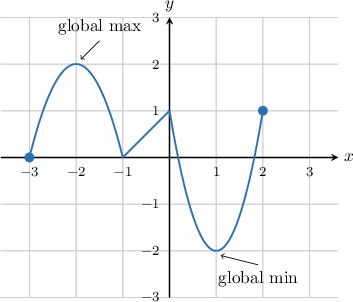
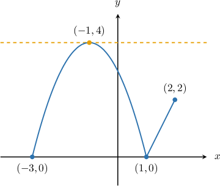
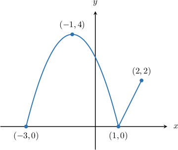
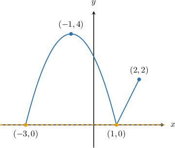
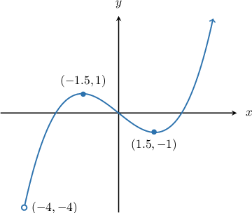

# Global Extrema of Functions

Source: https://www.mathacademy.com/topics/1888?courseId=120
Topic ID: 1888

## Prerequisites

- [The Domain of a Function](../algebra-i/802-the-domain-of-a-function.md)

## Lesson

### Introduction

When we deal with functions, we are often interested in their largest or smallest values.

- The **global maximum** of a function is the largest $y$-value that the function attains on its domain. There can only be (at most) one global maximum. It's also called the **absolute maximum.**

- The **global minimum** of a function is the smallest $y$-value that the function attains on its domain. There can only be (at most) one global minimum. It's also called the **absolute minimum.**

If one or both exist, the global maximum and minimum values of a function are collectively called the **global extrema** of the function.

For example, in the graph below, the global maximum is $2$, while the global minimum is $-2$.

The point where a function reaches its global maximum/minimum is called the **global maximum/minimum point**. So in this case,

- $(-2,2)$ is the global maximum point, and

- $(1,-2)$ is the global minimum point.

**Watch out!** The *global maximum/minimum* is unique. It's a value of the function ($y$-coordinate on the graph). However, there can be several *global maximum/minimum points*. All of these will have the same $y$-coordinate (*global maximum/minimum*) but different $x$-coordinates.

### Example: Identifying the Global Maximum of a Function

#### Question

What is the global maximum point of the function shown below?

#### Explanation

First, we recall the following definitions:

- The global maximum of a function is the largest value that the function attains on its domain. There can only be (at most) one global maximum.

- A global maximum point is a point $(x,y)$ where a function reaches a global maximum. There can be zero, one, or many global maximum points.

For our function, the maximum value reached by the function is $f(x)=4.$ Therefore, the global maximum is $4.$ The function reaches this value when $x=-1,$ so the global maximum point is $(-1,4).$

### Example: Identifying the Global Minimum of a Function

#### Question

What are the global minimum points of the function shown below?

#### Explanation

First, we recall the following definitions:

- The global minimum of a function is the smallest value that the function attains on its domain. There can only be (at most) one global minimum.

- A global minimum point of a function is a point $(x,y)$ where a function reaches a global minimum. There can be zero, one, or many global minimum points.

For our function, the minimum value reached by the function is $f(x)=0.$ Therefore, the global minimum is $0.$ The function reaches this value when $x=-3$ and when $x=1,$ so the global minimum points are $(-3,0)$ and $(1,0).$

### Example: Identifying Whether the Global Extrema of a Function Exist

#### Question

The graph $y = f(x)$ is shown below. Which of the following statements is true?

1. The global maximum of $f(x)$ is $1.$

2. The global minimum of $f(x)$ is $-4.$

3. The function does not have any global extrema.

#### Explanation

Let's examine each statement.

- Statement I is false. As $x$ increases on the right-hand side of the graph, the function continues to increase without bound (as indicated by the arrow). So, the function does not reach a global maximum value.

- Statement II is false. At first glance, it might seem that the point $(-4,-4)$ corresponds to the global minimum, but since $x=-4$ is not included in the domain (as indicated by the open circle), the function does ** have a global minimum.

- Statement III is true. The function does not have a global maximum and does not have a global minimum. Therefore, the function does not have any global extrema.

Therefore, the correct answer is "III only."
