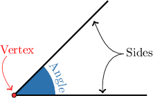
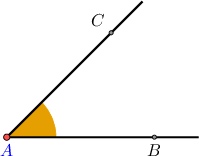
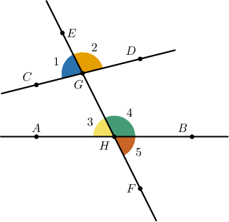
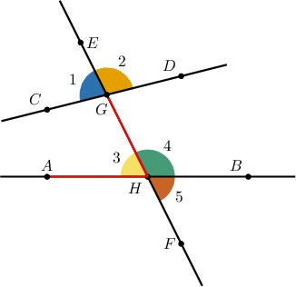
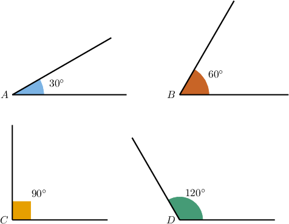
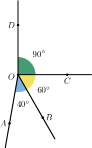
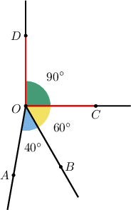
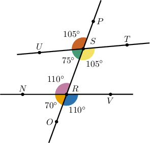
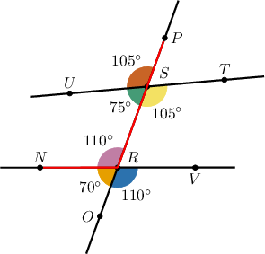

# Angles and Measures of Angles

Source: https://www.mathacademy.com/topics/2172?courseId=120
Topic ID: 2172

## Prerequisites

- [Points, Lines, Rays, and Segments](../grade-4/1378-points-lines-rays-and-segments.md)

## Lesson

### Introduction

An **angle** is formed whenever two rays meet at a point.

The common point shared by the rays is called the **vertex**, and the rays themselves are called the **sides** of the angle.

Consider the following angle, made up of the rays $\overrightarrow{{\color{blue}{A}}B}$ and $\overrightarrow{{\color{blue}{A}}C}.$

There are several different ways of labeling this angle.

- One way to write this angle is as follows: The symbol $\angle$ means "angle." Notice that the vertex ${\color{blue}{A}}$ is in the middle.

- We can also swap the order in which we write the endpoints. For example, Notice that the vertex ${\color{blue}{A}}$ is still in the middle.

- To save space, we sometimes write $\angle {\color{blue}{A}}.$

- Finally, instead of using the $\angle$ symbol, we can write $\widehat{C{\color{blue}{A}}B}$ or $\widehat{B{\color{blue}{A}}C}.$

### Example: Expressing Angles Using Angle Notation

#### Question

Which numbered angle refers to the same angle as $\widehat{GHA}?$

#### Explanation

If we trace along the letters of the angle name, from $G$ to $H$ to $A$, we see that $\widehat{GHA}$ refers to the angle $\angle 3.$

Therefore, $\angle{3}$ is another name for $\widehat{GHA}.$

### Angle Measures

The **measure** of an angle is the amount of "turn" from one side of the angle to the other.

We measure angles in **degrees**, which have the symbol $^\circ.$

Let's look at a few examples of angles with their measures.

Note the following:

- The more "turn" there is, the larger the angle's measure.

- A corner angle (like the angle $C$ above) has a measure of $90^\circ.$ An angle with measure $90^\circ$ is called a **right angle.**

We use the letter $m$ to represent the measure of the angle. For example,

$$

m \angle C = 90^\circ.

$$

We'd read this as "the measure of the angle $C$ is $90$ degrees."

### Example: Determining an Angle With a Given Measure

#### Question

Which angle has a measure of $90^{\circ}?$

#### Explanation

Let's highlight the angle with a measure $90^\circ$ on our diagram.

From the diagram, we see that the angle $\angle{COD}$ (or $\angle{DOC}$) has a measure of $90^\circ.$

### Example: Reading the Measure of an Angle

#### Question

What is the measure of the angle $\angle{NRP}?$

#### Explanation

If we trace along the letters of the angle name, from $N$ to $R$ to $P,$ we can see the angle $\angle{NRP}.$

Therefore, $m\angle{NRP}=110^\circ.$
