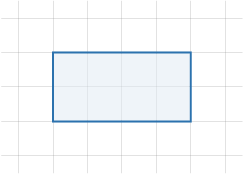
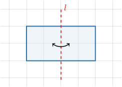
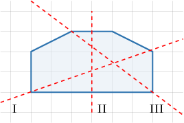
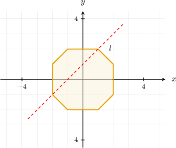
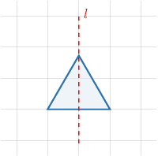
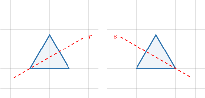
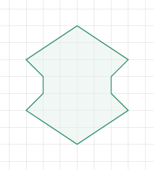
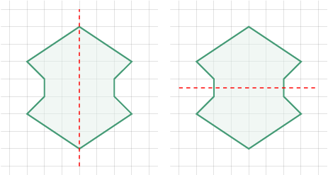
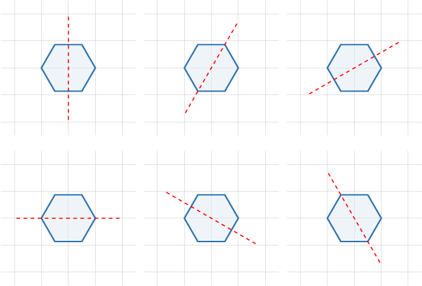

# Reflective Symmetry

Source: https://www.mathacademy.com/topics/2226?courseId=120
Topic ID: 2226

## Prerequisites

- [Regular Polygons](../grade-8/1322-regular-polygons.md)
- [Reflections of Figures Across Arbitrary Lines](../geometry/3535-reflections-of-figures-across-arbitrary-lines.md)
- [Rectangles, Rhombuses, and Squares](../grade-5/3751-rectangles-rhombuses-and-squares.md)

## Lesson

### Introduction

A polygon has **reflective symmetry** if the resulting figure lies perfectly on top of the original figure when reflected across some line.

For example, let's consider the rectangle below.

This rectangle has reflective symmetry because it appears unchanged after the reflection over the line $l,$ as shown below.

### Example: Identifying Lines That Reflect a Polygon to Itself

#### Question

Reflections across which lines carry the polygon below onto itself?

#### Explanation

Let's consider each of the lines in turn.

- By reflecting the polygon across line I, we do ** map the polygon onto itself.

- By reflecting the polygon across line II, we map the polygon onto itself.

- By reflecting the polygon across line III, we do ** map the polygon onto itself.

Therefore, the correct answer is "II only."

### Example: Determining Reflections That Map a Polygon to Itself in a Coordinate Plane

#### Question

Reflections across which of the following lines carry the polygon below onto itself?

1. the line $l$

2. the line $y=-x$

3. the $y$-axis

#### Explanation

Let's consider each of the lines in turn.

- By reflecting the polygon across $l$, we do ** map the polygon onto itself.

- By reflecting the polygon across $y=-x$, we map the polygon onto itself.

- By reflecting the polygon across $y$-axis, we map the polygon onto itself.

Therefore, the correct answer is "II and III only."

### Axes of Symmetry

If a polygon remains the same when reflected across a line, then we call that line an **axis of symmetry**.

For example, the equilateral triangle below has the line $l$ as an axis of symmetry.

Some polygons have multiple axes of symmetry. For example, the equilateral triangle has other axes of symmetry, $r$ and $s$, as shown below.

These are all the axes of symmetries for the equilateral triangle. So, this triangle has $3$ axes of symmetry.

### Example: Identifying the Axes of Symmetry of a Polygon

#### Question

How many axes of symmetry does the polygon below have?

#### Explanation

The polygon has $2$ axes of symmetry, as shown below.

### Example: Identifying the Number of Axes of Symmetry of a Polygon From a Description

#### Question

How many axes of symmetry does a regular hexagon have?

#### Explanation

A regular hexagon has $6$ axes of symmetry, as illustrated below.

