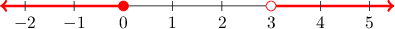
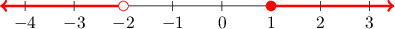
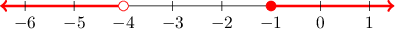
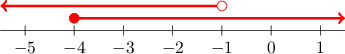
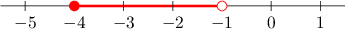
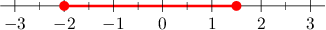

# Compound Inequalities

Source: https://www.mathacademy.com/topics/2310?courseId=120
Topic ID: 2310

## Prerequisites

- [Inequalities](../grade-7/178-inequalities.md)

## Lesson

### Introduction

A **compound inequality** is an inequality that consists of multiple different inequalities put together. For example, the compound inequality

$$

x \leq 0 \hspace{.25cm} \text{ or } \hspace{.25cm} x \gt 3

$$

states that $x$ is less than or equal to $0$, or greater than $3$.

For the compound "or" inequality to be satisfied, at least one of the separate inequalities must be satisfied. To illustrate:

- $x=-1$ satisfies the inequality because it satisfies $x \leq 0.$

- $x=5$ satisfies the inequality because it satisfies $x > 3.$

- $x=1$ does not satisfy the inequality because it does not satisfy $x \leq 0$ and it also does not satisfy $x > 3.$

To graph a compound inequality involving the word "or," we graph the two separate inequalities on the same number line. In this particular case,

- the inequality $x \leq 0$ consists of a closed circle at $0$ and an arrow to the left, while

- the inequality $x >3$ consists of an open circle at $3$ and an arrow to the right.

The resulting graph is as follows:

### Example: Representing "Or" Inequalities on Number Lines

#### Question

Represent the inequality $x < -2$ or $x \geq 1$ on a number line.

#### Explanation

The inequality $x < -2$ or $x \geq 1$ means that $x$ can take any value less than $-2,$ or greater than or equal to $1.$

To represent this on a number line, we graph the two separate inequalities:

- the inequality $x < -2$ consists of an open circle at $-2$ and an arrow to the left.

- the inequality $x \geq 1$ consists of a closed circle at $1$ and an arrow to the right.

The resulting graph is as follows:

### Example: Identifying "Or" Inequalities Given on Number Lines

#### Question

Which inequality corresponds to the highlighted region shown on the number line above?

#### Explanation

The red rays contain all values less than $-4$ or greater than $-1.$ In addition,

- the open circle at $-4$ implies that $x$ cannot be equal to $-4,$ and

- the closed circle at $-1$ implies that $x$ can be equal to $-1.$

Therefore, the highlighted region represents $x < -4$ or $x \geq -1.$

### Compound "And" Inequalities

Compound inequalities can also be written with the word "and." However, such inequalities are often written together as a single expression with two inequality signs. For example, the compound inequality

$$

-4 \leq x < -1

$$

means that $-4 \leq x$ and $x < -1.$

For the compound "and" inequality to be satisfied, both of the separate inequalities must be satisfied. To illustrate:

- $x=-3$ satisfies the inequality because it satisfies both $-4 \leq x$ and $x < -1.$

- $x=-5$ does not satisfy the inequality because it does not satisfy $-4 \leq x.$

- $x=0$ does not satisfy the inequality because it does not satisfy $x < -1.$

To graph this compound inequality, we first graph the two inequalities separately.

Then, we keep only where they overlap.

**Note:** Any compound "and" inequality will always represent a segment between two points. So, it is not always necessary to draw both inequalities and find the overlap. To speed up the process, we can just draw the endpoints with open or closed circles as appropriate, and highlight the area between the endpoints.

### Example: Representing "And" Inequalities on Number Lines

#### Question

What inequality corresponds to the highlighted region shown on the number line above?

#### Explanation

The red segment contains all values between $-2$ and $0.$ In addition,

- the closed circle at $-2$ implies that $x$ can be equal to $-2,$ while

- the open circle at $0$ implies that $x$ cannot be equal to $0.$

Therefore, the highlighted region represents $-2 \leq x < 0.$

### Example: Identifying "And" Inequalities Given on Number Lines

#### Question

Which inequality corresponds to the highlighted region shown on the number line above?

#### Explanation

The red segment contains all values between $-2$ and $\dfrac{3}{2}.$ In addition,

- the closed circle at $-2$ implies that $x$ can be equal to $-2,$ while

- the closed circle at $\dfrac32$ implies that $x$ can be equal to $\dfrac32.$

Therefore, the highlighted region represents $-2 \boxed{\color{blue} \leq} x \boxed{\color{blue} \leq} \dfrac32.$
