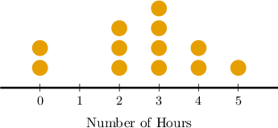
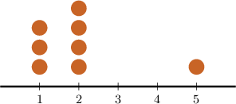
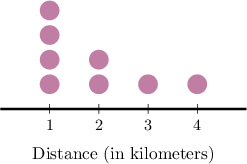
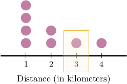
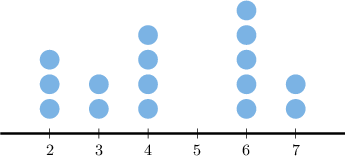
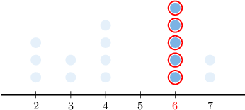
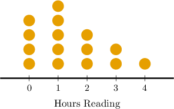
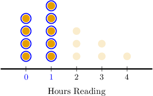

# Dot Plots

Source: https://www.mathacademy.com/topics/2499?courseId=120
Topic ID: 2499

## Prerequisites

- [Frequency Tables](../grade-6/2509-frequency-tables.md)

## Lesson

### Introduction

A **dot plot** is a visual representation of a data set. A horizontal axis shows the possible values of the data, and each data point is represented by a dot above its corresponding value on a horizontal axis.

Consider the following frequency table, which details the number of hours students in a class spent studying for a final exam:

To make a dot plot, we let a horizontal axis represent the number of hours studied. Then, we plot each data point as a dot above its corresponding value on the horizontal axis. The resulting plot is as follows:

The advantage of using dot plots is that their shape gives us an overall sense of how the data is distributed. For example, we can see immediately that most students spend at least two hours studying for the exam.

We can also create dot plots from data given as a list. Let's see an example.

### Example: Creating a Dot Plot

#### Question

Draw a dot plot that represents the data set shown below.

$$

2, \: 1, \: 1, \: 2, \: 5, \: 1, \: 2, \: 2

$$

#### Explanation

First, notice that we have three values in our data:

$\qquad$ $1,$ $2,$ and $5.$

Next, we draw a number line from the smallest to the greatest value:

The data tells us the following:

- The number $1$ appears three times. So, there will be $\color{blue}3$ dots over $1$ on the number line.

- The number $2$ appears four times. So, there will be $\color{blue}4$ dots over $2$ on the number line.

- The number $5$ appears once. So, there will be $\color{blue}1$ dot over $5$ on the number line.

Therefore, we get the dot plot shown below.

### Example: Finding a Missing Value in a Frequency Table

#### Question

The dot plot below gives the distance (to the nearest kilometer) ran by a group of joggers one day. Each dot represents a single jogger.

The frequency table below represents the same information. What number is missing from the table?

#### Explanation

Notice the $3$rd column of the dot plot. It tells us that there is $\color{blue}1$ jogger who ran $3$ kilometers.

Therefore, the missing value is $\color{blue}1.$

### Example: Interpreting Dot Plots

#### Question

What is the most common value in the data set represented by the dot plot below?

#### Explanation

The plot tells us the following:

- the value $2$ appears three times (there are $3$ dots over $2$)

- the value $3$ appears twice (there are $2$ dots over $3$)

- the value $4$ appears four times (there are $4$ dots over $4$)

- the value $5$ appears zero times (there are no dots over $5$)

- the value $\color{red}6$ appears five times (there are $5$ dots over $6$)

- the value $7$ appears twice (there are $2$ dots over $7$)

Therefore, the most common value among the given data set is $6.$

### Example: Finding a Partial Count From a Dot Plot

#### Question

The dot plot below shows the results of a survey of a group of people, asking them how many hours per day they spend reading. How many respondents spend no more than one hour per day reading?

#### Explanation

The dot plot tells us the following:

- $\color{blue}4$ of the respondents spend $0$ hours per day reading ($4$ dots over $0$)

- $\color{blue}5$ of the respondents spend $1$ hour per day reading ($5$ dot over $1$)

- $3$ of the respondents spend $2$ hours per day reading ($3$ dots over $2$)

- $2$ of the respondents spend $3$ hour per day reading ($2$ dot over $3$)

- $1$ of the respondents spends $4$ hours per day reading ($1$ dots over $4$)

Therefore, ${\color{blue}4} + {\color{blue}5} = 9$ of the respondents spend no more than one hour per day reading.
