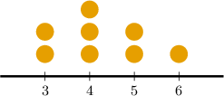
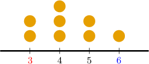
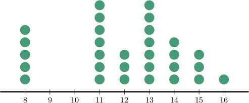
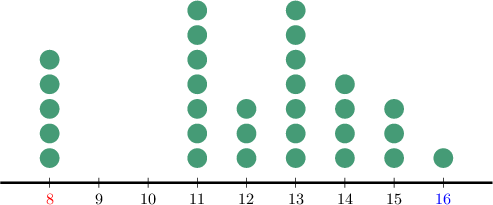
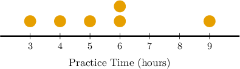

# Measuring Range and MAD From Dot Plots

Source: https://www.mathacademy.com/topics/2501?courseId=120
Topic ID: 2501

## Prerequisites

- [Range, Quartiles, and IQR](../grade-6/2480-range-quartiles-and-iqr.md)
- [Mean Absolute Deviation](../grade-6/2481-mean-absolute-deviation.md)
- [Measuring Centrality From Dot Plots](../grade-6/2500-measuring-centrality-from-dot-plots.md)

## Lesson

### Introduction

We can compute a data set's range and mean absolute deviation using its dot plot.

To illustrate, let's find the range of the data set represented by the dot plot below.

Recall that the range of a data set is the difference between the greatest and the smallest values.

Now, according to the plot, the smallest value is $\color{red}3$ and the greatest is ${\color{blue}6}.$

Therefore, the range of the data set is

$$

{\color{blue}\text{greatest}} - {\color{red}\text{smallest}} = {\color{blue}6} - {\color{red}3} = 3.

$$

### Example: Measuring the Range of a Data Set From a Dot Plot

#### Question

The dot plot below shows the number of games a group of competitors won during a chess tournament. Each dot represents a different competitor. What is the range in the number of games won by the members of this group?

#### Explanation

The range of a data set is the difference between the greatest and the smallest values.

According to the plot, the smallest value is $\color{red}8$ and the greatest is $\color{blue}16.$

Therefore, the range of the data set is

$$

{\color{blue}\text{greatest}} - {\color{red}\text{smallest}} = {\color{blue}16} - {\color{red}8} = 8.

$$

### Example: Measuring the Mean Absolute Deviation of a Data Set From a Dot Plot

#### Question

The dot plot below shows the total time members of a rock band practiced their instruments last week. Each dot represents a different band member. What is the mean absolute deviation in the band members' practice times?

#### Explanation

The dot plot tells us the following:

- $1$ member practiced for $3$ hours

- $1$ member practiced for $4$ hours

- $1$ member practiced for $5$ hours

- $2$ members practiced for $6$ hours

- $1$ member practiced for $9$ hours

So, we get the following data:

$$

3, \: 4, \: 5, \: 6, \: 6, \: 9

$$

Now, we find the mean of the data:

$$

\begin{aligned}mean & =\frac{(3×1)+(4×1)+(5×1)+(6×2)+(9×1)}{6} \\ & =\frac{33}{6} \\ & =5.5\end{aligned}

$$

Next, we subtract the mean from each number in the data set, find the absolute value of the results, and add all these together:

$$

\begin{aligned}|3−5.5|+|4−5.5|+|5−5.5|+|6−5.5|+|6−5.5|+|9−5.5| & = \\ |−2.5|+|−1.5|+|−0.5|+|\,0.5\,|+|\,0.5\,|+|\,3.5\,| & = \\ 2.5+1.5+0.5+0.5+0.5+3.5 & = \\ 9 & \end{aligned}

$$

Finally, to calculate the mean absolute deviation (MAD), we divide the sum obtained above (${\color{red}9}$) by the total number of data points ($6$). This gives

$$

\text{MAD} = \dfrac{\color{red}9}{6} = 1.5.

$$
