# Histograms

Source: https://www.mathacademy.com/topics/2510?courseId=120
Topic ID: 2510

## Prerequisites

- [Frequency Tables](../grade-6/2509-frequency-tables.md)
- [The Mode of a Data Set](../grade-6/3579-the-mode-of-a-data-set.md)
- [The Median of a Data Set](../grade-6/3749-the-median-of-a-data-set.md)

## Lesson

### Introduction

A **histogram** is a visual representation of a frequency table for grouped data.

For example, consider the data set below:

$$

55, \: 63, \: 65, \: 68, \: 71, \: 75, \: 82

$$

In this data set,

- there is $1$ number between $50$ and $59,$

- there are $3$ numbers between $60$ and $69,$

- there are $2$ numbers between $70$ and $79,$ and

- there is $1$ number between $80$ and $89.$

We can organize these results in the following frequency table.

To draw the histogram, we divide a horizontal axis into $4$ equal subintervals, one for each range of values. Then, on each subinterval, we draw a rectangle whose height is equal to the frequency in the corresponding range.

The resulting graph is shown below:

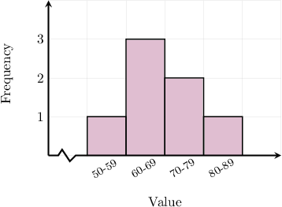

### Example: Filling a Missing Column in a Frequency Table

#### Question

The histogram below shows the height distribution, to the nearest centimeter, of a group of high school baseball players.

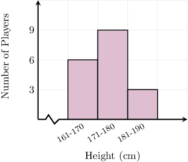

The frequency table below represents the same information. From left to right, what is missing from the table?

#### Explanation

The second column of the histogram tells us that there are $\color{blue}9$ players whose height is in the range of ${\color{blue}171{-}180} \, \text{cm}.$

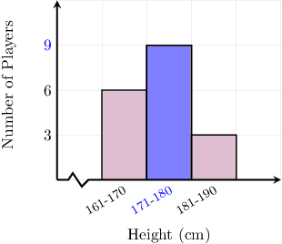

Therefore, the missing parts are $\color{blue}171{-}180$ and $\color{blue}9.$

### Example: Creating a Histogram From a Frequency Table

#### Question

The frequency table below gives the weights, measured to the nearest kilogram, of some students in a statistics class.

Draw a histogram that represents the same data set.

#### Explanation

From the frequency table:

- $\color{blue}6$ students had weights in the range $50{-}59$ kilograms,

- $\color{blue}10$ students had weights in the range $60{-}69$ kilograms,

- $\color{blue}8$ students had weights in the range $70{-}79$ kilograms, and

- $\color{blue}2$ students had weights in the range $80{-}89$ kilograms.

The histogram that represents this information is the following:

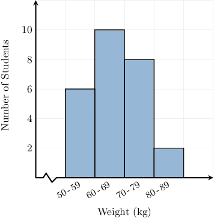

### Example: Finding a Partial Count From a Histogram

#### Question

Tina sorted out her collection of science fiction books into four groups according to their number of pages. The histogram below gives the corresponding distribution. How many of Tina's science fiction books have at most $249$ pages?

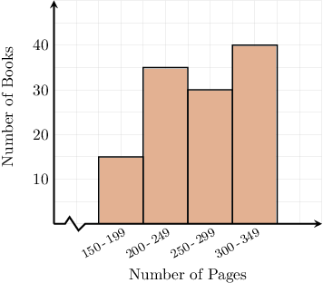

#### Explanation

The first and second bars correspond to the books that have between $\color{blue} 150{-}199$ and $\color{blue} 200{-}249$ pages, respectively.

The height of the first bar is $\color{red}15$ (halfway between $10$ and $20$) and the second bar has a height of $\color{red}35$ (halfway between $30$ and $40$).

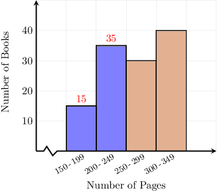

Therefore, Tina has ${\color{red}15} + {\color{red}35} = 50$ books that have at most $249$ pages.

### Tails, Skew, and Symmetry

A **tail** of a distribution is a part that extends away from the main cluster.

If the *left tail* of the distribution is longer than the right tail, then we say that the distribution is **left-skewed** (or **negatively skewed**). An example of a left-skewed distribution is shown below.

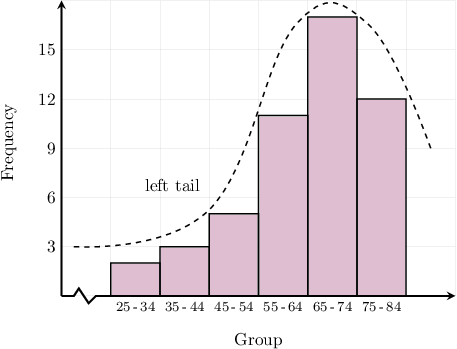

Similarly, if the *right tail* of the distribution is longer than the left tail, then we say that the distribution is **right-skewed** (or **positively skewed**). An example of a right-skewed distribution is shown below.

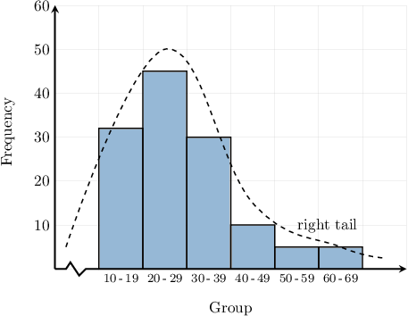

If the distribution's tails are the same, we say that the distribution is **symmetric**. An example of symmetric distribution is shown below.

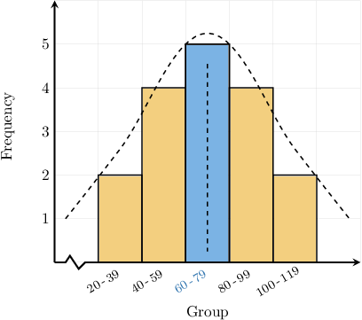

For symmetric distributions, the mean and the median always lie in the middle group. So, in this case, we know that the mean and median both lie within the values $60$ and $79.$

### The Mean and Median for Symmetric Distributions, and Modal Class

When a distribution is symmetric, and the corresponding histogram has an odd number of bars, the mean and the median always lie within the central column. So, in the case below, both the mean and median lie between $60$ and $79.$

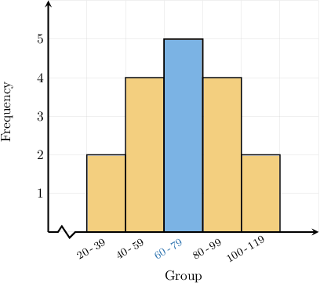

When a distribution is symmetric, and the corresponding histogram has an even number of bars, the mean and the median always lie within the two central columns. So, in the case below, both the mean and median lie between $60$ and $99.$

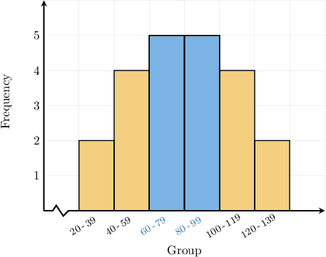

Note that it's usually impossible to precisely determine the mean and median from a histogram alone since the data is grouped. We can only estimate.

Finally, for any set of grouped data, the **modal class** is the **class** (i.e., group) corresponding to the tallest bar on the histogram. For the histogram below, the modal class is $40-59.$

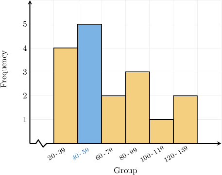

Similar to the mode, some data sets have *more than one* modal class. For example, the symmetric graph with six classes shown above (the one with two blue bars) has two modal classes, $60-79,$ and $80-99.$

Other data sets have no modal class:

- If each class has a height of $1,$ then there is no modal class.

- Similarly, if each class has the *same* height, then there is no modal class.

In both cases, we would have a completely flat histogram.

For example, the data set below has no modal class.

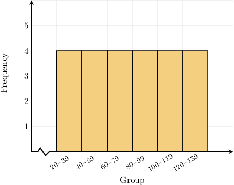

### Example: Identifying Characteristics of Distributions Using Histograms

#### Question

Members of a gym were asked how much time they spend working out on a typical day. The histogram below shows the results. Which of the following statements are true?

1. The distribution is left-skewed.

2. The distribution is symmetric.

3. The distribution is right-skewed.

4. The mean lies between $100$ and $119$ minutes.

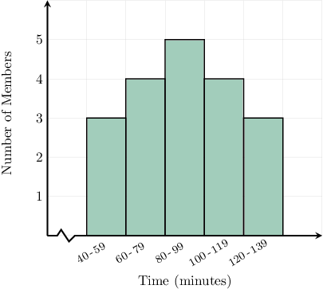

#### Explanation

Let's look at the statements one by one.

- Statement II is true, while statements I and III are false. The left-hand side is a mirror image of the right-hand side. Therefore, the distribution is symmetric.

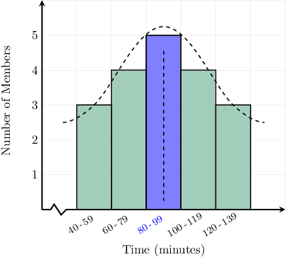

- Statement IV is false. When a distribution is symmetric, and the corresponding histogram has an odd number of bars, the mean and the median always lie within the central column. Therefore, the mean time lies between $80$ and $99$ minutes.

Therefore, the correct answer is "II only."
