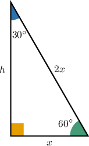
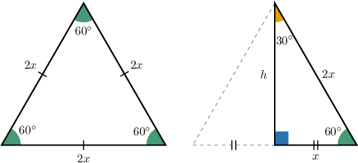
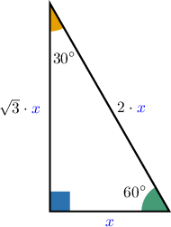
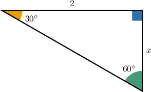
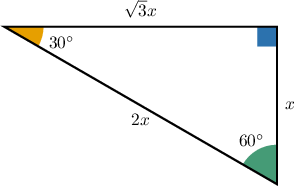
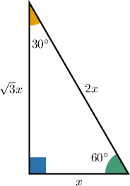

# 30-60-90 Triangles

Source: https://www.mathacademy.com/topics/262?courseId=120
Topic ID: 262

## Prerequisites

- [The Pythagorean Theorem](../geometry/433-the-pythagorean-theorem.md)
- [Rationalizing Denominators](../grade-8/1318-rationalizing-denominators.md)

## Lesson

### Introduction

Let's consider an equilateral triangle with sides of length $2x$. Notice that any altitude will split it into two congruent triangles, as shown below.

In the new smaller triangle the acute angles will be $30^\circ$ and $60^\circ.$ Such triangles are called **$\boldsymbol{30^\circ}$-$\boldsymbol{60^\circ}$-$\boldsymbol{90^\circ}$ triangles**.

Based on the picture above, we see a special property shared by all $30^\circ$-$60^\circ$-$90^\circ$ triangles:

*In any ${30^\circ}$-${60^\circ}$-${90^\circ}$ triangle, the hypotenuse is twice as long as the shortest leg (which is opposite the $30^\circ$ angle).*

This also works in the other direction:

*If the hypotenuse is twice as long as the shortest leg, then the given right triangle is a ${30^\circ}$-${60^\circ}$-${90^\circ}$ triangle.*

### Example: Relating the Length of the Hypotenuse to the Length Of the Shortest Side

#### Question

What is the length of the hypotenuse in a $30^\circ$-$60^\circ$-$90^\circ$ triangle if the side opposite the $30^\circ$ angle has a length of $6\,\textrm{cm}?$

#### Explanation

Let's refer to our standard $30^\circ$-$60^\circ$-$90^\circ$ triangle.

In any $30^\circ$-$60^\circ$-$90^\circ$ triangle, the hypotenuse is twice the length of the shorter leg.

The leg opposite the $30^\circ$ angle is the shorter leg of the triangle. So here, the shorter leg has length $x=6\, \text{cm}.$

So here, the length of the hypotenuse must be

$$

2 \cdot 6 = 12\,\textrm{cm}.

$$

### The Longer Leg

Consider the same ${30^\circ}$-${60^\circ}$-${90^\circ}$ triangle from before. This time, however, we will focus on the height ($h$) instead of the hypotenuse.

Applying the Pythagorean Theorem, we have

$$

\begin{aligned}(2𝑥)^{2} & =𝑥^{2}+ℎ^{2} \\ ℎ^{2} & =4𝑥^{2}−𝑥^{2} \\ ℎ^{2} & =3𝑥^{2} \\ ℎ & =\sqrt{√3}𝑥,\end{aligned}

$$

which gives us the second important property:

*In any ${30^\circ}$-${60^\circ}$-${90^\circ}$ triangle, the length of the longer leg (which is opposite the $60^\circ$ angle) is $\sqrt{3}$ times the length of the shorter leg (which is opposite the $30^\circ$ angle).*

We can summarize everything we know about ${30^\circ}$-${60^\circ}$-${90^\circ}$ triangles using the diagram below:

### Example: Relating the Length of the Shorter Leg to the Length of the Longer Leg

#### Question

In the triangle below, what is the length of the shorter leg?

#### Explanation

Let's refer to our standard $30^\circ$-$60^\circ$-$90^\circ$ triangle.

Since this is a $30^\circ$-$60^\circ$-$90^\circ$ triangle, the length of the longer leg is $\sqrt{3}$ times that of the shorter leg.

Here, the longer leg has length $2,$ and the shorter leg has length $x,$ so we have

$$

\begin{aligned}2 & =\sqrt{√3}𝑥 \\ 𝑥 & =\frac{2}{\sqrt{√3}}.\end{aligned}

$$

To remove the radical from the denominator, we can multiply the numerator and denominator by the radical:

$$

\begin{aligned}𝑥 & =\frac{2}{\sqrt{√3}}=\frac{2⋅\sqrt{√3}}{\sqrt{√3}⋅\sqrt{√3}}=\frac{2\sqrt{√3}}{3}\end{aligned}

$$

So, the length of the shorter leg is $\dfrac{2 \sqrt{3}}{3}.$

### Example: Relating the Length of the Hypotenuse to the Length Of the Longer Leg

#### Question

What is the length of the longer leg in a $30^\circ$-$60^\circ$-$90^\circ$ triangle if the hypotenuse has a length of $6?$

#### Explanation

Let's refer to our standard $30^\circ$-$60^\circ$-$90^\circ$ triangle.

Since the hypotenuse has a length of $6,$ we have

$$

\begin{aligned}2𝑥 & =6 \\ 𝑥 & =3.\end{aligned}

$$

Now that we know $x,$ we can calculate the length of the longer leg as follows:

$$

\sqrt{3}x = \sqrt{3} \cdot 3 = 3\sqrt{3}.

$$

Therefore, the longer leg has a length of $3 \sqrt{3}.$
