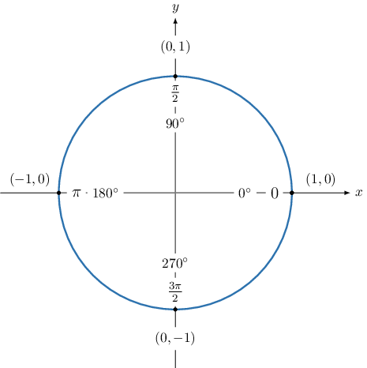

# Finding Trigonometric Ratios of Quadrantal Angles

Source: https://www.mathacademy.com/topics/269?courseId=120
Topic ID: 269

## Prerequisites

- [Extending the Trigonometric Ratios Using Angles in Radians](../algebra-ii/4037-extending-the-trigonometric-ratios-using-angles-in-radians.md)

## Lesson

### Introduction

A **quadrantal angle** is an angle whose terminal side lies on the $x$ or $y$-axis. The unit circle below illustrates the quadrantal angles that lie on the range $[0^\circ, 360^\circ).$

We can identify four points on the unit circle above,

$$

(1,0), \quad (0,1), \quad (-1,0), \quad (0,-1),

$$

that correspond to the angles

$$

0^\circ, \quad 90^\circ,\quad 180^\circ, \quad 270^\circ,

$$

in degrees, or

$$

0, \quad \dfrac{\pi}{2}, \quad \pi, \quad \dfrac{3\pi}{2},

$$

in radians.

We can use these points to find cosine and sine of quadrantal angles. First, recall that a point $(x,y)$ on the unit circle is related to the central angle $\theta$ using the following formulas:

$$

x = \cos\theta, \qquad y = \sin\theta

$$

For example, if we are asked to find the value of $\cos(\pi),$ then we just look at the $\color{blue}x$-coordinate of the corresponding point. The point is $({\color{blue}{-1}},0),$ and therefore, we get

$$

\cos(\pi)={\color{blue}{-1}}.

$$

### Example: Computing the Sine or Cosine of a Quadrantal Angle

#### Question

Find the value of $\sin{270^\circ}.$

#### Explanation

The angle $270^\circ$ is a quadrantal angle. Let's draw out the quadrantal angles on the unit circle.

From the unit circle, we see that the angle $270^\circ$ corresponds to the point $(0,-1).$

Since the sine of the angle corresponds to the $y$-coordinate, we have $\sin{270^\circ} = -1.$

### Example: Computing the Tangent or Cotangent of a Quadrantal Angle

#### Question

Find the value of $\tan\left(\dfrac{3\pi}{2}\right).$

#### Explanation

The angle $\dfrac{3\pi}{2}$ is a quadrantal angle. Let's draw out the quadrantal angles on the unit circle.

From the unit circle, we see that the angle $\dfrac{3\pi}{2}$ corresponds to the point $(0,-1).$

- Since the cosine of the angle corresponds to the $x$-coordinate, we have $\cos\left(\dfrac{3\pi}{2}\right) = 0.$

- Since the sine of the angle corresponds to the $y$-coordinate, we have $\sin\left(\dfrac{3\pi}{2}\right) = -1.$

Therefore, using the fact that $\tan{\theta} = \dfrac{\sin \theta}{\cos\theta},$ we have

$$

\tan\left(\dfrac{3\pi}{2}\right) = \dfrac{\sin\left(\dfrac{3\pi}{2}\right)}{\cos\left(\dfrac{3\pi}{2}\right)} = \dfrac{-1}{0}.

$$

However, division by zero is undefined. Therefore, $\tan\left(\dfrac{3\pi}{2}\right)$ is undefined.

### Example: Computing a Reciprocal Ratio of a Quadrantal Angle

#### Question

Find the value of $\csc \left(0\right).$

#### Explanation

The angle $0$ is a quadrantal angle. Let's draw out the quadrantal angles on the unit circle.

From the unit circle, we see that the angle $0$ corresponds to the point $(1,0).$

Since the sine of the angle corresponds to the $y$-coordinate, we have $\sin{\left(0\right)} = 0.$

Therefore, using the fact that $\csc{\theta} = \dfrac{1}{\sin\theta},$ we have

$$

\csc{\left(0\right)} = \dfrac{1}{\sin{\left(0\right)}} = \dfrac{1}{0}.

$$

However, division by zero is undefined. Therefore, $\csc\left(0\right)$ is undefined.
