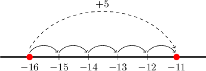
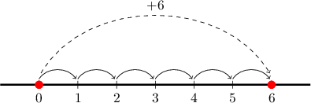
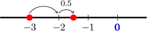

# Subtracting a Negative Number

Source: https://www.mathacademy.com/topics/297?courseId=120
Topic ID: 297

## Prerequisites

- [Adding a Positive Number to a Negative Number](../grade-7/329-adding-a-positive-number-to-a-negative-number.md)

## Lesson

### Introduction

Subtracting a negative number is the same as adding a positive number. To remember this, just think that whenever you see a minus ($-$) sign followed by a negative ($-$) sign, they combine into a single plus $(+)$ sign, like so:

$$

\,−\,(\,−\,4)

$$

A minus sign followed by a negative sign can be hard to make out, so it's considered better form to place parentheses around the negative number. For example, $9-(-4)$ is the same thing as $9 + 4.$ This gives

$$

\begin{aligned}9\,\overset{\overset{−\,(−}{}}{+}\,4) & = \\ 9\,+\,4 & = \\ 13 & .\end{aligned}

$$

Similarly,

$$

\begin{aligned} - 16 -(-5) &= - 16 + 5. \end{aligned}

$$

To compute the result of adding $5$ to $-16,$ we start at $-16$ and move $5$ places to the right:

When we do this, we land at $-11$. Therefore,

$$

-16-(-5)=-16+5=-11.

$$

### Example: Subtracting a Negative Number From a Positive Number

#### Question

Calculate the value of $0-(-6).$

#### Explanation

To subtract $-6$ from $0,$ we combine the two negative signs to make a single plus sign. This gives

$$

\begin{aligned}0−(−6) & = \\ 0+6 & = \\ 6 & .\end{aligned}

$$

### Example: Subtracting a Negative Number From a Negative Number

#### Question

Subtract $-100$ from $-85$.

#### Explanation

To subtract $−100$ from $-85,$ we combine the two negative signs to make a single plus sign. This gives

$$

\begin{aligned}−85−(−100) & = \\ −85+100 & = \\ 15 & .\end{aligned}

$$

### Example: Subtracting a Negative Decimal From a Number

#### Question

What is the value of $-3-(-1.5)$?

#### Explanation

To subtract $-1.5$ from $-3,$ we combine the two negative signs to make a single plus sign. This gives

$$

\begin{aligned}−3−(−1.5)=−3+1.5.\end{aligned}

$$

To calculate $-3+1.5,$ we start at $-3$ and move $1$ place to the right. Then, we move another $0.5$ places to the right:

Therefore,

$$

-3-(-1.5)= -1.5.

$$

### Example: Subtracting a Negative Fraction From a Fraction

#### Question

Find $\dfrac{3}{7} - \left(-\dfrac{11}{7} \right).$

#### Explanation

To subtract $-\dfrac{11}{7}$ from $\dfrac{3}{7},$ we combine the two negative signs to make a single plus sign. This gives

$$

\begin{aligned}\frac{3}{7}−(−\frac{11}{7}) & =\frac{3}{7}+\frac{11}{7}.\end{aligned}

$$

We have a common denominator of $7,$ so we combine numerators:

$$

\begin{aligned}\frac{3}{7}+\frac{11}{7}=\frac{3+11}{7}=\frac{14}{7}\end{aligned}

$$

Now, we can simplify the resulting fraction:

$$

\begin{aligned}\frac{14}{7} & =14÷7=2\end{aligned}

$$

**** If two fractions have different denominators, we need to put them over a common denominator first and ** add or subtract!

### Rules for Dealing with Pluses and Minuses

Lastly, let's recap the rules for dealing with *pluses* and *minuses* if they follow each other:

- $\mathbf{\color{blue}+} \: (\mathbf{\color{red}-}) = \mathbf{\color{red}-} \quad$ [**plus** followed by **minus** becomes **minus**]

- $\mathbf{\color{red}-} \: (\mathbf{\color{blue}+}) = \mathbf{\color{red}-} \quad$ [**minus** followed by **plus** becomes **minus**]

- $\mathbf{\color{blue}+} \: (\mathbf{\color{blue}+}) = \mathbf{\color{blue}+} \quad$ [**plus** followed by **plus** becomes **plus**]

- $\mathbf{\color{red}-} \: (\mathbf{\color{red}-}) = \mathbf{\color{blue}+} \quad$ [**minus** followed by **minus** becomes **plus**]
