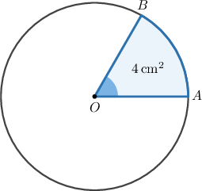
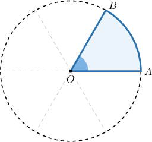
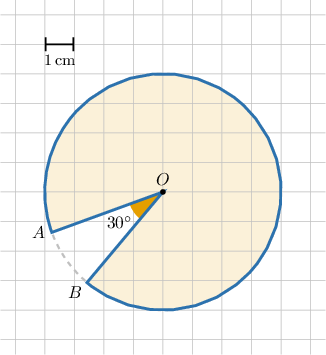
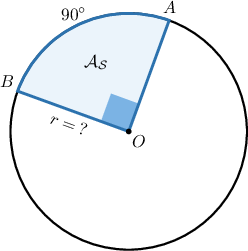
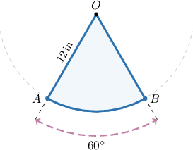

# Further Calculating Areas of Sectors

Source: https://www.mathacademy.com/topics/3533?courseId=120
Topic ID: 3533

## Prerequisites

- [Calculating Areas of Circular Sectors](../geometry/596-calculating-areas-of-circular-sectors.md)

## Lesson

### Introduction

The area of the whole circle below is $24\,\textrm{cm}^2,$ and the area of the shaded sector is $4\,\textrm{cm}^2.$ What is the measure of $\angle{AOB}?$

First, note that the ratio of the smaller area to the larger area is

$$

\dfrac{4\,\textrm{cm}^2}{24\,\textrm{cm}^2} = \dfrac{1}{6}.

$$

Therefore, the shaded area is precisely one-sixth of the total area.

Consequently, $\angle AOB$ represents $\dfrac16$ of a complete turn. So, the measure of $\angle{AOB}$ is

$$

\begin{aligned}𝑚∠𝐴𝑂𝐵 & =\frac{1}{6}⋅360^{∘}=60^{∘}.\end{aligned}

$$

### Example: Calculating the Area of a Circular Sector From a Diagram

#### Question

What is the area of the shaded circular sector shown below?

#### Explanation

From the diagram, we have that the radius $r$ of the circle is $4\,\textrm{cm}.$

Now, $\angle{AOB}$ is the central angle that intercepts the arc $\overset{\frown}{AB}.$ So the measure of the major arc (that corresponds to our sector) is

$$

360^\circ - m\angle{AOB} = 360^\circ - 30^\circ = 330^\circ.

$$

Note that the ratio of the measure of the major arc to a full circle turn is

$$

\dfrac{330^\circ}{360^\circ} = \dfrac{11}{12}.

$$

Therefore, if the area of the circle is $\mathcal{A}$, then the area of the major sector will be

$$

\begin{aligned}\frac{11}{12}⋅A & =\frac{11}{12}⋅𝜋𝑟^{2} \\ & =\frac{11}{12}⋅𝜋⋅4^{2} \\ & =\frac{44𝜋}{3}\,cm^{2}.\end{aligned}

$$

### Example: Finding an Unknown Radius Given the Area of a Circular Sector

#### Question

The area of the circular sector $AOB$ is $9\pi\,\textrm{km}^2$ and $m\overset{\frown}{AB}=90^\circ.$ Find the radius of the circle.

#### Explanation

The ratio of the measure of the arc to a full circle turn is

$$

\dfrac{m\angle{AOB}}{360^\circ} = \dfrac{m\overset{\frown}{AB}}{360^\circ}= \dfrac{90^\circ}{360^\circ} = \dfrac{1}{4}.

$$

Therefore, if the area of the circle is $\mathcal{A}$, then the area of the sector will be

$$

\begin{aligned}A_{S} & =\frac{1}{4}A \\ & =\frac{1}{4}⋅𝜋𝑟^{2}.\end{aligned}

$$

Substituting the value of the area of the sector, we get

$$

\begin{aligned}9𝜋 & =\frac{1}{4}⋅𝜋𝑟^{2} \\ 9𝜋 & =\frac{1}{4}⋅𝜋𝑟^{2} \\ 9 & =\frac{1}{4}⋅𝑟^{2} \\ 𝑟 & =±6\end{aligned}

$$

Therefore, $r=6\,\textrm{km}$, since a distance can't be negative.

### Example: Word Problems

#### Question

A $12$-inch pendulum swings through an angle of $60^\circ$, as depicted below. Find the total area swept by the pendulum.

#### Explanation

Let $r= 12\,\textrm{in}.$ Then, the area of the corresponding full circle is

$$

\pi r^2 = \pi \cdot 12^2 = 144\pi\,\textrm{in}^2.

$$

The ratio of the central angle to $360^\circ$ is

$$

\dfrac{60^\circ}{360^\circ} = \dfrac{1}6.

$$

Therefore, the area of the sector swept by the pendulum is

$$

\begin{aligned}A & =\frac{1}{6}⋅144𝜋 \\ & =24𝜋\,in^{2}.\end{aligned}

$$
