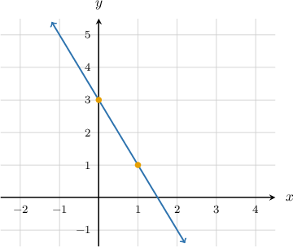
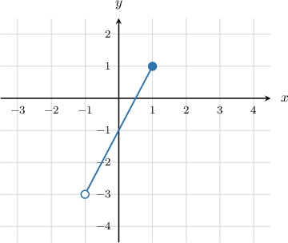
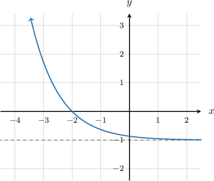
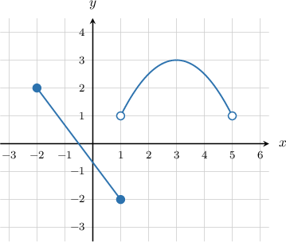

# The Range of a Function: Advanced Cases

Source: https://www.mathacademy.com/topics/3728?courseId=120
Topic ID: 3728

## Prerequisites

- [Piecewise Functions](../algebra-i/165-piecewise-functions.md)
- [End Behavior of Functions](../algebra-i/2048-end-behavior-of-functions.md)

## Lesson

### Introduction

The range of a function can be thought of as the set of $y$-values given by the function's graph. For that reason, it's often helpful to plot the function when determining its range.

For example, consider the linear function

$$

f(x) =3-2x,

$$

where $x$ is any real number. What is the range of $f(x)$?

Since this is a linear function, we only need two points to plot it. For example:

- When $x=0,$ we have $y=3.$ This gives the point $(0,3).$

- When $x=1,$ we have $y=1.$ This gives the point $(1,1).$

Plotting these two points and connecting them, we obtain the following diagram.

Notice that the graph $y=f(x)$ will cover all possible $y$-values, so the range of the function is

$$

-\infty < y < \infty.

$$

Using interval notation, we can also write the range as $(-\infty, \infty).$

Let's now look at an example of a linear function with a restricted domain.

### Example: Identifying the Range of a Linear Function

#### Question

Consider the function $f(x) = 2x-1$ for $x \in (-1,1].$ What is its range?

#### Explanation

First, we graph the function.

Then, we find the smallest and largest $y$-values on the graph.

- The smallest $y$-value is $-3.$ This occurs at the point $(-1,-3).$ However, the graph does not include this point.

- The largest $y$-value is $1.$ This occurs at the point $(1,1).$

The function covers all the $y$-values between $-3$ and $1,$ including $1$ but not including $-3.$

Therefore, the range is $-3 < y \leq 1,$ which can also be written as

$$

-3 < f(x) \leq 1.

$$

### Example: Identifying the Range of a Function by Considering Its End Behavior

#### Question

What is the range of the function $f(x),$ shown below?

#### Explanation

First, we find the smallest and largest $y$-values in the graph.

- The smallest $y$-value is $-1.$ This occurs when $x\to \infty.$ However, note that this point is not included in the graph.

- There is no largest $y$-value.

The function covers all the $y$-values between $-1$ and $\infty,$ but not including $-1.$

Therefore, the range is $-1 \lt y \lt \infty,$ which can also be written as $-1 \lt f(x) \lt \infty.$

### Example: Identifying the Range of a Piecewise Function

#### Question

What is the range of the function $f(x),$ shown above?

#### Explanation

We find the ranges of the individual pieces, and then calculate their union:

- The range of the branch defined on $x\in [-2,1]$ is $[-2,2].$

- The range of the branch defined on $x\in (1,5)$ is $(1,3].$

Therefore, the range of $f(x)$ is $[-2,2] \cup (1,3] = [-2,3].$
