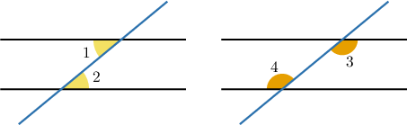
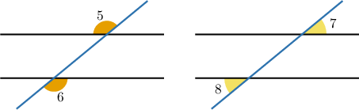
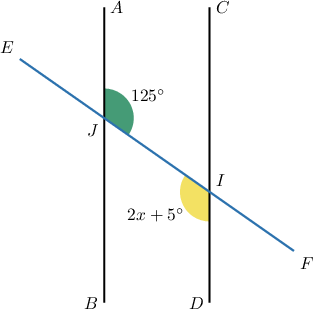
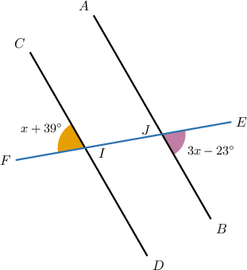
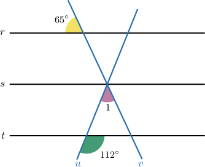
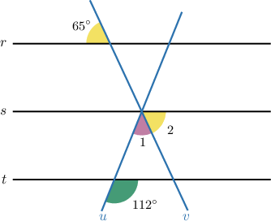
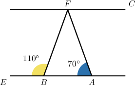
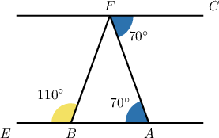

# Alternate Angles

Source: https://www.mathacademy.com/topics/4019?courseId=120
Topic ID: 4019

## Prerequisites

- [Corresponding Angles](../grade-8/421-corresponding-angles.md)

## Lesson

### Introduction

Suppose we have a pair of parallel lines cut by a transversal.

**Alternate interior angles** are the pairs of angles on *alternate* (opposite) sides of the transversal and are *interior* to (inside of) the parallel lines. These pairs of angles always have equal measure.

**Alternate external angles** are the pairs of angles on *alternate* (opposite) sides of the transversal and are *exterior* to (outside of) the parallel lines. These pairs of angles always have equal measure.

### Example: Finding Alternate Interior Angles

#### Question

Solve for $x$ in the figure above given that $\overset{\longleftrightarrow}{AB} \parallel \overset{\longleftrightarrow}{CD}.$

#### Explanation

The parallel lines $\overset{\longleftrightarrow}{AB} \parallel \overset{\longleftrightarrow}{CD}$ are cut by a transversal $\overset{\longleftrightarrow}{EF}.$

The angles $\angle{JID}$ and $\angle{IJA}$ are interior to the parallel lines and are on opposite sides of the transversal. So, they are alternate interior angles, and consequently, they have the same measure.

Setting the measures of $\angle{JID}$ and $\angle{IJA}$ equal to each other, we have an equation that we can solve for $x\mathbin{:}$

$$

\begin{aligned}𝑚∠𝐽𝐼𝐷 & =𝑚∠𝐼𝐽𝐴 \\ 2𝑥+5^{∘} & =125^{∘} \\ 2𝑥 & =120^{∘} \\ \frac{2𝑥}{2} & =\frac{120^{∘}}{2} \\ \frac{2𝑥}{2} & =60^{∘} \\ 𝑥 & =60^{∘}\end{aligned}

$$

### Example: Finding Alternate Exterior Angles

#### Question

Solve for $x$ in the figure above given that $\overset{\longleftrightarrow}{AB} \parallel \overset{\longleftrightarrow}{CD}.$

#### Explanation

The parallel lines $\overset{\longleftrightarrow}{AB} \parallel \overset{\longleftrightarrow}{CD}$ are cut by a transversal $\overset{\longleftrightarrow}{EF}.$

The angles $\angle{FIC}$ and $\angle{EJB}$ are exterior to the parallel lines and are on opposite sides of the transversal. So, they are alternate exterior angles, and consequently, they have the same measure.

Setting the measures of $\angle{FIC}$ and $\angle{EJB}$ equal to each other, we have an equation that we can solve for $x\mathbin{:}$

$$

\begin{aligned}𝑚∠𝐹𝐼𝐶 & =𝑚∠𝐸𝐽𝐵 \\ 𝑥+39^{∘} & =3𝑥−23^{∘} \\ 39^{∘} & =2𝑥−23^{∘} \\ 62^{∘} & =2𝑥 \\ 2𝑥 & =62^{∘} \\ \frac{2𝑥}{2} & =\frac{62^{∘}}{2} \\ \frac{2𝑥}{2} & =31^{∘} \\ 𝑥 & =31^{∘}\end{aligned}

$$

### Example: Solving Problems With Alternate Angles

#### Question

Given that $r$, $s$ and $t$ in the above diagram are parallel, find $m\angle 1.$

#### Explanation

Consider $\angle 2$ in the diagram below.

Notice that $\angle 2$ and the angle whose measure is $65^\circ$ are alternate exterior angles formed when the transversal $v$ cuts the parallel lines $r$ and $s.$ Hence,

$$

m\angle 2 = 65^{\circ}.

$$

Also, notice that the angle determined by $\angle 1$ and $\angle 2$ and the angle whose measure is $112^\circ$ are corresponding angles formed when the transversal $u$ cuts the parallel lines $s$ and $t.$ Hence,

$$

m\angle 1 + m\angle 2 = 112^{\circ}.

$$

Now, substituting $m\angle 2$ into the equation, we can find $m\angle1 \mathbin{:}$

$$

\begin{aligned}𝑚∠1+𝑚∠2 & =112^{∘} \\ 𝑚∠1+65^{∘} & =112^{∘} \\ 𝑚∠1 & =47^{∘}\end{aligned}

$$

### Example: Further Solving Problems With Alternate Angles

#### Question

Given that $\overleftrightarrow{AB} \parallel \overleftrightarrow{CF},$ what is the measure of $\angle AFB?$

#### Explanation

Notice that $\angle{BAF}$ and $\angle{AFC}$ are alternate interior angles formed when the transversal $\overleftrightarrow{AF}$ cuts the parallel lines $\overleftrightarrow{AB}$ and $\overleftrightarrow{CF}.$ Hence,

$$

m\angle{AFC} = m\angle{BAF} = 70^{\circ}\,.

$$

Also, notice that $\angle{FBE}$ and $\angle{BFC}$ are alternate interior angles formed when the transversal $\overleftrightarrow{BF}$ cuts the parallel lines $\overleftrightarrow{AB}$ and $\overleftrightarrow{CF}.$ Hence,

$$

m\angle{BFC} =m\angle{FBE} = 110^{\circ}\,.

$$

Now, using the angle addition postulate, we can find $\angle{AFB}\mathbin{:}$

$$

\begin{aligned}𝑚∠𝐴𝐹𝐵 & =𝑚∠𝐵𝐹𝐶−𝑚∠𝐴𝐹𝐶 \\ & =110^{∘}−70^{∘} \\ & =40^{∘}\end{aligned}

$$
