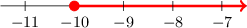

# Further Solving Linear Inequalities

Source: https://www.mathacademy.com/topics/4034?courseId=120
Topic ID: 4034

## Prerequisites

- [Solving Linear Equations by Clearing a Rational Expression](../grade-7/651-solving-linear-equations-by-clearing-a-rational-expression.md)
- [Representing Solutions to Inequalities on Number Lines](../grade-7/4031-representing-solutions-to-inequalities-on-number-lines.md)

## Lesson

### Introduction

Let's consider the following inequality:

$$

7x -2 < 5x - 18

$$

As usual, we solve the inequality just like we would solve an equation.

First, we apply the addition principle. We start by subtracting $5x$ from both sides:

$$

\begin{aligned}7𝑥−2 & <5𝑥−18 \\ 7𝑥−2−5𝑥 & <5𝑥−18−5𝑥 \\ 2𝑥−2 & <−18\end{aligned}

$$

Then, we add $2$ to both sides:

$$

\begin{aligned}2𝑥−2 & <−18 \\ 2𝑥−2+2 & <−18+2 \\ 2𝑥 & <−16\end{aligned}

$$

Finally, we use the multiplication principle, dividing both sides by $2{:}$

$$

\begin{aligned}2𝑥 & <−16 \\ \frac{2𝑥}{2} & <\frac{−16}{2} \\ 𝑥 & <−8\end{aligned}

$$

Therefore, the solution is $x < -8.$

### Example: Solving Linear Inequalities With Variables on Both Sides

#### Question

Solve the inequality $5x+13 \ge 3x-7$ and sketch the solution on the number line.

#### Explanation

We solve the inequality just like we would solve an equation.

First, we apply the addition principle:

$$

\begin{aligned}5𝑥+13 & ≥3𝑥−7 \\ 5𝑥+13−3𝑥 & ≥3𝑥−7−3𝑥 \\ 2𝑥+13 & ≥−7 \\ 2𝑥+13−13 & ≥−7−13 \\ 2𝑥 & ≥−20\end{aligned}

$$

Then, we use the multiplication principle:

$$

\begin{aligned}2𝑥 & ≥−20 \\ \frac{2𝑥}{2} & ≥\frac{−20}{2} \\ 𝑥 & ≥−10\end{aligned}

$$

Therefore, the solution is $x \ge -10.$

Our solution can be expressed using a number line, as shown below.

### Clearing Rational Expression in Linear Inequalities

Now, let's solve an inequality that contains a rational expression:

$$

\dfrac{2y-1}{3} \lt 5

$$

First, we clear the rational expression by multiplying both sides by $3{:}$

$$

\begin{aligned}\frac{2𝑦−1}{3} & <5 \\ 3⋅(\frac{2𝑦−1}{3}) & <3⋅5 \\ 3⋅(\frac{2𝑦−1}{3}) & <15 \\ 2𝑦−1 & <15\end{aligned}

$$

Then, we apply the addition and multiplication principles:

$$

\begin{aligned}2𝑦−1 & <15 \\ 2𝑦−1+1 & <15+1 \\ 2𝑦 & <16 \\ \frac{2𝑦}{2} & <\frac{16}{2} \\ 𝑦 & <8\end{aligned}

$$

Therefore, the solution is $y < 8.$

### Example: Solving Inequalities by Clearing a Rational Expression

#### Question

Solve the inequality $\dfrac{2-5y}{3} \le 4.$

#### Explanation

First, we clear the rational expression by multiplying both sides by $3{:}$

$$

\begin{aligned}\frac{2−5𝑦}{3} & ≤4 \\ 3⋅(\frac{2−5𝑦}{3}) & ≤3⋅4 \\ 3⋅(\frac{2−5𝑦}{3}) & ≤3⋅4 \\ 2−5𝑦 & ≤12\end{aligned}

$$

Then, we apply the addition and multiplication principles.

Remember, when we divide an inequality by a negative number, we need to flip the inequality sign:

$$

\begin{aligned}2−5𝑦 & ≤12 \\ 2−5𝑦−2 & ≤12−2 \\ −5𝑦 & ≤10 \\ \frac{−5𝑦}{−5} & \,\,≥\,\,\frac{10}{−5} \\ 𝑦 & ≥−2\end{aligned}

$$

Therefore, the solution is $y \ge -2.$

### Example: Inequalities With Rational Expression and Variables on Both Sides

#### Question

Solve the inequality $4y -1 > \dfrac {5y - 2} {3}.$

#### Explanation

First, we clear the rational expression by multiplying both sides by $3{:}$

$$

\begin{aligned}4𝑦−1 & >\frac{5𝑦−2}{3} \\ 3⋅(4𝑦−1) & >3⋅(\frac{5𝑦−2}{3}) \\ 3⋅(4𝑦−1) & >3⋅(\frac{5𝑦−2}{3}) \\ 3⋅(4𝑦−1) & >5𝑦−2 \\ 12𝑦−3 & >5𝑦−2\end{aligned}

$$

Then, we apply the addition and multiplication principles:

$$

\begin{aligned} 12y-3 &> 5y-2 \\\[5pt] 12y-3-5y &> 5y-2-5y \\\[5pt] 7y-3 &> {-2} \\\[5pt] 7y-3 +3 &> {-2} +3 \\\[5pt] 7y &> {1} \\\[5pt] \dfrac{7y}{7} &> \dfrac{1}7 \\\[5pt] y &> \dfrac{1}{7} \end{aligned}

$$

Therefore, the solution is $y > \dfrac17.$

### Clearing Two Rational Expressions in Linear Inequalities

Finally, let's consider an inequality that contains rational expressions on both sides:

$$

\dfrac{x+1}{4} \leq \dfrac{x}{2}

$$

The rational expressions on both sides of this inequality have positive denominators $4$ and $2.$ The least common multiple of $4$ and $2$ is ${\color{red}{4}}.$ Thus, we can clear the rational expressions by multiplying both sides of the inequality ${\color{red}{4}}.$ This gives

$$

\begin{aligned}\frac{𝑥+1}{4} & ≤\frac{𝑥}{2} \\ 4⋅(\frac{𝑥+1}{4}) & ≤4⋅(\frac{𝑥}{2}) \\ 𝑥+1 & ≤2𝑥.\end{aligned}

$$

Then, we apply the addition and multiplication principles.

Remember, when we divide an inequality by a negative number, we need to flip the inequality sign:

$$

\begin{aligned}𝑥+1 & ≤2𝑥 \\ 𝑥+1−2𝑥 & ≤2𝑥−2𝑥 \\ 1−𝑥 & ≤0 \\ 1−𝑥−1 & ≤0−1 \\ −𝑥 & ≤−1 \\ \frac{−𝑥}{(−1)} & \,\,≥\,\,\frac{−1}{(−1)} \\ 𝑥 & ≥1\end{aligned}

$$

Therefore, the solution is $x\geq 1.$

### Example: Solving Inequalities by Clearing Two Rational Expressions

#### Question

Solve the inequality $\dfrac{3a-2}{5} > \dfrac{4+6a}{2}.$

#### Explanation

First, we clear the rational expressions by multiplying both sides of the inequality by the lowest common positive multiple of the denominators:

$$

\begin{aligned}\frac{3𝑎−2}{5} & >\frac{4+6𝑎}{2} \\ 10⋅(\frac{3𝑎−2}{5}) & >10⋅(\frac{4+6𝑎}{2}) \\ 2⋅(3𝑎−2) & >5⋅(4+6𝑎) \\ 6𝑎−4 & >20+30𝑎\end{aligned}

$$

Then, we apply the addition and multiplication principles.

Remember, when we divide an inequality by a negative number, we need to flip the inequality sign:

$$

\begin{aligned}6𝑎−4 & >20+30𝑎 \\ 6𝑎−4−30𝑎 & >20+30𝑎−30𝑎 \\ −4−24𝑎 & >20 \\ −4−24𝑎+4 & >20+4 \\ −24𝑎 & >24 \\ \frac{−24𝑎}{−24} & \,\,<\,\,\frac{24}{−24} \\ 𝑎 & <−1\end{aligned}

$$

Therefore, the solution is $a < -1.$
