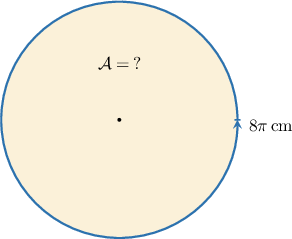
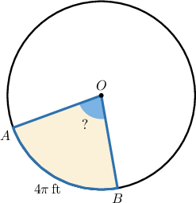
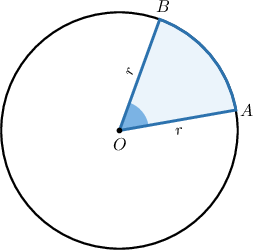
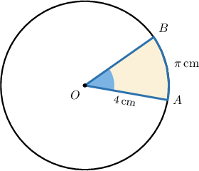
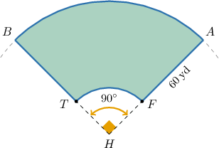

# Problem Solving With Circles

Source: https://www.mathacademy.com/topics/494?courseId=120
Topic ID: 494

## Prerequisites

- [The Pythagorean Theorem](../geometry/433-the-pythagorean-theorem.md)
- [Calculating Arc Lengths of Circular Sectors](../geometry/597-calculating-arc-lengths-of-circular-sectors.md)
- [The Area Between Two Shapes](../grade-7/1435-the-area-between-two-shapes.md)
- [Further Calculating Areas of Sectors](../geometry/3533-further-calculating-areas-of-sectors.md)

## Lesson

### Introduction

Recall that for a circle of radius $r,$ the area is given by

$$

\mathcal A = \pi r^2

$$

and the circumference is given by

$$

C = 2\pi r.

$$

When solving problems that involve circles, we often need to use the formula for the area of a circle *and* the formula for the circumference.

For instance, how do we find the area of a circle given that it has a circumference of $C=8\pi\,\textrm{cm}?$

The formula for the circumference of a circle is $C = 2\pi r,$ where $r$ is the radius. Using the fact that $C = 8\pi,$ we can solve for $r,$ as follows:

$$

\begin{aligned}𝐶 & =2𝜋𝑟 \\ 8𝜋 & =2𝜋𝑟 \\ 8𝜋 & =2𝜋𝑟 \\ 8 & =2𝑟 \\ 𝑟 & =4\,cm\end{aligned}

$$

Therefore, the area of the circle is

$$

\begin{aligned}A & =𝜋𝑟^{2} \\ & =𝜋⋅4^{2} \\ & =16𝜋\,cm^{2}.\end{aligned}

$$

### Example: Solving Problems Involving Areas of Circles

#### Question

The area of the circle above is $81\pi\,\textrm{ft}^2,$ and the length of the arc $\overset{\frown}{AB}$ is $4\pi\,\textrm{ft}.$ What is the measure of $\angle{AOB}?$

#### Explanation

The formula for the area of a circle is $\mathcal{A}=\pi r^2,$ where $r$ is the radius. Using the fact that $\mathcal A = 81\pi\,\textrm{ft}^2,$ we can solve for $r,$ as follows:

$$

\begin{aligned}A & =𝜋𝑟^{2} \\ 81𝜋 & =𝜋𝑟^{2} \\ 81𝜋 & =𝜋𝑟^{2} \\ 81 & =𝑟^{2} \\ 𝑟 & =9\end{aligned}

$$

We disregard the negative value since the radius can't be negative.

Therefore, the circumference is

$$

\begin{aligned}𝐶 & =2𝜋𝑟 \\ & =2𝜋⋅9 \\ & =18𝜋.\end{aligned}

$$

Now, the ratio of the length of $\overset{\frown}{AB}$ to the circumference $C$ is

$$

\dfrac{4\pi}{18\pi} = \dfrac{2}{9}.

$$

Therefore, the sector is $\dfrac{2}{9}$ of the whole circle, and we obtain

$$

m\angle{AOB} = 360^\circ \cdot\dfrac{2}{9} = 80^\circ.

$$

### Example: Solving Problems Involving the Circumference of a Circle

#### Question

Suppose that the numerical value of $\mathcal{A}+ C$ is $80 \pi$, where $\mathcal{A}$ is the area of a circle and $C$ is the circumference. Find the diameter of the circle.

#### Explanation

Let $r$ denote the radius of the circle. Then, $\mathcal{A} = \pi r^2$ and $C = 2 \pi r.$

Given that $\mathcal{A}+ C = 80 \pi,$ we can now solve for $r,$ as follows:

$$

\begin{aligned}A+𝐶 & =80𝜋 \\ 𝜋𝑟^{2}+2𝜋𝑟 & =80𝜋 \\ 𝜋(𝑟^{2}+2𝑟) & =80𝜋 \\ 𝜋(𝑟^{2}+2𝑟) & =80𝜋 \\ 𝑟^{2}+2𝑟 & =80 \\ 𝑟^{2}+2𝑟−80 & =0 \\ (𝑟+10)(𝑟−8) & =0\end{aligned}

$$

We disregard the negative value since the radius can't be negative. Therefore, $r=8.$

Finally, the diameter of the circle is

$$

\begin{aligned}𝑑 & =2𝑟 \\ & =2⋅8 \\ & =16.\end{aligned}

$$

### Problems Involving Circular Sectors

Recall that any two radii of a circle form an arc $\overset{\frown}{AB}$ and a sector $OAB$ with central angle $\angle AOB.$

The key idea for solving problems that involve circular sectors is to work with the ratio of the central angle $m\angle{AOB}$ to that of a full turn of $360^\circ.$ Let

$$

k = \dfrac{m\angle{AOB}}{360^\circ},

$$

and let $\mathcal{A}$ and $C$ denote the area of the circle and its circumference, respectively. Then,

- the length of the arc $\overset{\frown}{AB}$ is $k \cdot C,$ and

- the area of the sector is $k \cdot \mathcal{A}.$

### Example: Solving Problems Involving the Area of a Circular Sector

#### Question

Find the area of the shaded region below given that the radius of the circle is $4\,\textrm{cm}$ and the length of the arc $\overset{\frown}{AB}$ is $\pi\,\textrm{cm}.$

#### Explanation

First, we will find the fraction of the circle's area that corresponds to the shaded region. This is the same as the ratio of the arc length of the shaded region to the full circumference of the circle.

First, let's find the circumference of the circle:

$$

\begin{aligned}𝐶 & =2𝜋𝑟 \\ & =2𝜋⋅4 \\ & =8𝜋\,cm\end{aligned}

$$

We're told that the length of the arc $\overset{\frown}{AB}$ is $\pi \,\textrm{cm},$ so the ratio of the length of $\overset{\frown}{AB}$ to the circumference $C$ is

$$

\dfrac{ \pi}{8\pi} = \dfrac 18.

$$

This means the central angle $\angle{AOB}$ corresponding to the arc $\overset{\frown}{AB}$ covers $\dfrac{1}{8}$ of a full turn, which means that the area $\mathcal A_S$ of our sector covers $\dfrac{1}{8}$ of the area of the entire circle.

Therefore, we can compute the area of the sector ${AOB}$ as follows:

$$

\begin{aligned}A_{𝑆} & =\frac{1}{8}𝜋𝑟^{2} \\ & =\frac{1}{8}𝜋⋅4^{2} \\ & =2𝜋\,cm^{2}\end{aligned}

$$

### Example: Problem Solving With Circles: Word Problems

#### Question

A baseball diamond has a length of $80$ yards from the home plate $H$ to the outfield fence $\overset{\frown}{AB}.$ The lines from the home plate to first base $A$ and from the home plate to third base $B$ form an angle of $90^\circ,$ as shown in the figure below. What is the area of the shaded region that makes up the outfield?

#### Explanation

The central angle corresponding to the arc $\overset{\frown}{AB}$ is $\angle{AHB}.$ Notice that

$$

k= \dfrac{90^\circ}{360^\circ} = \dfrac{1}{4},

$$

where $k$ represents the proportion of a full circle corresponding to $\angle AHB.$

Now, from the problem statement, we can deduce that the length of the inner radius $\overline{HF}$ is

$$

HF = 80-60 = 20 \, \textrm{yd}.

$$

Let's find the area of the inner sector (the part that corresponds to the infield):

$$

\begin{aligned}A_{inner} & =𝑘⋅𝜋𝑟^{2} \\ & =\frac{1}{4}⋅𝜋⋅20^{2} \\ & =100𝜋\,yd^{2}\end{aligned}

$$

Similarly, we find the area of the outer sector:

$$

\mathcal{A}_{\textrm{outer}} = \dfrac 1{4} \cdot \pi \cdot 80^2 = 1\, 600\pi \, \textrm{yd}^2

$$

Therefore, the total area of the region that makes up the outfield is

$$

\begin{aligned}A_{shaded} & =A_{outer}−A_{inner} \\ & =1\,600𝜋−100𝜋 \\ & =1\,500𝜋\,yd^{2}.\end{aligned}

$$
