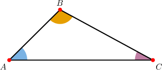
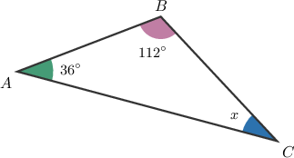
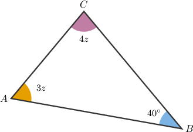
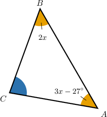

# Interior Angles of Triangles

Source: https://www.mathacademy.com/topics/496?courseId=120
Topic ID: 496

## Prerequisites

- [Measures of Segments](../grade-7/1379-measures-of-segments.md)
- [Right, Straight, Full, and Null Angles](../grade-4/1509-right-straight-full-and-null-angles.md)
- [Congruent Angles](../grade-7/3554-congruent-angles.md)

## Lesson

### Introduction

A **triangle** is a geometric shape that consists of three points connected by three line segments, as shown below.

For this triangle,

- the line segments $\overline{AB}$, $\overline{BC}$ and $\overline{CA}$ are the **sides** of the triangle,

- the points $\color{red}A$, $\color{red}B$ and $\color{red}C$ are the **vertices** of the triangle,

- the angles $\angle{A}$, $\angle{B}$ and $\angle{C}$ formed by the sides are called the **interior angles** of the triangle.

To denote a triangle, we use the symbol $\boldsymbol{\triangle}$ and list its vertices (in any order). So, the above diagram shows us

$$

\triangle ABC.

$$

It can be shown that all triangles have the following property:

*The sum of the measures of the interior angles of any triangle is always equal to $180^\circ.$*

For example, in $\triangle ABC$ shown above, the interior angle theorem tells us that

$$

m\angle{A} + m\angle{B} + m\angle{C} = 180^\circ .

$$

Therefore, if we know the measures of two angles in a triangle, we can calculate the value of the other.

### Example: Finding a Missing Angle in a Triangle

#### Question

Find the value of $x$ in the triangle above.

#### Explanation

Since the sum of the measures of the interior angles in any triangle is equal to $180^\circ$, we have

$$

\begin{aligned}𝑚∠𝐴+𝑚∠𝐵+𝑚∠𝐶 & =180^{∘} \\ 36^{∘}+112^{∘}+𝑥 & =180^{∘} \\ 148^{∘}+𝑥 & =180^{∘} \\ 𝑥 & =32^{∘}.\end{aligned}

$$

### Example: Calculating an Unknown Quantity From a Triangle

#### Question

Find the measure of $\angle C.$

#### Explanation

Since the sum of the measures of the interior angles of a triangle is $180^\circ$, we have

$$

\begin{aligned}3𝑧+4𝑧+40^{∘} & =180^{∘} \\ 7𝑧+40^{∘} & =180^{∘} \\ 7𝑧 & =140^{∘} \\ 𝑧 & =20^{∘}.\end{aligned}

$$

Therefore,

$$

\begin{aligned}𝑚∠𝐶 & =4𝑧 \\ & =4(20^{∘}) \\ & =80^{∘}.\end{aligned}

$$

### Example: Calculating an Unknown Quantity Given a Description of a Triangle

#### Question

Consider a triangle $\triangle ABC$, where $m\angle{A} = 55^\circ$, $m\angle B = x + 10^\circ$, and $m\angle C = 3x - 5^\circ.$ Find the value of $x.$

#### Explanation

The sum of the measures of the interior angles must be $180^\circ.$ Therefore,

$$

\begin{aligned}55^{∘}+(𝑥+10^{∘})+(3𝑥−5^{∘}) & =180^{∘} \\ 60^{∘}+4𝑥 & =180^{∘} \\ 4𝑥 & =120^{∘} \\ 𝑥 & =30^{∘}.\end{aligned}

$$

### Example: Finding Angles in Triangles With Congruent Angles

#### Question

Find the measure of angle $C$ given that $m\angle{A} = m\angle{B}.$

#### Explanation

Using $m\angle{A} = m\angle{B},$ we get

$$

\begin{aligned}𝑚∠𝐴 & =𝑚∠𝐵 \\ 3𝑥−27^{∘} & =2𝑥 \\ 𝑥 & =27^{∘}.\end{aligned}

$$

Consequently, substituting $x=27^\circ$ in the expression for $m\angle B,$ we get

$$

m\angle{B}=2(27^\circ)=54^\circ.

$$

Now, we can find $m\angle C$ using the fact that the internal angles of any triangle sum to $180^\circ$:

$$

\begin{aligned}𝑚∠𝐴+𝑚∠𝐵+𝑚∠𝐶 & =180^{∘} \\ 2𝑚∠𝐵+𝑚∠𝐶 & =180^{∘} \\ 2⋅54^{∘}+𝑚∠𝐶 & =180^{∘} \\ 108^{∘}+𝑚∠𝐶 & =180^{∘} \\ 𝑚∠𝐶 & =72^{∘}\end{aligned}

$$
