# Segment Bisectors and the Perpendicular Bisector Theorem

Source: https://www.mathacademy.com/topics/521?courseId=120
Topic ID: 521

## Prerequisites

- [Midpoints](../grade-7/1463-midpoints.md)
- [Parallel and Perpendicular Lines](../grade-4/3979-parallel-and-perpendicular-lines.md)

## Lesson

### Introduction

Two intersecting lines are **perpendicular** if they form a right angle (an angle that measures $90^\circ$).

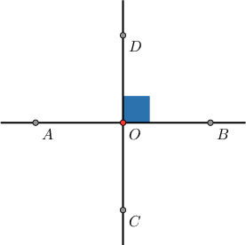

For example, the two lines above are perpendicular because the angle $\angle BOD$ is a right angle.

The opposite is also true: if two lines are perpendicular, then they meet at a right angle.

As you may have noticed already, when two lines are perpendicular, they don't form only one right angle. All the four angles formed by the intersection are right angles!

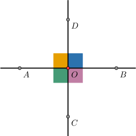

### Bisectors

A segment **bisector** is any segment, line, or ray that splits another segment into two congruent parts.

For example, in the diagram below, $\overset{\longleftrightarrow}{AB}$ is a bisector of the segment $\overline{ST}.$

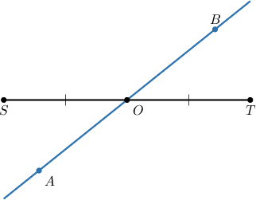

A **perpendicular bisector** is any segment, line, or ray that bisects another segment *and is perpendicular to that segment*.

For example, in the diagram below, $\overset{\longleftrightarrow}{UV}$ is a perpendicular bisector of the segment $\overline{ST}.$

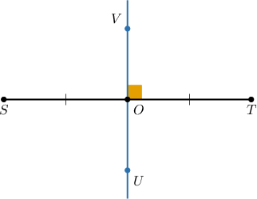

### Example: Identifying Properties of Perpendicular Bisectors

#### Question

Which of the following diagrams represents a perpendicular bisector of $\overline{AB}?$

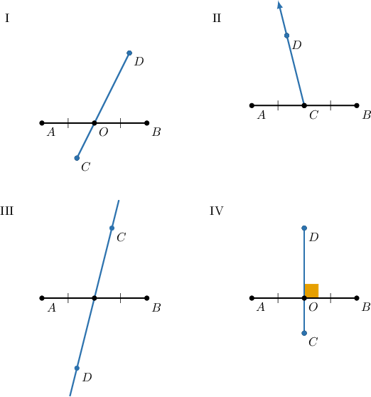

#### Explanation

A perpendicular bisector of $\overline{AB}$:

- must split $\overline{AB}$ in half, and

- must be perpendicular to $\overline{AB}$.

Among the given options, only diagram IV shows a perpendicular bisector to the line segment $\overline{AB}.$

Notice that in diagrams I, II and III we have bisectors but they are not perpendicular to $\overline{AB}.$

### The Perpendicular Bisector Theorem

The **perpendicular bisector theorem** states that:

In a plane, if a point is on the perpendicular bisector of a segment, then it is equidistant from the endpoints of the segment.

For example, in the diagram below, we see that $\overset{\longleftrightarrow}{CD}$ is the perpendicular bisector of $\overline{AB}.$

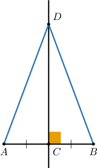

Consequently, we can conclude that the point $D$ is equidistant from the endpoints of $\overline{AB}.$ So we have $AD=BD.$

### Example: Applying the Perpendicular Bisector Theorem

#### Question

Solve for $x$ in the figure below given that $\overset{\longleftrightarrow}{CD}$ is the perpendicular bisector of $\overline{AB}.$

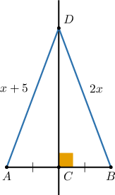

#### Explanation

By the perpendicular bisector theorem, a point on the perpendicular bisector of a segment is equidistant from the endpoints of the segment. Hence, we have:

$$

\begin{aligned}𝐷𝐴 & =𝐷𝐵 \\ 𝑥+5 & =2𝑥 \\ 𝑥 & =5\end{aligned}

$$

### The Converse of the Perpendicular Bisector Theorem

The **converse of the perpendicular bisector theorem** states that:

In a plane, if a point is equidistant from the endpoints of a segment, then it is on the perpendicular bisector of the segment.

For example, in the diagram below, we see that $\overset{\longleftrightarrow}{CD}$ is perpendicular to $\overline{AB},$ and the point $D$ is equidistant from the endpoints of $\overline{AB}.$

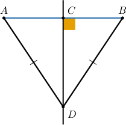

Therefore, we can conclude that $\overset{\longleftrightarrow}{CD}$ is the perpendicular bisector of $\overline{AB}.$ In particular, we conclude that $AC = BC.$

### Example: Applying the Converse of the Perpendicular Bisector Theorem

#### Question

Solve for $x$ in the figure below given that $AD=BD$ and $AE=BE.$

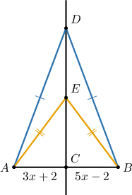

#### Explanation

By the converse of the perpendicular bisector theorem, a point equidistant from the endpoints of a segment lies on the perpendicular bisector of the segment.

Here, the points $D$ and $E$ are both equidistant from the endpoints of $\overline{AB}.$ Therefore, $D$ and $E$ both lie on the perpendicular bisector of $\overline{AB}.$

Since only one line can be drawn through two given points, the line $\overset{\longleftrightarrow}{DE}$ is the perpendicular bisector of $\overline{AB}.$

In particular, we have that $AC=BC.$ We can use this equation to solve for $x\mathbin{:}$

$$

\begin{aligned}𝐴𝐶 & =𝐵𝐶 \\ 3𝑥+2 & =5𝑥−2 \\ 4 & =2𝑥 \\ 𝑥 & =2\end{aligned}

$$

### Basic Properties of Perpendicular Lines

The most important property of perpendicular lines is the following.

Given a line $l$ and a point $P$, there is one and only one line $m$ that passes through $P$ and is perpendicular to $l$.

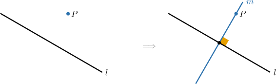

Other nice properties include the following:

- If two distinct lines are perpendicular to the same (third) line, then these two lines are parallel. For example, in the figure below, both lines $n$ and $m$ are perpendicular to the line $l$. As a result, $n \parallel m$.

- If a line is perpendicular to one of two parallel lines, then that line is also perpendicular to the second parallel line.

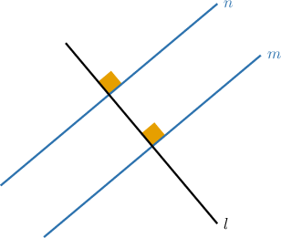

#### Symbol $\perp$

Finally, if a line $p$ is perpendicular to a line $q$, we can denote it without words using the symbol $\perp$ (perpendicular), as follows:

$$

p \perp q

$$

This reads as "*$p$ is perpendicular to $q$*."
