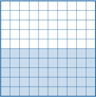
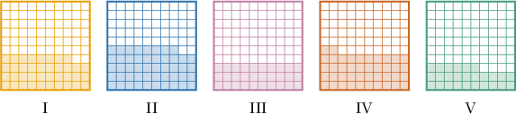
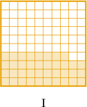
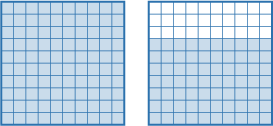
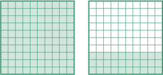
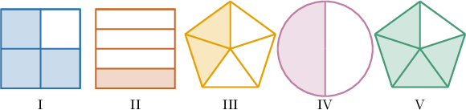
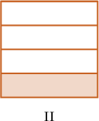

# Understanding Percentages Using Models

Source: https://www.mathacademy.com/topics/562?courseId=120
Topic ID: 562

## Prerequisites

- [Two-Digit by One-Digit Division](../grade-5/535-two-digit-by-one-digit-division.md)
- [Two-Digit by One-Digit Multiplication](../grade-5/2392-two-digit-by-one-digit-multiplication.md)
- [Dividing by 10, 100, and 1,000 Using the Pattern of Zeros](../grade-4/3882-dividing-by-10-100-and-1-000-using-the-pattern-of-zeros.md)
- [Converting Mixed Numbers to Improper Fractions](../grade-4/3901-converting-mixed-numbers-to-improper-fractions.md)

## Lesson

### Introduction

A **percentage** is another way of expressing a fraction that's used often in everyday situations. The word **percent** means "out of $100.$"

Let's take a look at the square below.

Notice that

- the square has been divided into $100$ equal parts, and

- $\color{blue}50$ of those parts are shaded.

Since $\color{blue}50$ out of $100$ parts are shaded, we say that "$\color{blue}50$ percent of the square is shaded."

We have a special symbol that we use instead of the word percent. This symbol is written as follows:

$$

\Large{\%}

$$

Using this symbol, we say that "${\color{blue}{5}0}\%$ of the square is shaded."

### Example: Interpreting Percents Less Than 100% Using 100-Piece Models

#### Question

Which of the following models shows $38\%?$

#### Explanation

Recall that $38\%$ is the same as $38$ out of $100.$

So, we need a model that shows $38$ shaded tiles out of $100.$ The correct model is:

### Percentages Greater Than 100%

When more than $100$ pieces are shaded in a model where $100$ pieces represent a whole, the percentage will be greater than $100\%.$

Let's take a look at the model below, where one large square represents one whole:

In this model, $170$ tiles are shaded. Therefore, this model represents $170\%.$

### Example: Interpreting Percentages Greater Than 100% Using 100-Piece Models

#### Question

Given that a large square represents a whole, draw a model that shows $130\%.$

#### Explanation

First, recall that $130\%$ is the same as $130$ out of $100.$

So, we need a model where $100$ tiles represent one whole, and $130$ tiles are shaded. This model is as follows:

### Representing Percentages Using Other Models

How do we find the percentage represented by a fraction model when the model isn't split into $100$ equal pieces?

The answer is to express the fraction as an equivalent fraction with a denominator of $100.$

As an example, let's consider the model below:

This model represents the following fraction:

$$

\dfrac{4}{5}

$$

To make an equivalent fraction with a denominator of $100,$ we multiply both the numerator and the denominator by $20\mathbin{:}$

$$

\dfrac{4}{5} = \dfrac{4 \times 20}{5 \times 20} = \dfrac{80}{100}

$$

Since $\dfrac{80}{100}$ is equivalent to $80\%,$ we conclude that our fraction model represents $80\%.$

We can also use equivalent fractions to construct a simplified fraction model for a given percent. Let's see an example.

### Example: Interpreting Percentages Less Than 100% Using Other Models

#### Question

Which of the models below represents $25\%?$

#### Explanation

First, recall that $25\%$ is the same as $\dfrac{25}{100}.$

We now need to simplify this fraction. Dividing the numerator and denominator by $5,$ we get

$$

\dfrac{25}{100} = \dfrac{25\div 5}{100\div 5} = \dfrac{5}{20}.

$$

Finally, we divide the numerator and denominator by $5$ once more:

$$

\dfrac{5}{20} = \dfrac{5\div 5}{20\div 5} = \dfrac14

$$

The model that shows $\dfrac{1}{4}$ is:

### Example: Interpreting Percentages Greater Than 100% Using Other Models

#### Question

If a $10$-sided polygon represents a whole, draw a model representing $110\%.$

#### Explanation

First, recall that $110\%$ is the same as $\dfrac{110}{100}.$

Now, we simplify the fraction. Dividing the numerator and denominator by $10,$ we get

$$

\dfrac{110}{100} = \dfrac{110 \div 10}{100 \div 10} = \dfrac{11}{10}.

$$

Finally, we write $\dfrac{11}{10}$ as a mixed number:

$$

\dfrac{11}{10} = 1 \, \text{R} \, 1 = 1 \, \dfrac{1}{10}

$$

Therefore, our model could be the following:

