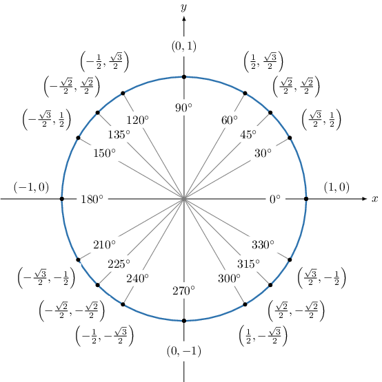
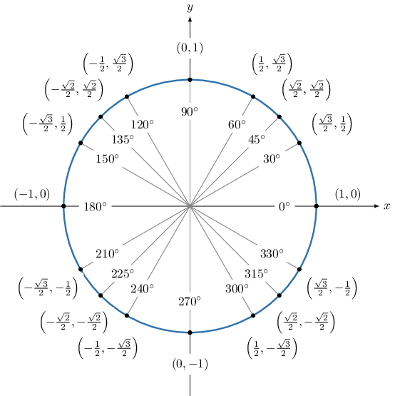

# Trigonometric Ratios of Large Angles in Degrees

Source: https://www.mathacademy.com/topics/6179?courseId=120
Topic ID: 6179

## Prerequisites

- [Further Extensions of the Special Trigonometric Ratios](../algebra-ii/1844-further-extensions-of-the-special-trigonometric-ratios.md)

## Lesson

### Introduction

In this lesson, we'll learn how to determine trigonometric ratios of large angles in degrees.

For example, suppose we wish to calculate the value of

$$

\sin\left(7,230^\circ\right).

$$

Trigonometric ratios like sine and cosine repeat every $360^\circ$ (full turns). So, instead of evaluating a large angle directly, we reduce it to a smaller, coterminal angle between $0^\circ$ and $360^\circ.$

To do this, we first find an angle that's coterminal with $7,230^\circ$ and lies in the range $[0,360^\circ).$

Recall that coterminal angles differ by a multiple of $360^\circ.$ So, we divide $7,230$ by $360$ with remainder:

$$

7,230 \div 360 = 20 \ \text{R} \ 30

$$

Therefore, we can express $7,230$ as a multiple if $360$ *plus* our remainder as follows:

$$

7,230 = 20 \cdot 360 + 30.

$$

Adding in our degree symbol, we have

$$

\begin{aligned}7,230^{∘}=20⋅360^{∘}+30^{∘}.\end{aligned}

$$

So, we can reduce our large angle of $7,230^\circ$ by $20$ full turns of $360^\circ,$ since adding or subtracting a full turn doesn't change the sine:

$$

\sin\left(7,230^\circ\right) = \sin\left({\color{blue}20 \cdot 360^\circ} + 30^\circ\right) = \sin\left(30^\circ\right).

$$

Let's remind ourselves of the special trigonometric ratios, as given by the unit circle.

From the unit circle, we see that the angle $30^\circ$ corresponds to the point $\left(\dfrac{\sqrt{3}}{2},\dfrac{1}{2}\right).$

Since the sine of the angle corresponds to the $y$-coordinate, we have $\sin\left(30^\circ\right) = \dfrac{1}{2}.$

Therefore,

$$

\sin\left(7,230^\circ\right) = \dfrac{1}{2}.

$$

### Example: Finding the Sine of a Large Angle

#### Question

Find the value of $\sin\left(8,235^\circ\right).$

#### Explanation

First, we find an angle that's coterminal with $8,235^\circ$ and lies in the range $[0,360^\circ).$

Recall that coterminal angles differ by a multiple of $360^\circ.$ So, we divide $8,235$ by $360$ with remainder:

$$

8,235 \div 360 = 22\ \text{R} \ 315

$$

Therefore,

$$

8,235= 22\cdot 360 + 315.

$$

As a result, we have

$$

\begin{aligned}8,235^{∘}=22⋅360^{∘}+315^{∘}.\end{aligned}

$$

Therefore, $\sin \left(8,235^\circ\right) = \sin \left(315^\circ\right).$

Let's remind ourselves of the special trigonometric ratios, as given by the unit circle.

From the unit circle, we see that the angle $315^\circ$ corresponds to the point $\left(\dfrac{\sqrt{2}}{2}, -\dfrac{\sqrt{2}}{2}\right).$

Since the sine of the angle corresponds to the $y$-coordinate, we have $\sin\left(315^\circ\right) = -\dfrac{\sqrt{2}}{2}.$

Therefore, $\sin\left(8,235^\circ\right) = -\dfrac{\sqrt{2}}{2}.$

### Example: Finding the Cosine of a Large Angle

#### Question

What is the value of $\cos\left(7,965^\circ\right)?$

#### Explanation

First, we find an angle that's coterminal with $7,965^\circ$ and lies in the range $[0,360^\circ).$

Recall that coterminal angles differ by a multiple of $360^\circ.$

So, we divide $7,965$ by $360$ with remainder:

$$

7,965 \div 360 = 22 \ \text{R} \ 45

$$

As a result, we have

$$

7,965^\circ = 22 \cdot 360^\circ + 45^\circ.

$$

Therefore, $\cos\left(7,965^\circ\right) = \cos\left(45^\circ\right).$

Let's remind ourselves of the special trigonometric ratios, as given by the unit circle.

From the unit circle, we see that the angle $45^\circ$ corresponds to the point $\left(\dfrac{\sqrt{2}}{2},\dfrac{\sqrt{2}}{2}\right).$

Since the cosine of the angle corresponds to the $x$-coordinate, we have $\cos\left(45^\circ\right) = \dfrac{\sqrt{2}}{2}.$

Therefore, $\cos\left(7,965^\circ\right) = \dfrac{\sqrt{2}}{2}.$

### Example: Finding the Tangent of a Large Angle

#### Question

Find the value of $\tan\left(7,140^\circ\right).$

#### Explanation

First, we find an angle that's coterminal with $7,140^\circ$ and lies in the range $[0^\circ,360^\circ).$

Recall that coterminal angles differ by a multiple of $360^\circ.$

So, we divide $7,140$ by $360$ with remainder:

$$

7,140 \div 360 = 19 \ \text{R} \ 300

$$

As a result, we have

$$

7,140^\circ = 19 \cdot 360^\circ + 300^\circ.

$$

Therefore, $\tan(7,140^\circ) = \tan(300^\circ).$

Let's remind ourselves of the special trigonometric ratios, as given by the unit circle.

From the unit circle, we see that the angle $300^\circ$ corresponds to the point $\left(\dfrac{1}{2}, -\dfrac{\sqrt{3}}{2}\right).$

- Since the cosine of the angle corresponds to the $x$-coordinate, we have $\cos \left(300^\circ \right) = \dfrac{1}{2}.$

- Since the sine of the angle corresponds to the $y$-coordinate, we have $\sin \left(300^\circ \right) = -\dfrac{\sqrt{3}}{2}.$

Therefore, using the fact that $\tan\theta = \dfrac{\sin\theta}{\cos\theta},$ we have

$$

\tan(300^\circ) = \dfrac{\left(-\dfrac{\sqrt{3}}{2}\right)}{\left(\dfrac{1}{2}\right)} = -\sqrt{3}.

$$

Finally,

$$

\tan(7,140^\circ) = -\sqrt{3}.

$$
