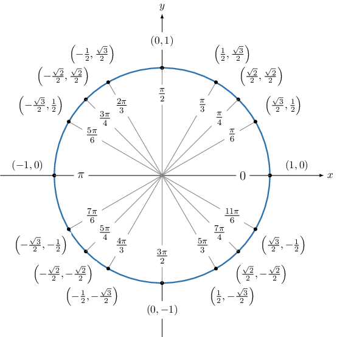

# Trigonometric Ratios of Large Angles in Radians

Source: https://www.mathacademy.com/topics/6184?courseId=120
Topic ID: 6184

## Prerequisites

- [Trigonometric Ratios of Large Angles in Degrees](./6179-trigonometric-ratios-of-large-angles-in-degrees.md)

## Lesson

### Introduction

In this lesson, we'll learn how to determine trigonometric ratios of large angles in radians.

For example, suppose we wish to find the value of

$$

\sin\left(\dfrac{203\pi}{4}\right).

$$

Trigonometric ratios like sine and cosine repeat every $2\pi$ radians (full turns). So, instead of evaluating a large angle directly, we reduce it to a smaller, coterminal angle between $0$ and $2\pi.$ To do this, we write the angle as a sum of multiples of $2\pi$ plus a remainder.

We first find an angle that's coterminal with $\dfrac{203\pi}{4}$ and lies in the range $[0,2\pi).$

Recall that coterminal angles differ by a multiple of $2\pi$ radians. So, we divide $203$ by $2 \cdot 4 = 8$ with remainder:

$$

203 \div 8 = 25 \ \text{R} \ 3

$$

Therefore,

$$

203 = 25 \cdot 8 + 3.

$$

As a result, we have

$$

\begin{aligned}\frac{203𝜋}{4} & =\frac{(25⋅8+3)𝜋}{4} \\ & =25⋅\frac{8𝜋}{4}+\frac{3𝜋}{4} \\ & =25⋅2𝜋+\frac{3𝜋}{4}.\end{aligned}

$$

So, we can reduce our large angle of $\dfrac{203\pi}{4}$ by $25$ full turns of $2\pi,$ as adding or subtracting a full turn doesn't change the sine:

$$

\sin \left(\dfrac{203\pi}{4}\right) = \sin \left({\color{blue}25 \cdot 2\pi} + \dfrac{3\pi}{4}\right) = \sin \left(\dfrac{3\pi}{4}\right)

$$

Let's remind ourselves of the special trigonometric ratios, as given by the unit circle.

From the unit circle, we see that the angle $\dfrac{3\pi}{4}$ corresponds to the point $\left(-\dfrac{\sqrt 2}{2},\dfrac{\sqrt 2}{2}\right).$

Since the sine of the angle corresponds to the $y$-coordinate, we have $\sin\left(\dfrac{3\pi}{4}\right) = \dfrac{\sqrt{2}}{2}.$

Therefore,

$$

\sin\left(\dfrac{203\pi}{4}\right) = \dfrac{\sqrt{2}}2.

$$

### Example: Finding the Sine of a Large Angle

#### Question

Find the value of $\sin\left(\dfrac{127\pi}{6}\right).$

#### Explanation

First, we find an angle that's coterminal with $\dfrac{127\pi}{6}$ and lies in the range $[0,2\pi).$

Recall that coterminal angles differ by a multiple of $2\pi$ radians.

So, we divide $127$ by $2 \cdot 6 = 12$ with remainder:

$$

127 \div 12 = 10 \ \text{R} \ 7

$$

Therefore,

$$

127 = 10 \cdot 12 + 7.

$$

As a result, we have

$$

\begin{aligned}\frac{127𝜋}{6} & =\frac{(10⋅12+7)𝜋}{6} \\ & =10⋅\frac{12𝜋}{6}+\frac{7𝜋}{6} \\ & =10⋅2𝜋+\frac{7𝜋}{6}.\end{aligned}

$$

Therefore, $\sin \left(\dfrac{127\pi}{6}\right) = \sin \left(\dfrac{7\pi}{6}\right).$

Let's remind ourselves of the special trigonometric ratios, as given by the unit circle.

From the unit circle, we see that the angle $\dfrac{7\pi}{6}$ corresponds to the point $\left(-\dfrac{\sqrt 3}{2},-\dfrac{1}{2}\right).$

Since the sine of the angle corresponds to the $y$-coordinate, we have $\sin\left(\dfrac{7\pi}{6}\right) = -\dfrac{1}{2}.$

Therefore, $\sin\left(\dfrac{127\pi}{6}\right) = -\dfrac{1}{2}.$

### Example: Finding the Cosine of a Large Angle

#### Question

Find the value of $\cos\left(\dfrac{159\pi}{4}\right).$

#### Explanation

First, we find an angle that's coterminal with $\dfrac{159\pi}{4}$ and lies in the range $[0,2\pi).$

Recall that coterminal angles differ by a multiple of $2\pi$ radians.

So, we divide $159$ by $2 \cdot 4 = 8$ with remainder:

$$

159 \div 8 = 19 \ \text{R} \ 7

$$

Therefore,

$$

159 = 19 \cdot 8 + 7.

$$

As a result, we have

$$

\begin{aligned}\frac{159𝜋}{4} & =\frac{(19⋅8+7)𝜋}{4} \\ & =19⋅\frac{8𝜋}{4}+\frac{7𝜋}{4} \\ & =19⋅2𝜋+\frac{7𝜋}{4}.\end{aligned}

$$

Therefore, $\cos \left(\dfrac{159\pi}{4}\right) = \cos \left(\dfrac{7\pi}{4}\right).$

Let's remind ourselves of the special trigonometric ratios, as given by the unit circle.

From the unit circle, we see that the angle $\dfrac{7\pi}{4}$ corresponds to the point $\left(\dfrac{\sqrt 2}{2},-\dfrac{\sqrt 2}{2}\right).$

Since the cosine of the angle corresponds to the $x$-coordinate, we have $\cos \left(\dfrac{7\pi}{4}\right) = \dfrac{\sqrt{2}}{2}.$

Therefore, $\cos\left(\dfrac{159\pi}{4}\right) = \dfrac{\sqrt{2}}{2}.$

### Example: Finding the Tangent of a Large Angle

#### Question

Find the value of $\tan\left(\dfrac{215\pi}{4}\right).$

#### Explanation

First, we find an angle that's coterminal with $\dfrac{215\pi}{4}$ and lies in the range $[0,2\pi).$

Recall that coterminal angles differ by a multiple of $2\pi$ radians.

So, we divide $215$ by $2 \cdot 4 = 8$ with remainder:

$$

215 \div 8 = 26 \ \text{R} \ 7

$$

Therefore,

$$

215 = 26 \cdot 8 + 7

$$

As a result, we have

$$

\begin{aligned}\frac{215𝜋}{4} & =\frac{(26⋅8+7)𝜋}{4} \\ & =26⋅\frac{8𝜋}{4}+\frac{7𝜋}{4} \\ & =26⋅2𝜋+\frac{7𝜋}{4}.\end{aligned}

$$

Therefore, $\tan \left(\dfrac{215\pi}{4}\right) = \tan \left(\dfrac{7\pi}{4}\right).$

Let's remind ourselves of the special trigonometric ratios, as given by the unit circle.

From the unit circle, we see that the angle $\dfrac{7\pi}{4}$ corresponds to the point $\left(\dfrac{\sqrt 2}{2}, -\dfrac{\sqrt 2}{2}\right).$

- Since the cosine of the angle corresponds to the $x$-coordinate, we have $\cos \left(\dfrac{7\pi}{4}\right) = \dfrac{\sqrt{2}}{2}.$

- Since the sine of the angle corresponds to the $y$-coordinate, we have $\sin \left(\dfrac{7\pi}{4}\right) = -\dfrac{\sqrt{2}}{2}.$

Therefore, using the fact that $\tan\theta = \dfrac{\sin\theta}{\cos\theta},$ we have

$$

\tan \left( \dfrac{7\pi}{4}\right) = \dfrac{\sin \left( \dfrac{7\pi}{4}\right)}{\cos\left( \dfrac{7\pi}{4}\right)} = \dfrac{-\frac{\sqrt{2}}{2}}{\frac{\sqrt{2}}{2}} = -1.

$$
