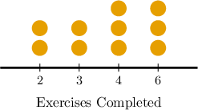

# Comparing Means

Source: https://www.mathacademy.com/topics/6191?courseId=120
Topic ID: 6191

## Prerequisites

- [Measuring Centrality From Dot Plots](../grade-6/2500-measuring-centrality-from-dot-plots.md)
- [Calculating Means From Histograms](../grade-7/6313-calculating-means-from-histograms.md)

## Lesson

### Introduction

We often want a single number that gives us a sense of the "typical" or "average" value in a data set. This is where measures of central tendency, such as the mean, become especially useful.

The mean summarizes all the values in a data set into a *single number* by balancing them out. This makes the mean a powerful tool for comparing two groups.

For example, suppose a study compared students' reading proficiencies in two 4th-grade classes. Both classes sat the same standardized test. The students in class A achieved a mean score of $8.0.$ The results of the students in class B are given below:

$$

6,\quad 5,\quad 8,\quad 10,\quad 10,\quad 4,\quad 6

$$

By comparing the mean scores of classes A and B, what can we say about the relative performance of the two classes on this test?

Let's start by computing the mean of class B's results:

$$

\textrm{Mean}(B) = \dfrac{6+5+8+10+10+4+6}{7} = 7.0

$$

So, class A's mean score is higher, which *suggests* that class A performed better on the test overall.

Note the following:

- It's crucial to recognize that there are various methods for comparing two data sets. Comparing the means is only one way.

- Examining multiple measures together provides a more comprehensive view of the data.

- So in the example above, while comparing the means might *suggest* that class A performed better, we would need to gather more evidence—by considering the median, mode, and the overall spread of scores—to draw a fairer conclusion.

### Example: Comparing Means

#### Question

Gina is a science blogger. She received the following number of likes for each of her six posts over the past $24$ hours:

$$

8, \; 16, \; 32, \; 14, \; 20, \; 6

$$

Maria, another science writer, received a mean of $14$ likes per post over the past $24$ hours.

Which of the following statements are true?

1. Gina's posts received a mean of $14$ likes each over the past $24$ hours.

2. Maria's mean number of likes per day is smaller than Gina's.

3. A comparison of the means suggests that Gina's posts are more popular than Maria's.

#### Explanation

Let's examine the statements one by one.

- Statement I is false. The mean number of likes Gina's posts received is Therefore, Gina's posts received an average of $16$ likes each over the past $24$ hours.

- Statement II is true. Since $14 < 16$, we conclude that Maria's mean number of likes per post is smaller than Gina's.

- Statement III is true. Maria's mean is smaller than Gina's, suggesting that Gina's posts are more popular.

Therefore, the correct answer is "II and III only."

### Example: Comparing Means From Frequency Tables

#### Question

Two groups of campers reported the number of cups of water they drank during a hike. The table above summarizes the responses for Group A. For the campers in Group B, their average number of cups of water was $2.$

A comparison of the means suggests which group drank more cups of water on average?

#### Explanation

To calculate the mean of a dataset given in a frequency table, we compute the sum of the products of each value $x$ and its corresponding frequency $f_x,$ and then divide that sum by the total number of data points.

We begin by extending the table to include a third column for the product of each value and its frequency:

We now calculate the mean by dividing the sum of these products by the total number of data points, given by the total sum of the frequencies:

$$

\begin{aligned}Mean(𝐴) & =\frac{5+9+15+7}{3+3+3+3} \\ & =\frac{36}{12} \\ & =3\end{aligned}

$$

Since $2 < 3,$ the mean for Group B is less than the mean for Group A.

Therefore, a comparison of the means suggests Group A drank more cups on average.

### Example: Comparing Means From Dot Plots and Histograms

#### Question

Two fitness centers recorded the number of exercises each member completed per session during a certain period. The information for Center A is summarized in the dot plot above, where each dot represents the number of exercises completed by a certain member in one session. Center B had a mean number of exercises completed equal to $3.5.$

A comparison of the means suggests which group completed more exercises per session.

#### Explanation

We begin by constructing the frequency table from the given dot plot:

To calculate the mean of a dataset given in a frequency table, we compute the sum of the products of each value $x$ and its corresponding frequency $f_x,$ and then divide that sum by the total number of data points.

Next, we extend the table to include a third column for the product of each value and its frequency:

We now calculate the mean by dividing the sum of these products by the total number of data points, given by the total sum of the frequencies:

$$

\begin{aligned}Mean(𝐴) & =\frac{4+6+12+18}{2+2+3+3} \\ & =\frac{40}{10} \\ & =4\end{aligned}

$$

Since $3.5 < 4,$ the mean for Center B is less than the mean for Center A.

Therefore, a comparison of the means suggests members of Center A completed more exercises per session on average.
