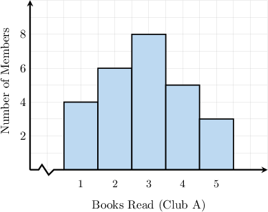
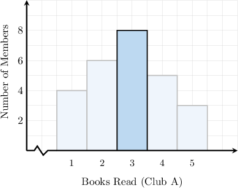
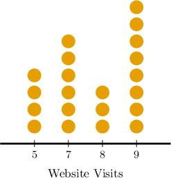
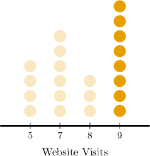

# Comparing Modes

Source: https://www.mathacademy.com/topics/6193?courseId=120
Topic ID: 6193

## Prerequisites

- [Measuring Centrality From Dot Plots](../grade-6/2500-measuring-centrality-from-dot-plots.md)
- [Calculating Modes and Medians From Histograms](../grade-7/6190-calculating-modes-and-medians-from-histograms.md)

## Lesson

### Introduction

We often want a single number that gives us a sense of the "typical" or "average" value in a data set. This is where measures of central tendency, such as the mode, become especially useful.

The mode identifies the *most frequent value* in a data set. This makes it a useful tool for comparing groups when we want to know the most common outcome.

For example, suppose two reading clubs tracked the number of books their members read in a month. The data for Club A is summarized in the histogram below. For Club B, the most common number of books read was $5.$

What can we say by comparing the two clubs based on their modes?

From the histogram above, the tallest bar corresponds to $8$ members at $3$ books read, so the mode for Club A is $3.$

So, we have

$$

\textrm{Mode}(A) = 3, \quad \textrm{Mode}(B) = 5.

$$

Hence, Club B’s mode is higher, which *suggests* that members of Club B read more books.

Note the following:

- It's crucial to recognize that there are various methods for comparing two data sets. Comparing the modes is only one way.

- Examining multiple measures together provides a more comprehensive view of the data.

- So in the example above, while comparing the modes might *suggest* that Club B read more, we would need to gather more evidence—by considering the mean, median, and the overall spread of values—to draw a fairer conclusion.

### Example: Comparing Modes

#### Question

Dr. Perelman and Dr. Conway compared blood glucose level measurements they each obtained from $10$ of their patients. Dr. Perelman's patients' modal blood glucose level was $182 \, \mathrm{mg}/\mathrm{dL}.$ The blood glucose levels (in $\mathrm{mg}/\mathrm{dL}$) of Dr. Conway's patients are as follows:

$$

120,\; 140, \; 145,\; 160,\; 175, \; 190, \; 190,\; 190, \; 200,\; 210

$$

Which of the following statements are true?

1. The modal blood glucose level of Dr. Conway's patients is $190 \, \mathrm{mg}/\mathrm{dL}.$

2. The modal blood glucose level of Dr. Conway's patients is higher than that of Dr. Perelman's patients.

3. A comparison of the modes suggests that Dr. Conway's patients have higher blood glucose levels.

#### Explanation

Let's examine the statements one by one.

- Statement I is true. Notice that the data set from Dr. Conway's patients are already ordered from smallest to greatest and that $190\, \mathrm{mg}/\mathrm{dL}$ is the most frequent value on the list: So, the modal value is $190\, \mathrm{mg}/\mathrm{dL}.$

- Statement II is true. Dr. Conway's patients' modal blood glucose level is $190\, \mathrm{mg}/\mathrm{dL},$ while Dr. Perelman's patients' modal blood glucose level is $182 \, \mathrm{mg}/\mathrm{dL}.$

- Statement III is true. Dr. Conway's mode is larger, suggesting that his patients have higher blood glucose levels.

Therefore, the correct answer is "I, II, and III."

### Example: Comparing Modes From Frequency Tables

#### Question

Two groups of friends reported the number of movies they watched last month. The table above summarizes the responses for Group A. For Group B, the most frequently reported number of movies watched was $4.$ A comparison of the modes suggests which group watched more movies last month?

#### Explanation

The mode is the value with the highest frequency in the data set.

From the frequency table, we see that the highest frequency is $7,$ corresponding to $2$ movies watched.

So, the mode for Group A is $2.$ And since $2 < 4,$ the mode for Group B is greater than the mode for Group A.

Therefore, based on the modes, Group B watched more movies last month.

### Example: Comparing Modes From Dot Plots and Histograms

#### Question

Two companies tracked the number of website visits per user per day during a certain period. The information for Company A is summarized in the dot plot above, where each dot represents the number of visits for a certain user on a particular day. For Company B, the most frequently reported number of visits per day was $7.$ A comparison of the modes suggests which company's website had more visits per day?

#### Explanation

The mode is the value with the highest frequency in the data set.

From the dot plot, we see that the highest frequency is $8,$ corresponding to $9$ visits per day.

So, the mode for Company A is $9.$ And since $9> 7,$ the mode for Company B is less than the mode for Company A.

Therefore, based on the modes, Company A had more website visits per day.
