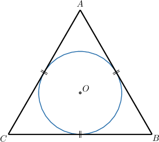
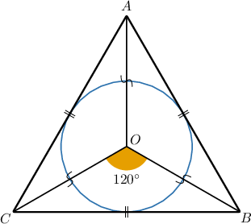
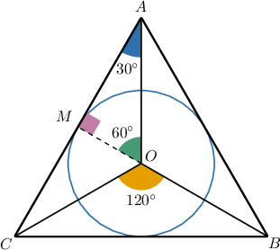
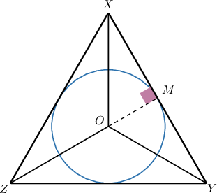
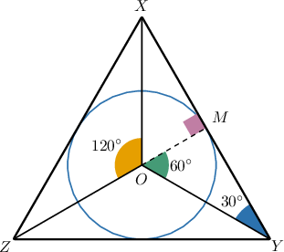
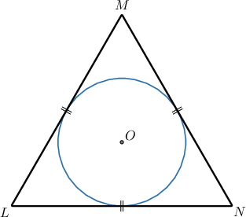
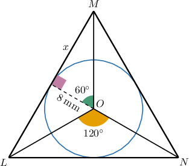
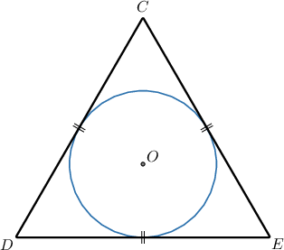
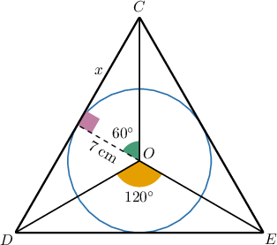
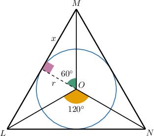

# Circles Inscribed in Equilateral Triangles

Source: https://www.mathacademy.com/topics/6213?courseId=120
Topic ID: 6213

## Prerequisites

- [The Circumference of a Circle](../geometry/460-the-circumference-of-a-circle.md)
- [The SSS Congruence Criterion](../geometry/531-the-sss-congruence-criterion.md)
- [Areas of Circles](../geometry/1745-areas-of-circles.md)
- [The Area of an Equilateral Triangle](../geometry/2886-the-area-of-an-equilateral-triangle.md)

## Lesson

### Introduction

A circle is **inscribed** in an equilateral triangle if the circle touches all three sides of the triangle, as shown in the diagram below.

In this lesson, we'll learn how to solve problems involving circles inscribed in equilateral triangles. Solving these kinds of problems often involves deducing key information from this diagram using our knowledge of angle bisectors and 30-60-90 triangles.

Let's see how we can create a 30-60-90 triangle from this setup.

First, suppose we draw the segments $\overline{OA},$ $\overline{OB},$ and $\overline{OC}$ from the circle's center to each of the triangle’s vertices. By the SSS criterion, we get three congruent isosceles triangles, $\triangle{AOB},$ $\triangle{BOC},$ and $\triangle{AOC},$ each with a central angle of $120^\circ,$ as shown below.

Now, suppose we draw the altitude $\overline{OM}$ in $\triangle{AOC}$ from the center of the circle to the point where the circle touches the opposite side. This divides the triangle into two right triangles, $\triangle{AOM}$ and $\triangle{COM},$ with angles $30^\circ,$ $60^\circ,$ and $90^\circ.$ The triangle $\triangle AOM$ is shown below.

To successfully solve problems involving circles inscribed in equilateral triangles, it's essential to understand how to construct these 30-60-90 triangles effortlessly. So, let's get some more practice at this in a similar situation.

### Example: Identifying Properties of Circles Inscribed in Equilateral Triangles

#### Question

The circle with center $O$ is inscribed into the equilateral triangle $\triangle XYZ,$ as shown above. Fill in the blanks below.

- $\overline{OM}$ is the radius of the circle.

- $\triangle{XOY}$ is an isosceles triangle.

- $\angle{XOZ}$ has a measure of $120^\circ.$

- $\triangle{XOM}$ is a $30$-$60$-$90$ triangle.

- $\angle{MYO}$ has a measure of $30^\circ.$

#### Explanation

The line segments, drawn from the center of the circle to each of the triangle’s vertices, form three identical isosceles triangles, each with a central angle of $120^\circ,$ as shown below.

We have the altitude $\overline{OM}$ drawn in one of these isosceles triangles from the center of the circle to the point where the circle touches the opposite side. This divides the triangle into two right triangles with angles $30^\circ,$ $60^\circ,$ and $90^\circ.$

Therefore, a possible answer could be as follows:

- $\boxed{\overline{OM}}$ is the radius of the circle.

- $\boxed{\triangle{XOY}}$ is an isosceles triangle.

- $\boxed{\angle{XOZ}}$ has a measure of $120^\circ.$

- $\boxed{\triangle{XOM}}$ is a $30$-$60$-$90$ triangle.

- $\boxed{\angle{MYO}}$ has a measure of $30^\circ.$

Therefore, all the statements are true.

### Using Properties of 30-60-90 Triangles

Now, suppose that a circle of radius $8 \: \text{mm}$ is inscribed into an equilateral triangle, as shown below. How can we use this information to determine the triangle's side length?

To find the side length of the triangle, we draw line segments from the center to each of the triangle’s vertices. This forms three identical isosceles triangles, each with a central angle of $120^\circ,$ as shown below.

Now, we take one of these isosceles triangles and draw an altitude from the center to the opposite side. This divides the triangle into two right triangles with angles $30^\circ$, $60^\circ$, and $90^\circ.$

In each $30$-$60$-$90$ triangle:

- Let the longer leg, which is opposite the $60^\circ$ angle, be $x.$ Notice that it is half of our equilateral triangle's side length.

- The shorter leg is a radius of the circle with length $r = 8 \: \text{mm}.$

Recall that, in any $30$-$60$-$90$ triangle, the longer leg is $\sqrt{3}$ times the shorter leg:

$$

\begin{aligned}𝑥 & =𝑟⋅\sqrt{√3} \\ & =8⋅\sqrt{√3} \\ & =8\sqrt{√3}\end{aligned}

$$

Therefore, our equilateral triangle's side length is

$$

2x = 2 \cdot 8 \sqrt{3} = 16 \sqrt{3} \: \text{mm}.

$$

Let's now consider an example where we need to calculate the area of the equilateral triangle.

### Example: Solving for the Triangle's Parameters

#### Question

A circle of radius $7 \: \text{cm}$ is inscribed into an equilateral triangle, as shown above. What is the area of the triangle?

#### Explanation

To find the side length of the triangle, we draw line segments from the center to each of the triangle’s vertices. This forms three identical isosceles triangles, each with a central angle of $120^\circ,$ as shown below.

Now, we take one of these isosceles triangles and draw an altitude from the center to the opposite side. This divides the triangle into two right triangles with angles $30^\circ$, $60^\circ$, and $90^\circ.$

In each $30$-$60$-$90$ triangle:

- Let the longer leg, which is opposite the $60^\circ$ angle, be $x.$ Notice that it is half of our equilateral triangle's side length.

- The shorter leg is the radius $r = 7 \: \text{cm}$ of the circle.

Next, in the $30$-$60$-$90$ triangle, the longer leg is $\sqrt{3}$ times the shorter leg:

$$

\begin{aligned}𝑥 & =𝑟⋅\sqrt{√3} \\ & =7⋅\sqrt{√3} \\ & =7\sqrt{√3}\,cm\end{aligned}

$$

Therefore, our equilateral triangle's side length is

$$

s = 2 \cdot 7 \sqrt{3} = 14 \sqrt{3} \: \text{cm},

$$

and the corresponding area of the triangle is

$$

\begin{aligned}A & =\frac{\sqrt{√3}}{4}𝑠^{2} \\ & =\frac{\sqrt{√3}}{4}(14\sqrt{√3})^{2} \\ & =\frac{\sqrt{√3}}{4}⋅588 \\ & =147\sqrt{√3}\,cm^{2}.\end{aligned}

$$

### Example: Solving for the Circle's Parameters

#### Question

A circle is inscribed into an equilateral triangle with a side length of $72$ feet, as shown above. What is the radius of the circle?

#### Explanation

To find the radius of the circle, we draw line segments from the center to each of the triangle’s vertices. This forms three identical isosceles triangles, each with a central angle of $120^\circ,$ as shown below.

Now, we take one of these isosceles triangles and draw an altitude from the center to the opposite side. This divides the triangle into two right triangles with angles $30^\circ$, $60^\circ$, and $90^\circ.$

In each $30$-$60$-$90$ triangle:

- The longer leg $x,$ which is opposite the $60^\circ$ angle, is half of our equilateral triangle's side length:

- The shorter leg is the radius $r$ of the circle.

Finally, in the $30$-$60$-$90$ triangle, the longer leg is $\sqrt{3}$ times the shorter leg:

$$

\begin{aligned}𝑥 & =𝑟⋅\sqrt{√3} \\ 36 & =𝑟⋅\sqrt{√3} \\ 𝑟 & =\frac{36}{\sqrt{√3}} \\ & =\frac{36}{\sqrt{√3}}⋅\frac{\sqrt{√3}}{\sqrt{√3}} \\ & =\frac{36\sqrt{√3}}{3} \\ & =12\sqrt{√3}\end{aligned}

$$

Therefore, the radius of the circle is $12\sqrt{3} \: \text{ft}.$
