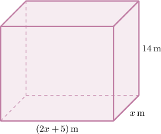

# Constructing Functions Representing Properties of Rectangular Solids

Source: https://www.mathacademy.com/topics/6297?courseId=120
Topic ID: 6297

## Prerequisites

- [Surface Areas of Rectangular Solids](../geometry/674-surface-areas-of-rectangular-solids.md)
- [Volumes of Rectangular Solids](../geometry/1753-volumes-of-rectangular-solids.md)
- [Rewriting Radical Expressions Using the Laws of Exponents](./6206-rewriting-radical-expressions-using-the-laws-of-exponents.md)
- [Solving Many-Variable Nonlinear Equations](./6294-solving-many-variable-nonlinear-equations.md)

## Lesson

### Introduction

In this lesson, we'll learn how to construct functions that represent volumes and surface areas of rectangular solids. This allows us to translate geometric descriptions into algebraic expressions that we can analyze and use to solve real-world problems.

For example, suppose a right rectangular prism has a height of $14$ meters. The width of the prism's base is $x$ meters, and the length of the prism's base is $5$ meters more than twice the width. What is the function $V$ that gives the volume of the prism in terms of the width of the prism's base?

First, recall that the volume $V$ of a right rectangular prism is given by

$$

V = lwh,

$$

where $l$ is its length, $w$ is its width, and $h$ is its height.

From the description, our right rectangular prism has the following measurements:

- The height is $h = 14$ meters.

- The width is $w = x$ meters.

- The length is $l = 2x + 5$ meters ($5$ meters more than twice the width).

The corresponding prism looks as shown below.

Therefore, the volume of the prism, in cubic meters, is

$$

\begin{aligned}𝑉(𝑥) & =𝑙𝑤ℎ \\ & =(2𝑥+5)⋅𝑥⋅14 \\ & =14𝑥(2𝑥+5)\end{aligned}

$$

Let's see another example concerning the surface area of a rectangular solid.

### Example: Interpreting Functions Representing Surface Area or Volume

#### Question

$$

S = 2 \!\left(\dfrac{x}{4} \cdot x + \dfrac{x}{4} \cdot 2 + x \cdot 2 \right)

$$

The length of a container's base is a quarter of its width $x,$ and the height of the container is $2$ feet. The function $S,$ given above, models the surface area of the container as a rectangular solid, expressed in square feet. What expression represents the area of the container's base, in square feet?

#### Explanation

The surface area of a rectangular solid is given by

$$

S = 2 \left( \text{length} \cdot \text{width} + \text{length} \cdot \text{height} + \text{width} \cdot \text{height} \right).

$$

Here, we have

$$

S = 2 \!\left(\dfrac{x}{4} \cdot x + \dfrac{x}{4} \cdot 2 + x \cdot 2 \right),

$$

where $x$ is the container's width.

The area of the container's base equals its length $\dfrac{x}{4}$ multiplied by its width $x.$ Therefore, the area of its base is

$$

\dfrac{x}{4} \cdot x.

$$

### Example: Constructing Functions Representing Surface Area or Volume

#### Question

A right rectangular prism has a base width of $x$ meters. The length of the prism's base is $9$ meters, and its height is $5x$ meters more than the length. What is the function $S$ that gives the surface area of the prism, in square meters, in terms of the width of the prism's base?

#### Explanation

From the description, our right rectangular prism has the following measurements:

- The width is $w = x$ meters.

- The length is $l = 9$ meters.

- The height is $h = 9 + 5x$ meters ($5x$ meters more than the length).

Therefore, the surface area of the prism is given by

$$

\begin{aligned}𝑆(𝑥) & =2(𝑙𝑤+𝑙ℎ+𝑤ℎ) \\ & =2(9⋅𝑥+9⋅(9+5𝑥)+𝑥⋅(9+5𝑥)) \\ & =2(9𝑥+81+45𝑥+9𝑥+5𝑥^{2}) \\ & =2(5𝑥^{2}+63𝑥+81).\end{aligned}

$$

### Correctly Interpreting Problem Statements

Sometimes the phrasing used in geometric descriptions can be confusing or misleading. In such cases, it's important to read the descriptions *very carefully*, write down the appropriate equations, and *rearrange them using algebra if necessary!*

Let's consider the following description:

A right rectangular prism has a height of $10$ meters. The length of the prism's base is $x$ meters, which is $2$ meters more than the width of the prism's base. Construct the function $V$ that gives the volume of the prism, in cubic meters, in terms of the length of the prism's base.

This question is asking us to construct a function representing the volume $V$ of a prism, which requires us to make use of the formula

$$

V = lwh

$$

where $l$ is the length of the prism, $w$ is its width, and $h$ is its height. Since we need to find the volume $V$ as a function of $x,$ we need to express $l, w$ and $h$ in terms of $x.$

From the description, our prism has the following measurements:

- The height is $h = 10$ meters.

- The length is $l = x$ meters.

- And here is the tricky part! We are told that the length of the prism is $2$ meters *more* than the width. This can be written as Now, since $l = x,$ we have Solving for $w,$ we get In other words, the width of the prism is $2$ meters *less* than its length.

Therefore, the volume of the prism is given by

$$

\begin{aligned}𝑉(𝑥) & =𝑙𝑤ℎ \\ & =𝑥⋅(𝑥−2)⋅10 \\ & =10𝑥(𝑥−2).\end{aligned}

$$

**Watch out!** In problems like these, a common mistake would be to write the volume as $10x(x \, {\color{red}+} \, 2).$

### Example: Constructing Functions Representing Volume: Harder Cases

#### Question

A right rectangular prism has a height of $7$ feet. The length of the prism’s base is $x$ feet, which is $5$ feet more than $3$ times the width of the prism’s base. Which function $V$ gives the volume of the prism, in cubic feet, in terms of the length of the prism’s base?

#### Explanation

From the description, our right rectangular prism has the following measurements:

- The height is $h = 7$ feet.

- The length is $l = x$ feet.

- Let the width be $w.$ We are told that the length is $5$ feet more than $3$ times the width: Solving for $w,$ we get

Therefore, the volume of the prism is given by

$$

\begin{aligned}𝑉(𝑥) & =𝑙𝑤ℎ \\ & =𝑥⋅\frac{1}{3}(𝑥−5)⋅7 \\ & =\frac{7}{3}𝑥(𝑥−5).\end{aligned}

$$

### Expressing the Properties of a Cube in Terms of Another Cube

Now, suppose that cube $A$ has a side length of $x$ millimeters. Cube $B$ has a *volume* that is $11$ cubic millimeters *less* than the volume of cube $A.$

Let's construct a function to represent the *surface area* of cube $B$ in terms of $x,$ the side length of cube $A.$

First, we let

- $x$ be the side length of cube $A,$ and

- $y$ be the side length of cube $B.$

Then,

- the volume of cube $A$ is $x^3,$ and

- the volume of cube $B$ is $y^3.$

We are told that the volume of cube $B$ is $11$ cubic millimeters less than the volume of cube $A.$ In symbols, this means that

$$

y^3 = x^3 - 11.

$$

Since we want to find the surface area of cube $B$ in terms of $x,$ we solve this equation for $y{:}$

$$

\begin{aligned}𝑦^{3} & =𝑥^{3}−11 \\ 𝑦 & =\sqrt[√𝑥^{3}−11]{3}\end{aligned}

$$

Therefore, the function $S$ that represents the surface area of cube $B$ is given by

$$

\begin{aligned}𝑆(𝑥) & =6𝑦^{2} \\ & =6(\sqrt[√𝑥^{3}−11]{3})^{2} \\ & =6((𝑥^{3}−11)^{1/3})^{2} \\ & =6(𝑥^{3}−11)^{2/3} \\ & =6\sqrt[√(𝑥^{3}−11)^{2}]{3}.\end{aligned}

$$

Let's see another example.

### Example: Constructing Functions Representing Area or Volume Given Two Cubes

#### Question

Cube $M$ has a side length of $m$ inches. Cube $N$ has a surface area that is $18$ square inches greater than one-half of the surface area of cube $M.$ What is the function $V$ that represents the volume of a cube $N,$ in cubic inches?

#### Explanation

Let

- $m$ be the side length of cube $M,$ and

- $n$ be the side length of cube $N.$

Then,

- the surface area of cube $M$ is $6m^2,$ and

- the surface area of cube $N$ is $6n^2.$

We are told that the surface area of cube $N$ is $18$ square inches greater than one half of the surface area of cube $M.$ In symbols, this means that

$$

6n^2 = \dfrac{1}{2}\cdot 6m^2 + 18.

$$

Now, we solve the obtained equation for $n{:}$

$$

\begin{aligned}6𝑛^{2} & =3𝑚^{2}+18 \\ \frac{6𝑛^{2}}{6} & =\frac{3𝑚^{2}+18}{6} \\ 𝑛^{2} & =\frac{𝑚^{2}}{2}+3 \\ 𝑛 & =\sqrt{√\frac{𝑚^{2}}{2}+3}\end{aligned}

$$

We disregard the negative solutions since the side length must be positive.

Therefore, the function $V$ that represents the volume of cube $N$ is given by

$$

\begin{aligned}𝑉(𝑚) & =𝑛^{3} \\ & =\sqrt{√\frac{𝑚^{2}}{2}+3}^{3} \\ & =((\frac{𝑚^{2}}{2}+3)^{1/2})^{3} \\ & =((\frac{𝑚^{2}}{2}+3)^{3})^{1/2} \\ & =\sqrt{√(\frac{𝑚^{2}}{2}+3)^{3}}.\end{aligned}

$$
