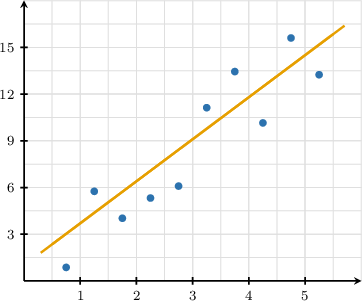
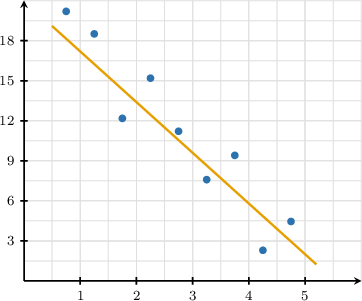
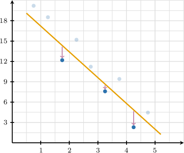
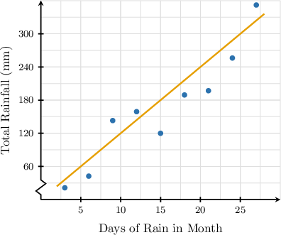
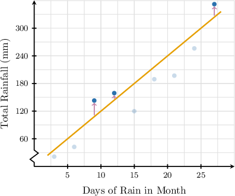
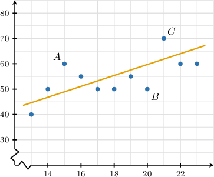
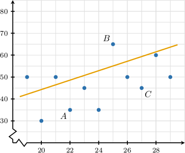
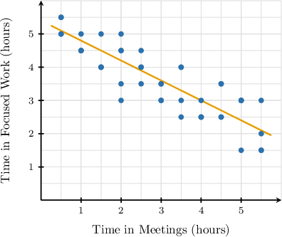
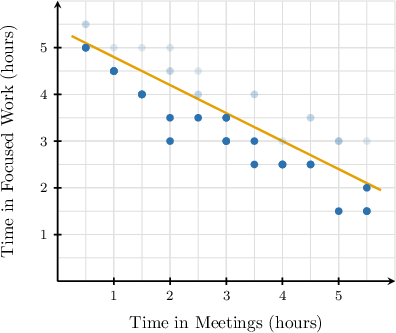
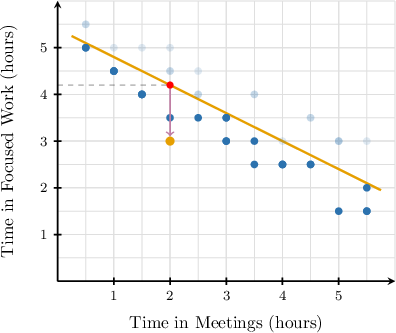

# Comparing Data Points to Lines of Best Fit

Source: https://www.mathacademy.com/topics/6298?courseId=120
Topic ID: 6298

## Prerequisites

- [Inequalities](../grade-7/178-inequalities.md)
- [Making Predictions Using Trend Lines](../algebra-i/3753-making-predictions-using-trend-lines.md)

## Lesson

### Introduction

In a relationship between two variables $x$ and $y,$ a line of best fit (or trend line) captures the general direction of the data, even if no single data point lies exactly on it.

But how should we interpret the line in relation to the actual data points?

We do so using the line's predictions. A data point's *predicted* $y$-value is the $y$-value of the point on the line of best fit at the same $x$-coordinate as the point.

Consider the scatter plot below, which shows $10$ data points in the relationship between two variables $x$ and $y,$ along with a line of best fit.

The line of best fit provides an overall model of the data, but it is not exact for every individual point:

- A data point's actual $y$-value $(y_\text{true})$ is *less than* the $y$-value predicted by the line of best fit $(y_\text{pred})$ if it lies *below* this line. Since the predicted $y$-value is greater than the actual $y$-value ($y_\text{pred} > y_\text{true}$), the line of best fit *overestimates* these data points. In this case, there is a total of $6$ data points below the line.

- On the other hand, a data point's actual $y$-value $(y_\text{true})$ is *greater than* the $y$-value predicted by the line of best fit $(y_\text{pred})$ if it lies *above* this line. Since the predicted $y$-value is less than the actual $y$-value ($y_\text{pred} < y_\text{true}$), the line of best fit *underestimates* these data points. In this case, there is a total of $4$ data points above the line.

### Example: Counting the Number of Points Underestimated or Overestimated by a Line of Best Fit

#### Question

The scatter plot above shows $9$ data points in the relationship between two variables $x$ and $y,$ along with a line of best fit. For how many of the $9$ data points is the actual $y$-value less than the $y$-value predicted by the line of best fit?

#### Explanation

A data point's predicted $y$-value is the $y$-value of the point on the line of best fit at the same $x$-coordinate as the point.

A data point's actual $y$-value is less than the $y$-value predicted by the line of best fit if it lies below this line.

Counting all such cases gives a total of $3$ data points below the line.

Therefore, the number of data points with an actual $y$-value less than the $y$-value predicted by the line of best fit is $3.$

### Example: Counting the Number of Underestimated or Overestimated Points in Contextual Situations

#### Question

The scatter plot above displays the relationship between days of rain in a month ($x$) and total rainfall ($y$, in millimeters) for $9$ different months, along with a line of best fit. For how many of the $9$ months is the total rainfall greater than the value predicted by the line of best fit?

#### Explanation

The line of best fit predicts total rainfall ($y$) from days of rain ($x$).

A month's total rainfall is greater than predicted by the line of best fit if the corresponding point on the scatter plot lies above this line.

Counting all such cases gives a total of $3$ months above the line.

Therefore, the number of months with total rainfall greater than predicted is $3.$

### Identifying Differences

The scatter plot below shows several data points in the relationship between two variables $x$ and $y$ along with a line of best fit.

Let's determine whether any of the labeled data points $A,$ $B,$ or $C$ has an actual $y$-value that is at least $10$ *more than* the value predicted by the line of best fit.

First, recall the following:

- A data point's predicted $y$-value is the $y$-value of the point on the line of best fit at the same $x$-coordinate as the point.

- A data point's actual $y$-value is *greater than* the $y$-value predicted by the line of best fit if it lies *above* this line.

With that in mind, let's consider each of the given points in turn.

- First, consider data point $A$ with coordinates $(15,60).$ At $x=15,$ the line of best fit predicts a corresponding $y$-value of $y\approx 49.$ On the other hand, the actual $y$-value of $A$ is $y=60.$ So, the difference between the actual and predicted $y$-values is Hence, the actual $y$-value of $A$ *is* at least $10$ more than the predicted $y$-value.

- Next, consider data point $B$ with coordinates $(20,50).$ Since $B$ lies below the line, its $y$-value is *less than* the value predicted by the line of best fit, not greater than. Hence, the actual $y$-value of $B$ *is not* at least $10$ more than the predicted $y$-value.

- Finally, consider data point $C$ with coordinates $(21,70).$ At $x=21,$ the line of best fit predicts a corresponding $y$-value of $y \approx 62.$ On the other hand, the actual $y$-value of $C$ is $y=70.$ So, the difference between the actual and predicted $y$-values is Hence, the actual $y$-value of $C$ *is not* at least $10$ more than the predicted $y$-value.

Therefore, only the $y$-value of $A$ is at least $10$ more than the value predicted by the line of best fit.

### Example: Identifying Data Points Corresponding to a Minimum Underestimate or Overestimate

#### Question

The scatter plot above shows several data points in the relationship between two variables $x$ and $y$ along with a line of best fit. Which of the labeled data points $A,$ $B,$ or $C$ has a $y$-value that is at least $10$ less than the value predicted by the line of best fit?

#### Explanation

A data point's predicted $y$-value is the $y$-value of the point on the line of best fit at the same $x$-coordinate as the point.

A data point's actual $y$-value is less than the $y$-value predicted by the line of best fit if it lies below this line.

With that in mind, let's consider each of the given points in turn.

- First, consider data point $A$ with coordinates $(22,35).$ At $x=22,$ the line of best fit predicts a corresponding $y$-value of $y \approx 48.$ On the other hand, the actual $y$-value of $A$ is $y=35.$ So, the difference between the actual and predicted $y$-values is Hence, the actual $y$-value of $A$ ** at least $10$ less than the predicted $y$-value.

- Next, consider data point $B$ with coordinates $(25,65).$ Since $B$ lies above the line, its $y$-value is ** the value predicted by the line of best fit, not less than. Hence, the actual $y$-value of $B$ ** at least $10$ less than the predicted $y$-value.

- Finally, consider data point $C$ with coordinates $(27,45).$ At $x=27,$ the line of best fit predicts a corresponding $y$-value of $y \approx 59.$ On the other hand, the actual $y$-value of $C$ is $y=45.$ So, the difference between the actual and predicted $y$-values is Hence, the actual $y$-value of $C$ ** at least $10$ less than the predicted $y$-value.

Therefore, the actual $y$-values of $A$ and $C$ are at least $10$ less than the predicted $y$-values.

### Example: Identifying the Worst Predicted Data Point

#### Question

A productivity audit tracked $27$ workdays. For each workday, the average time in meetings ($x$, in hours) and the average time in focused work ($y$, in hours) were recorded to the nearest half hour. The scatter plot above shows the data with a line of best fit.

The line of best fit **** one workday’s reported focused-work time by more than $1$ hour. How many hours of meetings were recorded this day?

#### Explanation

The line of best fit predicts a day's average time in focused work ($y$) given its average time in meetings ($x$).

The line ** a day’s reported focused-work time if its corresponding point on the scatter plot lies ** the line.

We are told that, for one of these points, the line of best fit overestimates the day’s reported focused-work time by more than $1$ hour.

Consider the data point at $(2,3).$ For a day with $x=2$ hours of meetings, the line of best fit predicts approximately $y \approx 4.2$ hours of focused work.

But the day corresponding to $(2,3)$ actually has $y=3$ hours of focused work. So, the line of best fit overestimates this day’s focused-work hours by

$$

4.2 - 3 = 1.2 > 1.

$$

No other point is that far below the line, so this must be the day in question. Therefore, $2$ hours of meetings were recorded this day.
