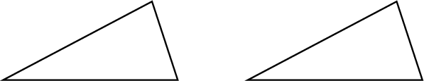
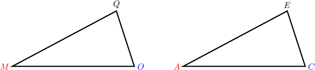
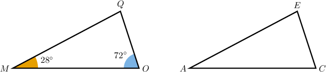
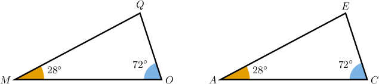
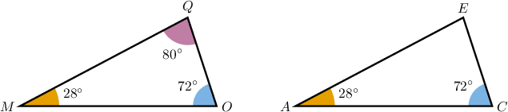
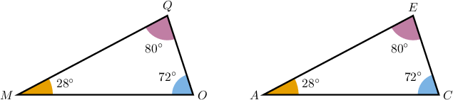
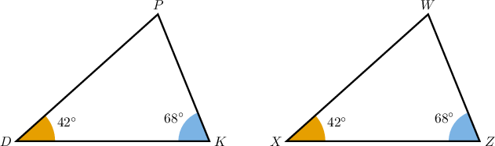
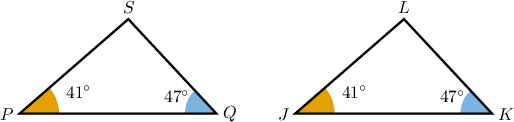
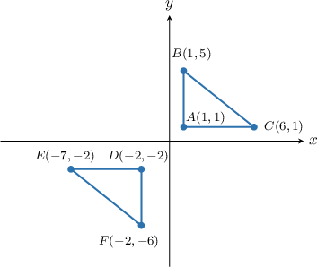

# Solving Problems Describing Congruent Triangles

Source: https://www.mathacademy.com/topics/6300?courseId=120
Topic ID: 6300

## Prerequisites

- [Horizontal and Vertical Lines](../grade-8/97-horizontal-and-vertical-lines.md)
- [Distances Between Points in the Coordinate Plane](../grade-6/573-distances-between-points-in-the-coordinate-plane.md)
- [The SAS Congruence Criterion](../geometry/1520-the-sas-congruence-criterion.md)

## Lesson

### Introduction

In this lesson, we will learn how to solve problems involving congruent triangles given using a description. Often, the key to solving these problems is to draw a sketch.

For example, suppose we're given the following description:

*Triangles $MOQ$ and $ACE$ are congruent, where $M,$ $O,$ and $Q$ correspond to $A,$ $C,$ and $E,$ respectively. The measure of angle $M$ is $28^{\circ}$ and the measure of angle $O$ is $72^{\circ}.$*

Let's draw a sketch of this situation, including as much information as possible.

First, we're told that we have two congruent triangles, $MOQ$ and $ACE.$ So, let's start by drawing two triangles that look the same.

From the statement, we have

$$

\triangle {\color{red}{M}}{\color{blue}{O}}{\color{black}{Q}} \cong \triangle {\color{red}{A}}{\color{blue}{C}}{\color{black}{E}}.

$$

This means we must have the following vertex correspondence:

$$

{\color{red}{M}} \leftrightarrow {\color{red}{A}}, \qquad {\color{blue}{O}} \leftrightarrow {\color{blue}{C}}, \qquad {\color{black}{Q}} \leftrightarrow {\color{black}{E}}

$$

Let's add some vertex labels to our diagram. Since we're only sketching, it doesn't really matter which label we apply to the vertices, *provided that* the vertex correspondence is respected. We can always redraw the image later if we need to.

Next, we're told that the measures of $\angle M$ and $\angle O$ are $28^\circ$ and $72^\circ,$ respectively. Let's add this information to our diagram.

Now, since the triangles are congruent, and we have the vertex correspondences $M \leftrightarrow A$ and $O \leftrightarrow C,$ we can immediately deduce that

$$

m\angle A = 28^\circ, \qquad m\angle C = 72^\circ.

$$

Let's add this to the picture.

Now, the sum of the angles in $\triangle MOQ$ must sum to $180^\circ.$ Therefore, we can calculate the measure of angle $Q$ as follows:

$$

\begin{aligned}𝑚∠𝑄 & =180^{∘}−𝑚∠𝑀−𝑚∠𝑂 \\ & =180^{∘}−28^{∘}−72^{∘} \\ & =80^{∘}.\end{aligned}

$$

Let's add this to our diagram.

Finally, since the triangles are congruent and we have the angle correspondence $Q\leftrightarrow E,$ we have that $\angle Q\cong\angle E,$ and we can deduce that

$$

m\angle E = m\angle Q = 80^\circ.

$$

Let's add this to our diagram.

### Example: Identifying Corresponding Angles in Congruent Triangles

#### Question

Triangles $D K P$ and $X Z W$ are congruent, where $D,$ $K,$ and $P$ correspond to $X,$ $Z,$ and $W,$ respectively. The measure of angle $K$ is $42^{\circ}$ and the measure of angle $P$ is $68^{\circ}.$ What is the measure of angle $Z?$

#### Explanation

Let's draw a sketch of the situation described.

Since $\triangle DKP \cong \triangle XZW,$ with the vertex correspondence

$$

D \leftrightarrow X, \qquad K \leftrightarrow Z, \qquad P \leftrightarrow W,

$$

their corresponding angles must also be congruent.

Therefore, the measure of angle $Z$ is

$$

m \angle Z = m \angle K = 42^\circ.

$$

### Example: Identifying Corresponding Angles in Congruent Triangles Using Sums of Interior Angles

#### Question

Triangles $P Q S$ and $J K L$ are congruent, where $P,$ $Q,$ and $S$ correspond to $J,$ $K,$ and $L,$ respectively. The measure of angle $P$ is $41^{\circ}$ and the measure of angle $Q$ is $47^{\circ}.$ What is the measure of angle $L?$

#### Explanation

Let's draw a sketch of the situation described.

First, we find the measure of $\angle S$ using the fact that the sum of interior angles in a triangle equals $180^\circ{:}$

$$

\begin{aligned}𝑚∠𝑃+𝑚∠𝑄+𝑚∠𝑆 & =180^{∘} \\ 41^{∘}+47^{∘}+𝑚∠𝑆 & =180^{∘} \\ 88^{∘}+𝑚∠𝑆 & =180^{∘} \\ 𝑚∠𝑆 & =180^{∘}−88^{∘} \\ & =92^{∘}\end{aligned}

$$

Now, since $\triangle PQS \cong \triangle JKL,$ with the vertex correspondence

$$

P \leftrightarrow J, \qquad Q \leftrightarrow K, \qquad S \leftrightarrow L,

$$

their corresponding angles must also be congruent.

Therefore, the measure of angle $L$ is

$$

m \angle L = m \angle S = 92^\circ.

$$

### Example: Identifying Corresponding Angles in Congruent Triangles in the Coordinate Plane

#### Question

Triangles $\triangle ABC$ and $\triangle DEF$ are plotted in the $xy$-plane. Triangle $\triangle ABC$ has vertices $A,$ $B,$ and $C$ at $(1,1),$ $(1,5),$ and $(6,1),$ respectively. Triangle $\triangle DEF$ has vertices $D,$ $E,$ and $F$ at $(-2,-2),$ $(-7,-2),$ and $(-2,-5),$ respectively. If $m\angle B = y^\circ-12^\circ,$ select the correct options to complete the sentences below.

Triangles $\triangle ABC$ and $\triangle DEF$ are similar by the $𝑆𝐴𝑆$ criterion.

The measure of angle $E$ is $102^{∘}−𝑦^{∘}$.

#### Explanation

First, let's sketch the two triangles described.

Notice that

- the segments $\overline{AB}$ and $\overline{DE}$ both lie on vertical lines, and

- the segments $\overline{AC}$ and $\overline{DF}$ both lie on horizontal lines.

So, the angles $\angle A$ and $\angle D$ in $\triangle ABC$ and $\triangle DEF,$ respectively, are both enclosed by these perpendicular lines; hence, they are right angles.

We find the measure of $\angle C$ using the fact that the sum of interior angles in a triangle equals $180^\circ{:}$

$$

\begin{aligned}𝑚∠𝐴+𝑚∠𝐵+𝑚∠𝐶 & =180^{∘} \\ 90^{∘}+(𝑦^{∘}−12^{∘})+𝑚∠𝐶 & =180^{∘} \\ 78^{∘}+𝑦^{∘}+𝑚∠𝐶 & =180^{∘} \\ 𝑚∠𝐶 & =102^{∘}−𝑦^{∘}\end{aligned}

$$

Next, the measures of the legs of the triangle $\triangle ABC$ are

$$

\begin{aligned}𝐴𝐵 & =5−1=4, \\ 𝐴𝐶 & =6−1=5,\end{aligned}

$$

and the measures of the legs of the triangle $\triangle DEF$ are

$$

\begin{aligned}𝐷𝐸 & =−1−(−5)=4, \\ 𝐷𝐹 & =−2−(−7)=5.\end{aligned}

$$

Hence, we have a pair of congruent angles,

$$

m\angle A = m\angle D = 90^\circ,

$$

and the corresponding sides enclosing the congruent angles are congruent:

$$

\begin{aligned}𝐴𝐵 & =4=𝐷𝐸 \\ 𝐴𝐶 & =5=𝐷𝐹\end{aligned}

$$

Consequently, $\triangle ABC \cong \triangle DFE$ by the $\boxed{\textrm{SAS}}$ criterion, with the vertex correspondence

$$

A \leftrightarrow D, \qquad B \leftrightarrow F, \qquad C \leftrightarrow E.

$$

Therefore, the measure of angle $E$ is

$$

m\angle E = m\angle C = \boxed{102^\circ - y^\circ}.

$$
