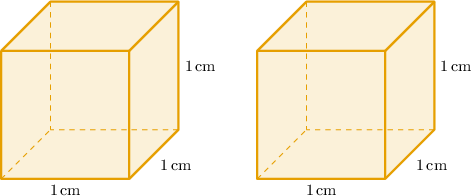
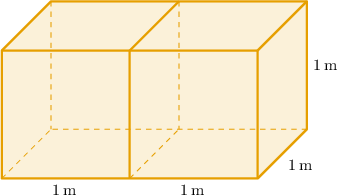
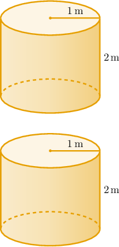
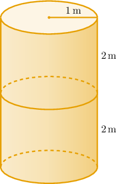

# Surface Areas of Combined Prisms

Source: https://www.mathacademy.com/topics/6305?courseId=120
Topic ID: 6305

## Prerequisites

- [Solving Quadratic Equations with No Constant Term](../algebra-i/393-solving-quadratic-equations-with-no-constant-term.md)
- [Solving Systems of Equations by Substitution](../grade-7/487-solving-systems-of-equations-by-substitution.md)
- [Surface Areas of Cylinders](../geometry/1762-surface-areas-of-cylinders.md)
- [Constructing Functions Representing Properties of Rectangular Solids](./6297-constructing-functions-representing-properties-of-rectangular-solids.md)

## Lesson

### Introduction

In this topic, we'll learn how to compute the surface area of solids formed by gluing prisms or cylinders along congruent faces. This is useful in real-world settings, for example, estimating materials, cost, or coverage (paint/wrap) when separate pieces are joined.

For instance, consider two identical cubes with a side length of $1$ meter.

Suppose the cubes are joined together by gluing one of their square faces together, as shown below.

Let's find the surface area, in square meters, of the combined solid.

If $s$ denotes the side length of a cube, then its surface area is given by

$$

\begin{aligned}𝑆 & =6⋅(face area) \\ & =6⋅𝑠^{2} \\ & =6𝑠^{2}.\end{aligned}

$$

Therefore, the surface area of a single cube of side length $s=1\,\textrm m$ (before joining them) is

$$

\begin{aligned}𝑆 & =6(1)^{2} \\ & =6⋅1 \\ & =6\,m^{2}.\end{aligned}

$$

This means that the surface areas of both cubes (before joining) is

$$

2S = 2\cdot 6 = 12\,\textrm{m}^2.

$$

When the two cubes are glued together at their square faces, *one face from each is hidden.* In other words, a total of *two square faces are hidden*. This reduces the total surface area by

$$

2s^2=2(1)^2 = 2\,\textrm{m}^2.

$$

Therefore, the surface area of the combined solid is

$$

\begin{aligned}2𝑆−2𝑠^{2} & =12−2 \\ & =10\,m^{2}.\end{aligned}

$$

### Example: Finding the Combined Surface Area of Two Cubes

#### Question

Two identical cubes have a side length of $4$ meters. The cubes are joined together by gluing one of their square faces together. Find the surface area, in square meters, of the combined solid.

#### Explanation

If $s$ denotes the side length of a cube, then its surface area is given by

$$

\begin{aligned}𝑆 & =6⋅(face area) \\ & =6⋅𝑠^{2} \\ & =6𝑠^{2}.\end{aligned}

$$

Therefore, the surface area of a single cube of side length $s=4\,\textrm m$ (before joining them) is

$$

\begin{aligned}𝑆 & =6(4)^{2} \\ & =6⋅16 \\ & =96\,m^{2}.\end{aligned}

$$

This means that the surface areas of both cubes (before joining) is

$$

2S = 2\cdot 96 = 192\,\textrm{m}^2.

$$

When the two cubes are glued together at their square faces, one face from each is hidden, reducing the total surface area by

$$

2s^2=2(4)^2 = 32\,\textrm{m}^2.

$$

Therefore, the surface area of the combined solid is

$$

\begin{aligned}2𝑆−2𝑠^{2} & =192−32 \\ & =160\,m^{2}.\end{aligned}

$$

### Example: Finding the Combined Surface Area of Two Rectangular Solids

#### Question

A square-based right rectangular prism has a height of $h$ and a base side length of $s.$ The second right rectangular prism has an identical square base but is nine times higher. The two prisms are joined together by gluing one of their square bases together. Construct an expression that gives the surface area of the combined solid.

#### Explanation

We are given that

- the first prism has a base side length of $s$ and a height of $h,$ while

- the second prism has a base's side length of $s$ and a height of $9h.$

So, the surface area of the first prism is given by

$$

\begin{aligned}𝑆_{1} & =2⋅(base area)+4⋅(lateral surface area) \\ & =2⋅𝑠^{2}+4⋅𝑠ℎ \\ & =2𝑠^{2}+4𝑠ℎ.\end{aligned}

$$

And the surface area of the second prism is given by

$$

\begin{aligned}𝑆_{2} & =2⋅(base area)+4⋅(lateral surface area) \\ & =2⋅𝑠^{2}+4⋅𝑠⋅9ℎ \\ & =2𝑠^{2}+36𝑠ℎ.\end{aligned}

$$

When the two prisms are glued together at their square bases, one base from each is hidden, reducing the total surface area by $2s^2.$ Therefore, the surface area of the combined solid is

$$

\begin{aligned}𝑆_{1}+𝑆_{2}−2𝑠^{2} & =(2𝑠^{2}+4𝑠ℎ)+(2𝑠^{2}+36𝑠ℎ)−2𝑠^{2} \\ & =4𝑠^{2}+40𝑠ℎ−2𝑠^{2} \\ & =2𝑠^{2}+40𝑠ℎ.\end{aligned}

$$

### Surface Areas of Combined Cylinders

Now, consider two identical cylinders of height $2$ meters and a base radius of $1$ meter, as shown below.

Let's imagine the cylinders are joined together by gluing one of their bases together.

To find the surface area of the combined solid, we'll use the fact that the surface area $S$ of a cylinder is given by

$$

\begin{aligned}𝑆 & =2⋅(base area)+(lateral surface area) \\ & =2⋅𝜋𝑟^{2}+2𝜋𝑟⋅ℎ \\ & =2𝜋𝑟^{2}+2𝜋𝑟ℎ.\end{aligned}

$$

where $r$ is the base radius and $h$ is its height.

When the two cylinders are glued together at their bases, one base from each is hidden, reducing the total surface area by $2\pi r^2=2\pi (1)^2.$ Therefore, the surface area of the combined solid is

$$

\begin{aligned}2𝑆−2𝜋𝑟^{2} & =2(2𝜋𝑟^{2}+2𝜋𝑟ℎ)−2𝜋𝑟^{2} \\ & =2(2𝜋(1)^{2}+2𝜋(1)(2))−2𝜋(1)^{2} \\ & =2(2𝜋+4𝜋)−2𝜋 \\ & =2(6𝜋)−2𝜋 \\ & =12𝜋−2𝜋 \\ & =10𝜋\,m^{2}.\end{aligned}

$$

Let's see some more examples.

### Example: Finding the Combined Surface Area of Two Cylinders

#### Question

A cylinder has a height of $h$ and a base radius of $r.$ The second cylinder has an identical base but is one-and-a-half times higher. The two cylinders are joined together by gluing one of their bases together. Find an expression for the surface area of the combined solid.

**

$$

\begin{aligned}𝑆 & =2⋅(base area)+(lateral surface area) \\ & =2⋅𝜋𝑟^{2}+2𝜋𝑟ℎ\end{aligned}

$$

**

#### Explanation

We are given that

- the first cylinder has a base radius of $r$ and a height of $h,$ while

- the second cylinder has a base radius of $r$ and a height of $1.5h.$

So, the surface area of the first cylinder is given by

$$

\begin{aligned}𝑆_{1} & =2⋅(base area)+(lateral surface area) \\ & =2⋅𝜋𝑟^{2}+2𝜋𝑟⋅ℎ \\ & =2𝜋𝑟^{2}+2𝜋𝑟ℎ.\end{aligned}

$$

And the surface area of the second cylinder is given by

$$

\begin{aligned}𝑆_{2} & =2⋅(base area)+(lateral surface area) \\ & =2⋅𝜋𝑟^{2}+2𝜋𝑟⋅1.5ℎ \\ & =2𝜋𝑟^{2}+3𝜋𝑟ℎ.\end{aligned}

$$

When the two cylinders are glued together at their bases, one base from each is hidden, reducing the total surface area by $2\pi r^2.$ Therefore, the surface area of the combined solid is

$$

\begin{aligned}𝑆_{1}+𝑆_{2}−2𝜋𝑟^{2} & =(2𝜋𝑟^{2}+2𝜋𝑟ℎ)+(2𝜋𝑟^{2}+3𝜋𝑟ℎ)−2𝜋𝑟^{2} \\ & =4𝜋𝑟^{2}+5𝜋𝑟ℎ−2𝜋𝑟^{2} \\ & =2𝜋𝑟^{2}+5𝜋𝑟ℎ.\end{aligned}

$$

### Example: Finding a Base Parameter Given a Combined Surface Area

#### Question

Two identical wooden blocks are each in the shape of a cylinder with a height of $12$ centimeters. The surface area of each block is $M$ square centimeters. When the two blocks are joined together by gluing one of their bases together, the resulting solid has a surface area of $1.2M$ square centimeters. What is the radius, in centimeters, of each circular base?

**

$$

\begin{aligned}𝑆 & =2⋅(base area)+(lateral surface area) \\ & =2⋅𝜋𝑟^{2}+2𝜋𝑟ℎ\end{aligned}

$$

**

#### Explanation

Let $r$ be the radius of the base. Since each block is a cylinder with height $12$ centimeters, its surface area can be expressed as

$$

\begin{aligned}𝑀 & =2𝜋𝑟^{2}+2𝜋𝑟⋅12 \\ & =2𝜋𝑟^{2}+24𝜋𝑟.\end{aligned}

$$

When the two wooden cylinders are glued together at their bases, one base from each is hidden, reducing the total surface area by $2\pi r^2.$ So, the combined surface area is

$$

2M - 2\pi r^2.

$$

We are told this equals $1.2M.$ So, we obtain the following equation:

$$

2M - 2\pi r^2 = 1.2M

$$

Rearranging terms and simplifying, we get the following:

$$

\begin{aligned}2𝑀−1.2𝑀 & =2𝜋𝑟^{2} \\ (2−1.2)𝑀 & =2𝜋𝑟^{2} \\ 0.8𝑀 & =2𝜋𝑟^{2} \\ 0.4𝑀 & =𝜋𝑟^{2}\end{aligned}

$$

Now, we substitute the expression $M = 2\pi r^2 + 24\pi r$ into $0.4M = \pi r^2$ and simplify:

$$

\begin{aligned}0.4(2𝜋𝑟^{2}+24𝜋𝑟) & =𝜋𝑟^{2} \\ 5⋅0.4(2𝜋𝑟^{2}+24𝜋𝑟) & =5⋅𝜋𝑟^{2} \\ 2(2𝜋𝑟^{2}+24𝜋𝑟) & =5𝜋𝑟^{2} \\ 4𝜋𝑟^{2}+48𝜋𝑟 & =5𝜋𝑟^{2} \\ 48𝜋𝑟 & =𝜋𝑟^{2} \\ 48𝑟 & =𝑟^{2} \\ 𝑟^{2}−48𝑟 & =0 \\ 𝑟(𝑟−48) & =0\end{aligned}

$$

So, $r = 0$ or $r = 48.$ We disregard $r = 0$ since the radius must be positive.

Therefore, the radius of the base is $48 \: \mathrm{cm}.$
