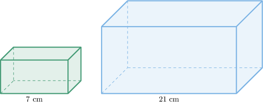

# Working With Descriptions of Similar Solids

Source: https://www.mathacademy.com/topics/6308?courseId=120
Topic ID: 6308

## Prerequisites

- [Surface Areas and Volumes of Similar Solids](../geometry/504-surface-areas-and-volumes-of-similar-solids.md)

## Lesson

### Introduction

In this lesson, we will continue our exploration of surface areas and volumes of similar solids.

Consider the similar rectangular prisms shown below:

Prism $E$ (on the left) has a side length of $7\,\text{cm}$, while prism $F$ (on the right) has a side length of $21\,\text{cm}$. Suppose we are told that the surface area of prism $F$ is $567\,\text{cm}^2$ and its volume is $1701\,\text{cm}^3$. Using this information, we want to determine the surface area and volume of prism $E$.

Recall from a previous lesson that if the lengths of a three-dimensional object are enlarged by a scale factor of $k$ then the surface area of the new shape will be enlarged by a scale factor of $k^2$ and the volume of the new shape will be enlarged by a scale factor of $k^3$.

Here, the smaller prism is similar to the larger one with a scale factor of

$$

k = \dfrac{7\,\textrm{cm}}{21\,\textrm{cm}} = \dfrac{1}{3}.

$$

Thus, the ratio of the surface areas is $k^2 = \left(\dfrac13\right)^2 = \dfrac19,$ and we have

$$

\dfrac{\mathcal{A}_E}{\mathcal{A}_F} = \dfrac{1}{9}.

$$

Solving for $\mathcal{A}_E$ and substituting in $\mathcal{A}_F = 567\,\textrm{m}^2,$ we get

$$

\begin{aligned}A_{𝐸} & =\frac{1}{9}⋅A_{𝐹} \\ & =\frac{1}{9}⋅567\,cm^{2} \\ & =63\,cm^{2}.\end{aligned}

$$

For volumes, the ratio is given by the cube of the scale factor:

$$

k^3 = \left(\dfrac13\right)^3 = \dfrac{1}{27}.

$$

So we have

$$

\dfrac{V_E}{V_F} = \dfrac{1}{27}.

$$

Solving for $V_E$ and substituting in $V_F = 1701\,\textrm{cm}^3,$ we get

$$

\begin{aligned}𝑉_{𝐸} & =\frac{1}{27}⋅𝑉_{𝐹} \\ & =\frac{1}{27}⋅1701cm^{3} \\ & =63cm^{3}.\end{aligned}

$$

### Example: Working From Length to Surface Area or Volume in Similar Solids

#### Question

Cone $P$ has a height of $6\,\textrm{in}$ and is similar to cone $Q,$ which has a height of $9\,\textrm{in}.$ The volume of cone $P$ is $56\,\textrm{in}^3.$ What is the volume of cone $Q?$

#### Explanation

If two solids are similar with scale factor $k,$ then the ratio of the corresponding volumes equals $k^3.$

Here, the larger cone ($Q$) is similar to the smaller one ($P$) with a scale factor of

$$

k = \dfrac{9\,\textrm{in}}{6\,\textrm{in}} = \dfrac{3}{2}.

$$

Thus, the ratio of the volume is $k^3 = \left(\dfrac32\right)^3 = \dfrac{27}{8},$ and we have

$$

\dfrac{\mathcal{V}_Q}{\mathcal{V}_P} = \dfrac{27}{8}.

$$

Solving for $\mathcal{V}_Q$ and substituting $\mathcal{V}_P = 56\,\textrm{in}^3,$ we get

$$

\begin{aligned}V_{𝑄} & =\frac{27}{8}⋅V_{𝑃} \\ & =\frac{27}{8}⋅56 \\ & =189\,in^{3}.\end{aligned}

$$

### Example: Working From Surface Area or Volume to Length in Similar Solids

#### Question

The height of rectangular prism $P$ is $10\,\textrm{cm}.$ Rectangular prism $Q$ is similar to prism $P,$ and has a surface area that is $36$ times that of $P.$ What is the height of prism $Q?$

#### Explanation

If two solids are similar with scale factor $k,$ then the ratio of the corresponding surface areas equals $k^2.$

Since prism $Q$ has a surface area that is $36$ times that of prism $P,$ we have

$$

\dfrac{\mathcal{A}_Q}{\mathcal{A}_P} = 36.

$$

This means that the prisms are similar with a scale factor of

$$

k = \sqrt{36} = 6.

$$

Thus, the ratio of the heights is

$$

\dfrac{h_Q}{h_P} = 6.

$$

Solving for $h_Q$ and substituting in $h_P = 10\,\textrm{cm},$ we get

$$

\begin{aligned}ℎ_{𝑄} & =6⋅ℎ_{𝑃} \\ & =6⋅10\,cm \\ & =60\,cm.\end{aligned}

$$

### Example: Working From Surface Area to Volume in Similar Solids

#### Question

Two triangular prisms, $P$ and $Q,$ are similar. The surface area of prism $P$ is $36\,\textrm{in}^2,$ and the surface area of prism $Q$ is $324\,\textrm{in}^2.$ If the volume of prism $P$ is $50\,\textrm{in}^3,$ what is the volume of prism $Q?$

#### Explanation

If two solids are similar with scale factor $k,$ then

- the ratio of the corresponding surface areas equals $k^2,$ and

- the ratio of the corresponding volumes equals $k^3.$

Here, prism $Q$ is larger than prism $P.$ Computing the ratio of the surface areas, we have

$$

\dfrac{\mathcal{A}_Q}{\mathcal{A}_P} = \dfrac{324\,\textrm{in}^2}{36\,\textrm{in}^2} = 9.

$$

This means that the solids are similar with a scale factor of

$$

k = \sqrt{9} = 3.

$$

Thus, the ratio of the volumes is $k^3 = 3^3 = 27,$ and we have

$$

\dfrac{\mathcal{V}_Q}{\mathcal{V}_P} = 27.

$$

Solving for $\mathcal{V}_Q$ and substituting in $\mathcal{V}_P = 50\,\textrm{in}^3,$ we get

$$

\begin{aligned}V_{𝑄} & =27⋅V_{𝑃} \\ & =27⋅50\,in^{3} \\ & =1,350\,in^{3}.\end{aligned}

$$

### Example: Working From Volume to Surface Area in Similar Solids

#### Question

Two square pyramids, $P$ and $Q,$ are similar. The volume of pyramid $P$ is $16\,\textrm{ft}^3,$ and the volume of pyramid $Q$ is $432\,\textrm{ft}^3.$ If the surface area of pyramid $P$ is $36\,\textrm{ft}^2,$ what is the surface area of pyramid $Q?$

#### Explanation

If two solids are similar with scale factor $k,$ then

- the ratio of the corresponding volumes equals $k^3,$ and

- the ratio of the corresponding surface areas equals $k^2.$

Here, pyramid $Q$ is larger than pyramid $P.$ Computing the ratio of the volumes, we have

$$

\dfrac{\mathcal{V}_Q}{\mathcal{V}_P} = \dfrac{432}{16} = 27.

$$

This means that the pyramids are similar with a scale factor of

$$

k = \sqrt[3]{27} = 3.

$$

Thus, the ratio of the surface areas is $k^2 = 3^2 = 9,$ and we have

$$

\dfrac{\mathcal{A}_Q}{\mathcal{A}_P} = 9.

$$

Solving for $\mathcal{A}_Q$ and substituting in $\mathcal{A}_P = 36\,\textrm{ft}^2,$ we get

$$

\begin{aligned}A_{𝑄} & =9⋅A_{𝑃} \\ & =9⋅36\,ft^{2} \\ & =243\,ft^{2}.\end{aligned}

$$
