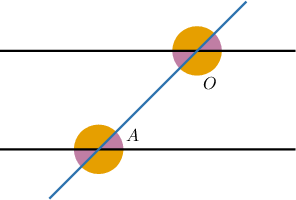
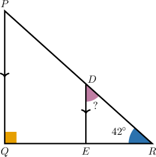
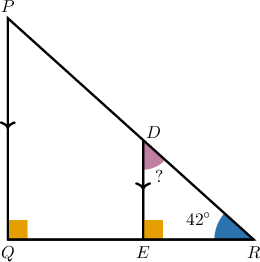
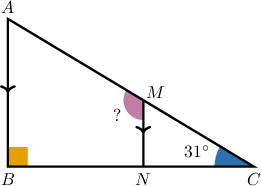
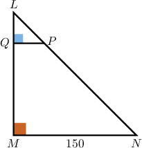
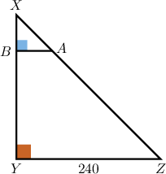

# Solving Parallel Line Problems From Descriptions

Source: https://www.mathacademy.com/topics/6314?courseId=120
Topic ID: 6314

## Prerequisites

- [The AA Similarity Criterion](../geometry/1365-the-aa-similarity-criterion.md)
- [Solving Linear Equations Containing Binomials](./6225-solving-linear-equations-containing-binomials.md)
- [Solving Angle Problems From Descriptions of Similar Triangles](./6331-solving-angle-problems-from-descriptions-of-similar-triangles.md)

## Lesson

### Introduction

In this lesson, we will learn how to use the special angle relationships formed when a transversal intersects two parallel lines to find unknown angle measures.

Suppose a transversal cuts across two parallel lines, creating four acute angles and four obtuse angles, as shown below. Let $\angle A$ be one of the acute angles and $\angle O$ be one of the obtuse angles.

Suppose that we're told that the measure of an obtuse angle is $(5z + 28)^\circ.$ Let's use this information to write down an expression for the measure of the acute angles.

Recall from a previous lesson that when a transversal intersects two parallel lines, it creates eight angles in total. The four acute angles are all congruent, and the four obtuse angles are all congruent.

In our case, the measure of one obtuse angle is $m\angle O = (5z + 28)^\circ.$ Since acute and obtuse angles formed in this configuration are supplementary, their measures sum to $180^\circ{:}$

$$

m\angle A + m\angle O = 180^\circ

$$

Hence, the measure of each acute angle is

$$

\begin{aligned}𝑚∠𝐴 & =180^{∘}−𝑚∠𝑂 \\ & =180^{∘}−(5𝑧+28)^{∘} \\ & =180^{∘}−(5𝑧)^{∘}−28^{∘} \\ & =152^{∘}−(5𝑧)^{∘} \\ & =(152−5𝑧)^{∘}.\end{aligned}

$$

### Example: Determining Angles From Descriptions of Parallel Lines and Transversals

#### Question

A line intersects two parallel lines, forming four acute angles and four obtuse angles. The measure of one of the acute angles is $(96-5t)^\circ,$ and the sum of the measures of one of the obtuse angles and two of the acute angles is $(k-5t)^\circ.$ What is the value of $k?$

#### Explanation

When a transversal intersects two parallel lines, it creates eight angles in total: four acute angles and four obtuse angles. All acute angles are congruent, and all obtuse angles are congruent, as shown below.

Let $\angle A$ be an acute angle and $\angle O$ be an obtuse angle.

In our case,

$$

m\angle A = (96 - 5t)^\circ.

$$

We are told that the sum of one obtuse angle and two acute angles is $(k-5t)^\circ.$ Writing as an equation, we have

$$

m\angle O + 2m\angle A = (k-5t)^\circ.

$$

We know that $\angle A$ and $\angle O$ are supplementary. Therefore, the left-hand side of the above equation becomes

$$

\begin{aligned}𝑚∠𝑂+2𝑚∠𝐴 & =\underset{180^{∘}}{\underset{}{𝑚∠𝑂+𝑚∠𝐴}}+𝑚∠𝐴 \\ & =180^{∘}+(96−5𝑡)^{∘} \\ & =276^{∘}−5𝑡^{∘}.\end{aligned}

$$

Finally, we can equate this to $(k-5t)^\circ$ and solve for $k,$ as follows:

$$

\begin{aligned}276^{∘}−5𝑡^{∘} & =𝑘^{∘}−5𝑡^{∘} \\ 276 & =𝑘 \\ 𝑘 & =276\end{aligned}

$$

### Parallel Lines in Embedded Triangles

Now, we will learn how parallel lines inside a triangle create corresponding and alternate interior angles that help us find unknown angle measures.

Consider the triangles $RQP$ and $RED$ below, where $\overline{DE}$ and $\overline{PQ}$ are parallel. What's the measure of $\angle RDE?$

Since $\overline{DE}$ is parallel to $\overline{PQ}$ and $\angle{Q}$ is a right angle, $\angle{R E D}$ is also a right angle.

We consider the triangle $\triangle{RED}.$ In any triangle, the sum of the measures of its interior angles is $180^\circ.$ Therefore,

$$

m\angle{RDE} + m\angle{RED} + m\angle{DR E} = 180^\circ.

$$

Taking into account that $m\angle{RED} = 90^\circ$ and $m\angle{DRE} = m\angle{PRQ} = 42^\circ,$ we can determine $m\angle{RDE}$ as follows:

$$

\begin{aligned}𝑚∠𝑅𝐷𝐸+𝑚∠𝑅𝐸𝐷+𝑚∠𝐷𝑅𝐸 & =180^{∘} \\ 𝑚∠𝑅𝐷𝐸+90^{∘}+42^{∘} & =180^{∘} \\ 𝑚∠𝑅𝐷𝐸+132^{∘} & =180^{∘} \\ 𝑚∠𝑅𝐷𝐸 & =48^{∘}\end{aligned}

$$

We often need to solve similar problems by drawing a diagram from a description that's given to us. In such cases, we need to read the information we're given carefully and draw a diagram that accurately represents the description.

Let's see an example.

### Example: Determining Angles From Descriptions of Embedded Right Triangles

#### Question

In a triangle $\triangle{ABC},$ the angle $\angle{B}$ is a right angle. Point $M$ lies on $\overline{AC},$ and point $N$ lies on $\overline{BC}$ such that $\overline{MN}$ is parallel to $\overline{AB}.$ If $m\angle{ACB} = 31^\circ,$ what is the measure, in degrees, of $\angle AMN?$

#### Explanation

We proceed to represent the given information in a diagram.

Since $\overline{MN}$ is parallel to $\overline{AB}$ and $\angle{B}$ is a right angle, $\angle{C N M}$ is also a right angle.

We consider the triangle $\triangle{CNM}.$ In any triangle, the sum of the measures of its interior angles is $180^\circ.$ Therefore,

$$

m\angle{CMN} + m\angle{CNM} + m\angle{MCN} = 180^\circ.

$$

Taking into account that $m\angle{CNM} = 90^\circ$ and $m\angle{MCN} = m\angle{ACB} = 31^\circ,$ we can determine $m\angle{CMN}$ as follows:

$$

\begin{aligned}𝑚∠𝐶𝑀𝑁+𝑚∠𝐶𝑁𝑀+𝑚∠𝑀𝐶𝑁 & =180^{∘} \\ 𝑚∠𝐶𝑀𝑁+90^{∘}+31^{∘} & =180^{∘} \\ 𝑚∠𝐶𝑀𝑁+121^{∘} & =180^{∘} \\ 𝑚∠𝐶𝑀𝑁 & =59^{∘}\end{aligned}

$$

Now, note that $\angle{AMN}$ and $\angle{CMN}$ form a linear pair, so they are supplementary. This means

$$

m\angle{AMN} + m\angle{CMN} = 180^\circ.

$$

Finally, substituting $m\angle{CMN} = 59^\circ$ in the equality above and solving for $m\angle{AMN},$ we obtain

$$

\begin{aligned}𝑚∠𝐴𝑀𝑁+𝑚∠𝐶𝑀𝑁 & =180^{∘} \\ 𝑚∠𝐴𝑀𝑁+59^{∘} & =180^{∘} \\ 𝑚∠𝐴𝑀𝑁 & =121^{∘}.\end{aligned}

$$

### Applying AA Similarity

Now, we will see how drawing a line parallel to one side of a right triangle creates a pair of similar triangles, which we can then use to find the lengths of unknown segments.

For example, suppose we're given the following description:

*In right triangle $LMN,$ angle $M$ is the right angle and $MN = 150.$ Point $P$ on side $\overline{LN}$ is connected to point $Q$ on side $\overline{LM}$ such that line segment $\overline{PQ}$ is parallel to side $\overline{MN}$ and $N P = 4 L P.$ What is the length of $\overline{PQ}?$*

We'll now proceed to draw a diagram from this description and calculate the required side length $\overline{PQ}.$

Since $\triangle LMN$ is a right triangle with the right angle at $M,$ and $\overline{PQ} \parallel \overline{MN}$ (where point $P$ lies on side $\overline{LN}$ and point $Q$ lies on side $\overline{LM}$), the triangles can be represented as follows:

Please take a moment to ensure you understand why this diagram accurately represents the given description.

In the triangles $\triangle LQP$ and $\triangle LMN,$ there are two pairs of congruent angles:

- $\angle PQL \cong \angle NML$ since both are right angles, and

- $\angle L$ is common to both triangles.

Since two pairs of corresponding angles are congruent, the triangles are similar by the AA similarity criterion. Therefore,

$$

\dfrac{PQ}{MN}=\dfrac{LP}{LN}.

$$

Since $NP = 4 LP,$ we have that

$$

\begin{aligned}𝐿𝑁 & =𝐿𝑃+𝑁𝑃 \\ & =𝐿𝑃+4𝐿𝑃 \\ & =5𝐿𝑃.\end{aligned}

$$

Therefore, since $MN=150,$ we obtain the following equations that we solve for $PQ{:}$

$$

\begin{aligned}\frac{𝑃𝑄}{𝑀𝑁} & =\frac{𝐿𝑃}{𝐿𝑁} \\ \frac{𝑃𝑄}{150} & =\frac{𝐿𝑃}{5𝐿𝑃} \\ \frac{𝑃𝑄}{150} & =\frac{1}{5} \\ 𝑃𝑄 & =\frac{1}{5}⋅150 \\ 𝑃𝑄 & =30.\end{aligned}

$$

Therefore, $PQ = 30$ units.

Let's see another example.

### Example: Determining Segment Lengths From Descriptions of Embedded Right Triangles

#### Question

In right triangle $XYZ,$ angle $Y$ is the right angle and $YZ = 240.$ Point $A$ on side $\overline{XZ}$ is connected to point $B$ on side $\overline{XY}$ such that line segment $\overline{AB}$ is parallel to side $\overline{YZ}$ and $YB = 7XB.$ What is the length of line segment $\overline{AB}?$

#### Explanation

Since $\triangle XYZ$ is a right triangle with the right angle at $Y,$ and $\overline{AB} \parallel \overline{YZ}$ (where point $A$ lies on side $\overline{XZ}$ and point $B$ lies on side $\overline{XY}$), it can be represented as follows:

In the triangles $\triangle XBA$ and $\triangle XYZ,$ there are two pairs of congruent angles:

- $\angle ABX \cong \angle ZYX$ since both are right angles, and

- $\angle X$ is common to both triangles.

Thus, $\triangle XBA \sim \triangle XYZ$ by AA similarity. As a result,

$$

\dfrac{AB}{YZ}=\dfrac{XB}{XY}.

$$

Since $YB=7XB,$ we have that

$$

\begin{aligned}𝑋𝑌 & =𝑋𝐵+𝑌𝐵 \\ & =𝑋𝐵+7𝑋𝐵 \\ & =8𝑋𝐵.\end{aligned}

$$

Therefore, since $YZ=240,$ we obtain the following equations that we solve for $AB{:}$

$$

\begin{aligned}\frac{𝐴𝐵}{𝑌𝑍} & =\frac{𝑋𝐵}{𝑋𝑌} \\ \frac{𝐴𝐵}{240} & =\frac{𝑋𝐵}{8𝑋𝐵} \\ \frac{𝐴𝐵}{240} & =\frac{1}{8} \\ 𝐴𝐵 & =\frac{1}{8}⋅240 \\ 𝐴𝐵 & =30.\end{aligned}

$$
