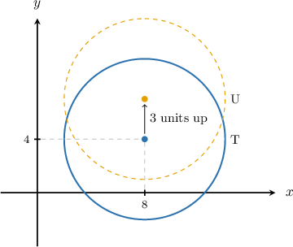

# Transforming Circles

Source: https://www.mathacademy.com/topics/6316?courseId=120
Topic ID: 6316

## Prerequisites

- [Equations of Circles](../geometry/843-equations-of-circles.md)
- [Finding Equations of Translated Functions](./6085-finding-equations-of-translated-functions.md)

## Lesson

### Introduction

In this lesson, we'll learn how to translate and scale a circle given its equation in the coordinate plane.

For example, consider the equation

$$

(x-8)^2+(y-4)^2=36

$$

that represents circle $\text{T}.$ Suppose that circle $\text{U}$ is obtained by shifting circle $\text{T}$ up $3$ units in the $xy$-plane. Let's find the equation for circle $\text{U}.$

For each point on circle $\text{T},$ we must add $3$ to each $y$-coordinate to get the corresponding point on circle $\text{U}.$ So, the new $y$-coordinates of the points on circle $\text{U}$ are given by

$$

y_{\textrm{new}} = y + 3.

$$

This equation is equivalent to

$$

y = y_{\textrm{new}} - 3.

$$

To get the equation of circle $\text{U},$ we substitute this into the equation of circle $\text{T}.$ Doing this, we get

$$

\begin{aligned}(𝑥−8)^{2}+(𝑦−4)^{2} & =36 \\ (𝑥−8)^{2}+((𝑦_{new}−3)−4)^{2} & =36.\end{aligned}

$$

Dropping the $\textrm{new}$ suffix, we get

$$

(x-8)^2+\big((y-3)-4\big)^2 = 36.

$$

Finally, simplifying the expression, we have

$$

(x-8)^2+(y-7)^2 = 36,

$$

which is the equation of circle $\text{U}.$

### Example: Translating Circles

#### Question

The equation $(x-7)^2 + y^2 = 64$ represents circle $\text{R}.$ Circle $\text{S}$ is obtained by shifting circle $\text{R}$ down $2$ units and right $1$ unit in the $xy$-plane. What is the equation of the circle $\text{S}?$

#### Explanation

We're given the equation of circle $\text{R}$

$$

(x-7)^2 + y^2 = 64

$$

and we wish to translate it by $2$ units down and $1$ unit right.

For each point on circle $\text{R}{:}$

- We must subtract $2$ from each $y$-coordinate to get the corresponding point on circle $\text{S}.$ So, the new $y$-coordinates of the points on circle $\text{S}$ are given by This equation is equivalent to

- We also must add $1$ to each $x$-coordinate to get the corresponding point on circle $\text{S}.$ So, the new $x$-coordinates of the points on circle $\text{S}$ are given by This equation is equivalent to

To get the equation of circle $\text{S},$ we substitute the expressions for $x$ and $y$ into the equation of circle $\text{R}.$ Doing this, we get

$$

\begin{aligned}(𝑥−7)^{2}+𝑦^{2} & =64 \\ ((𝑥_{new}−1)−7)^{2}+(𝑦_{new}+2)^{2} & =64.\end{aligned}

$$

Dropping the $\textrm{new}$ suffix, we get

$$

(x - 8)^2 + (y + 2)^2 = 64.

$$

Finally, simplifying the expression, we have

$$

(x - 8)^2 + (y + 2)^2 = 64.

$$

Therefore, the equation of circle $\text{S}$ is $(x - 8)^2 + (y + 2)^2 = 64.$

### Example: Translating and Scaling Circles

#### Question

The equation $(x+3)^2+(y-2)^2=25$ represents circle $\text{C}.$ Circle $\text{D}$ is obtained by shifting circle $\text{C}$ right $4$ units in the $xy$-plane, and its radius is twice that of circle $\text{C}.$ What is the equation of circle $\text{D}?$

#### Explanation

We're given the equation of circle $\text{C}$

$$

(x+3)^2+(y-2)^2=25

$$

and we wish to translate it by $4$ units right and double its radius.

For circle $\text{C}{:}$

- For each point on the circle, we must add $4$ to each $x$-coordinate to get the corresponding point on circle $\text{D}.$ So, the new $x$-coordinates of the points on circle $\text{D}$ are given by This equation is equivalent to

- We also must double the radius of circle $\text{C}$ to get the corresponding radius of circle $\text{D}.$ The right-hand side of the equation of circle $\text{C}$ represents the square of its radius: Doubling the radius of circle $\text{C},$ the new right-hand side of the equation of circle $\text{D}$ must be

To get the equation of circle $\text{D},$ we substitute into the equation of circle $\text{C}$ and update the right-hand side accordingly to give the new squared radius. Doing so, we get

$$

\begin{aligned}((𝑥_{new}−4)+3)^{2}+(𝑦−2)^{2}=100.\end{aligned}

$$

Dropping the $\textrm{new}$ suffix, we get

$$

\big((x - 4)+3\big)^2+(y-2)^2=100.

$$

Finally, simplifying the expression, we have

$$

(x-1)^2+(y-2)^2=100.

$$

Therefore, the equation of circle $\text{D}$ is $(x-1)^2+(y-2)^2=100.$

### Example: Determining Possible Coordinates on a Circle

#### Question

The equation $(x+2)^2+y^2=36$ represents circle $\text{R}.$ Circle $\text{S}$ is obtained by shifting circle $\text{R}$ left $2$ units in the $xy$-plane. The point $(a,b)$ lies on circle $\text{S}.$ Which of the following is a possible value of $a?$

1. $3$

2. $-10$

3. $-8$

#### Explanation

We're given the equation of circle $\text{R}$

$$

(x+2)^2+y^2=36

$$

and we wish to translate it by $2$ units left.

For each point on circle $\text{R},$ we must subtract $2$ from each $x$-coordinate to get the corresponding point on circle $\text{S}.$ So, the new $x$-coordinates of the points on circle $\text{S}$ are given by

$$

x_{\textrm{new}} = x - 2.

$$

This equation is equivalent to

$$

x = x_{\textrm{new}} + 2.

$$

To get the equation of circle $\text{S},$ we substitute this into the equation of circle $\text{R}.$ Doing this, we get

$$

\begin{aligned}(𝑥+2)^{2}+𝑦^{2} & =36 \\ ((𝑥_{new}+2)+2)^{2}+𝑦^{2} & =36.\end{aligned}

$$

Dropping the $\textrm{new}$ suffix, we get

$$

((x + 2)+2)^2+y^2 = 36.

$$

Finally, simplifying the expression, we have

$$

(x+4)^2+y^2 = 36.

$$

Therefore, the equation of circle $\text{S}$ is $(x+4)^2+y^2 = 36.$

Now, we need to find the range of possible values of $a,$ where $(a,b)$ is a point on the circle.

The center of circle $\text{S}$ is $(-4,0)$, and its radius is $r = 6.$ Therefore, the range of $x$-values on the circle is

$$

-4 - 6 \leq x \leq -4 + 6

$$

which simplifies as

$$

-10 \leq x \leq 2.

$$

We can write this as $x\in [-10,2].$

Let's now consider each value in turn.

- $a=3$ is NOT possible since $3\notin [-10,2]\quad{\color{red}{\times}}$

- $a=-10$ is possible since $-10\in [-10,2]\quad{\color{green}{\checkmark}}$

- $a=-8$ is possible since $-8\in [-10,2]\quad{\color{green}{\checkmark}}$

Therefore, the correct answer is, "II and III only."
