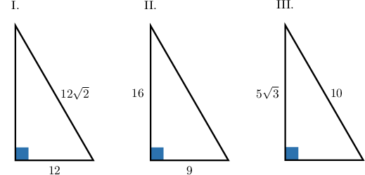
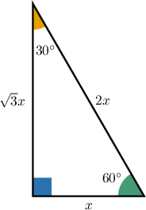
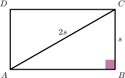
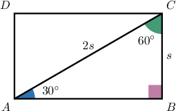
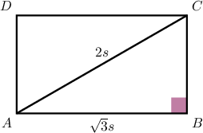
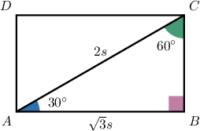
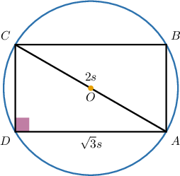
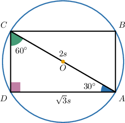

# Recognizing 30-60-90 Triangles

Source: https://www.mathacademy.com/topics/6324?courseId=120
Topic ID: 6324

## Prerequisites

- [The Area of a 30-60-90 Triangle](../geometry/2884-the-area-of-a-30-60-90-triangle.md)
- [Squares Inscribed in Circles](../geometry/6202-squares-inscribed-in-circles.md)

## Lesson

### Introduction

In this topic, we’ll learn to recognize a $30^\circ$-$60^\circ$-$90^\circ$ triangle from side ratios alone and use this to compute lengths quickly.

This pattern appears in some problems involving right triangles and rectangles. So, spotting it instantly can turn a multi-step geometry problem into a simple arithmetic task.

Let's refer to our standard $30^\circ$-$60^\circ$-$90^\circ$ triangle.

Notice the following:

- The ratio of the hypotenuse to the shortest leg:

- The ratio of the longest leg to the shortest leg:

- The ratio of the hypotenuse to the longest leg:

These ratios are true for any $30^\circ$-$60^\circ$-$90^\circ$ triangle. But the converse is also true:

If at least one of these ratios is true in a right triangle, then this is a $30^\circ$-$60^\circ$-$90^\circ$ triangle.

Let's see how we can use this to recognize $30^\circ$-$60^\circ$-$90^\circ$ triangles.

### Example: Recognizing 30-60-90 Triangles

#### Question

Consider the right triangles above (not drawn to scale). Which of the above is a $30^\circ$-$60^\circ$-$90^\circ$ triangle?

#### Explanation

Let's refer to our standard $30^\circ$-$60^\circ$-$90^\circ$ triangle.

Notice the following:

- The ratio of the hypotenuse to the shortest leg:

- The ratio of the longest leg to the shortest leg:

- The ratio of the hypotenuse to the longest leg:

These ratios are true for any $30^\circ$-$60^\circ$-$90^\circ$ triangle. But the converse is also true: if at least one of these ratios is true in a right triangle, then this is a $30^\circ$-$60^\circ$-$90^\circ$ triangle.

With that in mind, let's examine our right triangles in turn.

- Triangle I is ** a $30^\circ$-$60^\circ$-$90^\circ$ triangle. Here, the ratio of the hypotenuse to the shortest leg is the following:

- Triangle II is ** a $30^\circ$-$60^\circ$-$90^\circ$ triangle. Here, the ratio of the longest leg to the shortest leg is the following:

- Triangle III is a $30^\circ$-$60^\circ$-$90^\circ$ triangle. Indeed, the ratio of the hypotenuse to the longest leg is the following:

Therefore, the triangle $\textrm{III}$ is a $30^\circ$-$60^\circ$-$90^\circ$ triangle.

### Recognizing 30-60-90 Triangles in Rectangles

Now, suppose that the diagonal of a rectangle is twice the length of its shortest side, and the area of the rectangle is $10\sqrt{3}$ square inches. Let's use this information to find the length of the shortest side of the rectangle.

First, let $s$ be the length of the shortest side. Then, we have the following diagram.

Here, in rectangle $ABCD,$ the length of the diagonal $\overline{AC}$ is twice the length of the shortest side $\overline{BC}{:}$

$$

{AC}:{BC} = 2:1

$$

Next, since in the right triangle $ABC,$ the ratio of the hypotenuse to the shortest leg is

$$

\dfrac{\text{hypotenuse}}{\text{shortest}} = \dfrac{AC}{BC} = \dfrac{2}{1},

$$

we have that $\triangle ABC$ is a $30^\circ$-$60^\circ$-$90^\circ$ triangle.

Recall that the area of a $30^\circ$-$60^\circ$-$90^\circ$ triangle whose shortest side has length $s$ is given by

$$

A = \dfrac{\sqrt 3}{2} s^2.

$$

The area of $\triangle ADC$ is half the area of the rectangle, and since we're told that the area of the rectangle is $10\sqrt 3$ square inches, we have

$$

A = \dfrac{1}{2} \cdot 10\sqrt{3} = 5\sqrt{3}.

$$

Thus, we have the following equation that can be solved for $s{:}$

$$

\begin{aligned}\frac{\sqrt{√3}}{2}𝑠^{2} & =5\sqrt{√3} \\ \sqrt{√3} 𝑠^{2} & =10\sqrt{√3} \\ 𝑠^{2} & =10 \\ 𝑠 & =\sqrt{√10}\end{aligned}

$$

Therefore, the shortest side of the rectangle is

$$

BC = s= \sqrt{10} \: \text{in}.

$$

Let's see another, similar example.

### Example: Finding an Unknown Length in a Rectangle Using 30-60-90 Triangles

#### Question

The ratio between the longest side of a rectangle and its diagonal is $\sqrt{3}:2,$ and the area of the rectangle is $108\sqrt{3}$ square inches. What is the length, in inches, of the shortest side of the rectangle?

#### Explanation

Let $s$ be the length of the shortest side. Then, we have the following diagram.

Here, in rectangle $ABCD,$

- the length of the diagonal $\overline{AC}$ is $2$ times the length of the shortest side $\overline{BC},$ and

- the length of the longest side $\overline{AB}$ is $\sqrt{3}$ times the length of the shortest side $\overline{BC}.$

Thus, we have:

$$

{AC}:{AB} = 2:\sqrt{3}

$$

Now, since in the right triangle $ABC,$ the ratio of the hypotenuse to the longest leg is

$$

\dfrac{\text{hypotenuse}}{\text{longest}} = \dfrac{AC}{AB} = \dfrac{2}{\sqrt{3}},

$$

we have that $\triangle ABC$ is a $30^\circ$-$60^\circ$-$90^\circ$ triangle.

Recall that the area of a $30^\circ$-$60^\circ$-$90^\circ$ triangle whose shortest side has length $s$ is given by

$$

A = \dfrac{\sqrt 3}{2} s^2.

$$

The area of $\triangle ADC$ is half the area of the rectangle:

$$

A = \dfrac{1}{2} \cdot 108\sqrt{3} = 54\sqrt{3}

$$

Thus, we have the following equation that can be solved for $s{:}$

$$

\begin{aligned}\frac{\sqrt{√3}}{2}𝑠^{2} & =54\sqrt{√3} \\ \sqrt{√3} 𝑠^{2} & =108\sqrt{√3} \\ 𝑠^{2} & =108 \\ 𝑠 & =\sqrt{√108} \\ & =\sqrt{√36⋅3} \\ & =6\sqrt{√3}\end{aligned}

$$

Therefore, the shortest side of the rectangle is

$$

BC = s= 6\sqrt{3} \: \text{in}.

$$

### Example: Solving Problems Involving Rectangles Inscribed in Circles

#### Question

A rectangle is inscribed in a circle such that each vertex of the rectangle lies on the circumference. The ratio between the longest side of a rectangle and its diagonal is $\sqrt{3}:2,$ and the area of the rectangle is $200\sqrt{3}$ square meters. What is the length, in meters, of the diameter of the circle?

#### Explanation

Let $s$ be the length of the shortest side. Then, we have the following diagram.

Here, in rectangle $ABCD,$

- the length of the diagonal $\overline{AC}$ is $2$ times the length of the shortest side $\overline{CD},$ and

- the length of the longest side $\overline{AD}$ is $\sqrt{3}$ times the length of the shortest side $\overline{CD}.$

Thus, we have:

$$

{AC}:{AD} = 2:\sqrt{3}

$$

Now, since in the right triangle $ADC,$ the ratio of the hypotenuse to the longest leg is

$$

\dfrac{\text{hypotenuse}}{\text{longest}} = \dfrac{AC}{AD} = \dfrac{2}{\sqrt{3}},

$$

we have that $\triangle ADC$ is a $30^\circ$-$60^\circ$-$90^\circ$ triangle.

Recall that the area of a $30^\circ$-$60^\circ$-$90^\circ$ triangle whose shortest side has length $s$ is given by

$$

A = \dfrac{\sqrt 3}{2} s^2.

$$

The area of $\triangle ADC$ is half the area of the rectangle:

$$

A = \dfrac{1}{2} \cdot 200\sqrt{3} = 100\sqrt{3}

$$

Thus, we have the following equation that can be solved for $s{:}$

$$

\begin{aligned}\frac{\sqrt{√3}}{2}𝑠^{2} & =100\sqrt{√3} \\ \sqrt{√3} 𝑠^{2} & =200\sqrt{√3} \\ 𝑠^{2} & =200 \\ 𝑠 & =\sqrt{√200} \\ & =\sqrt{√100⋅2} \\ & =10\sqrt{√2}\end{aligned}

$$

So, the diagonal of the rectangle is

$$

\begin{aligned}𝐴𝐶 & =2𝑠 \\ & =2⋅10\sqrt{√2} \\ & =20\sqrt{√2}.\end{aligned}

$$

Finally, since the diameter of the circle is equal to the diagonal of the rectangle, we have that the diameter is

$$

AC = 20\sqrt{2} \: \text{m}.

$$
