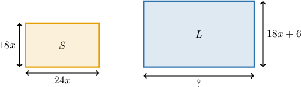
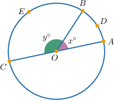
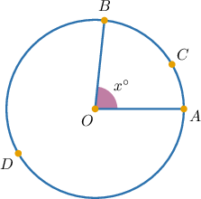
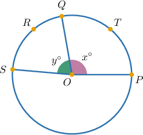

# Manipulating Ratios in Various Contexts

Source: https://www.mathacademy.com/topics/6325?courseId=120
Topic ID: 6325

## Prerequisites

- [Solving Problems Using Unit Rates](../grade-6/558-solving-problems-using-unit-rates.md)
- [Calculating Arc Lengths of Circular Sectors](../geometry/597-calculating-arc-lengths-of-circular-sectors.md)
- [Side Lengths and Angle Measures of Similar Polygons](../geometry/1367-side-lengths-and-angle-measures-of-similar-polygons.md)

## Lesson

### Introduction

Recall that whenever we have a ratio of two quantities $a$ and $b,$

$$

a \:\mathbin{:}\: b

$$

we can form an equivalent ratio by multiplying this ratio by a nonzero constant $k.$

$$

ka \:\mathbin{:}\: kb

$$

Similarly, we divide our original ratio by $k$ to get another equivalent ratio.

$$

\dfrac{a}{k} \:\mathbin{:}\: \dfrac{b}{k}

$$

It's often convenient to solve real-world problems using equivalent ratios presented in this form. This usually involves a three-step process.

1. First, we set up a ratio of quantities given in the problem statement.

2. Then, we determine the *unit rate*.

3. Finally, we multiply our ratio to find the equivalent ratio we are interested in.

Let's see a concrete example.

### A Concrete Example

Suppose a garden hose releases $1{,}260\,\textrm{L}$ of water in $14$ minutes at a constant rate, and we want to know how many liters are released in $5$ minutes at this rate.

To solve this, we first set up a ratio. In this case, the ratio of volume released to time is

$$

1{,}260\,\textrm{L} \:\mathbin{:}\: 14\,\textrm{min}.

$$

Now, we wish to know the volume of water released in $5$ minutes. To determine this, we

- determine the *unit rate* (liters of water per minute), and then

- multiply by the number of minutes we're interested in $(5).$

Dividing the above ratio by $14,$ we have

$$

\dfrac{1260}{14}\,\textrm{L} \:\mathbin{:}\: 1\,\textrm{min}

$$

which simplifies as

$$

90\,\textrm{L} \:\mathbin{:}\: 1\,\textrm{min}.

$$

This tells us that $90$ liters of water are released every minute.

Finally, multiplying this ratio by $5,$ we have

$$

5\cdot 90\,\textrm{L} \:\mathbin{:}\: 5\cdot 1\,\textrm{min}

$$

which gives

$$

450\,\textrm{L} \:\mathbin{:}\: 5\,\textrm{min}.

$$

Therefore, in $5$ minutes, the hose releases $450\,\textrm{L}$ of water.

### Example: Determining a Rate Using Equivalent Ratios

#### Question

A paint sprayer applies $132c\,\textrm{mL}$ of paint in $8d$ minutes at a constant rate. Which expression represents the number of milliliters applied in $3d$ minutes at this rate?

#### Explanation

The ratio of volume of paint applied to the number of minutes is given by

$$

132c\,\textrm{mL} \:\mathbin{:}\: 8d\,\textrm{min}

$$

We need to know the volume of paint applied in $3d$ minutes. To determine this, we

- determine the ** (milliliters of paint applied per minute), and then

- multiply by the number of minutes we're interested in $(3d).$

Dividing the above ratio by $8d,$ we have

$$

\dfrac{132c}{8d}\,\textrm{mL} \:\mathbin{:}\: 1\,\textrm{min}

$$

This tells us that $\dfrac{132c}{8d}$ milliliters of paint are applied every minute.

Finally, multiplying this ratio by $3d,$ we have

$$

3d\cdot \dfrac{132c}{8d}\,\textrm{mL} \:\mathbin{:}\: 3d\cdot 1\,\textrm{min}

$$

which gives

$$

\begin{aligned} & \frac{396𝑐𝑑}{8𝑑}\,mL\,:\,3𝑑\,min \\ & \frac{396𝑐\,𝑑}{8\,𝑑}\,mL\,:\,3𝑑\,min \\ & \frac{99𝑐}{2}\,mL\,:\,3𝑑\,min.\end{aligned}

$$

Therefore, in $3d$ minutes, the sprayer applies $\dfrac{99c}{2}\,\textrm{mL}$ of paint.

### Maintaining Fixed Ratios in Similar Polygons

Suppose we have a rectangle with a length-to-width ratio fixed at

$$

24\:\mathbin{:}\:18,

$$

as shown below (not drawn to scale), where $x$ is a positive constant.

Suppose the width is *increased* by $6$ units. How much must the length be increased by to maintain our $24\:{:}\:18$ ratio?

Here's the key idea. When two dimensions of a polygon have a fixed ratio, any *change* in the dimensions *must share the same ratio*.

The width is increased by $6$ units. To determine the resulting change in length, we

- determine the *unit rate* (change in length per unit change in width), and then

- multiply by the change in width we're interested in ($6$ units).

Dividing the ratio $24:18$ by $18,$ we have

$$

\dfrac{24}{18} \:\mathbin{:}\: 1

$$

which simplifies as

$$

\dfrac{4}{3} \:\mathbin{:}\: 1.

$$

This tells us that a $\dfrac{4}{3}$ unit change in length results from a $1$ unit change in width.

Then, multiplying this ratio by $6,$ we have

$$

6\cdot\dfrac{4}{3} \:\mathbin{:}\: 6\cdot 1

$$

which gives

$$

8 \:\mathbin{:}\: 6.

$$

Therefore, when the width increases by $6$ units, the length must increase by $8$ units.

We can apply the same principle when it comes to altering the dimensions of polyhedra. Let's see an example.

### Example: Maintaining Fixed Ratios in Polygons and Rectangular Solids

#### Question

A solar panel mounting tray in the shape of a rectangular solid has a fixed height and a fixed length-to-width ratio of $27\mathbin{:}18.$ If the width is increased by $14$ units, how should the length be adjusted to keep the same ratio?

#### Explanation

The fixed ratio of length to width is

$$

27\mathbin{:}18.

$$

To maintain this ratio when dimensions change, the ** in length and width must share the same ratio.

The width is increased by $14$ units. To determine the resulting change in length, we

- determine the ** (change in length per unit change in width), and then

- multiply by the change in width we're interested in ($14$ units).

Dividing the above ratio by $18,$ we have

$$

\dfrac{27}{18} \:\mathbin{:}\: 1

$$

which simplifies as

$$

\dfrac{3}{2} \:\mathbin{:}\: 1.

$$

This tells us that a $\dfrac32$ unit change in length results from a $1$ unit change in width.

Then, multiplying this ratio by $14,$ we have

$$

14\cdot\dfrac{3}{2} \:\mathbin{:}\: 14 \cdot 1

$$

which gives

$$

21 \:\mathbin{:}\: 14.

$$

Therefore, when the width increases by $14$ units, the length must $\boxed{\textrm{increase}}$ by $\boxed{21}$ units.

### Circle Problems

Recall that the proportion of a full turn represented by an arc is equal to the fraction of $360^\circ$ given by its central angle.

For example, an arc with a corresponding central angle of $30^\circ$ represents

$$

\dfrac{30^\circ}{360^\circ} = \dfrac{1}{16}

$$

of a full turn.

We use the ratio of an arc length to its proportion of a full turn to solve different types of circle problems:

$$

\textrm{arc length} \:\mathbin{:}\: \textrm{proportion of a full turn}

$$

To demonstrate, consider the circle below with center $O,$ where the length of arc $\overset{\frown}{ADB}$ is $4\pi,$ $x = 45,$ and $y=135.$

Let's use ratios to find the length of the arc $\overset{\frown}{BEC}.$

The arc length of $\overset{\frown}{ADB}$ is $4\pi,$ which represents

$$

\dfrac{45^\circ}{360^\circ} = \dfrac{1}{8}

$$

of a full turn. Therefore, we have the following ratio of arc length to full turn proportion:

$$

4\pi : \dfrac{1}{8}

$$

On the other hand, the arc $\overset{\frown}{BEC}$ represents

$$

\dfrac{135^\circ}{360^\circ} = \dfrac{3}{8}

$$

of a full turn. Our goal is to manipulate the above ratio to yield the arc length corresponding to this proportion.

Multiplying our ratio above by $3,$ we have

$$

\begin{aligned}4𝜋\, & :\,\frac{1}{8} \\ 3⋅4𝜋\, & :\,3⋅\frac{1}{8} \\ 12𝜋\, & :\,\frac{3}{8}.\end{aligned}

$$

Therefore, the length of the arc $\overset{\frown}{BEC},$ which represents $\dfrac38$ of a full turn, is $12\pi.$

### Example: Using Ratios to Determine Arc-Length

#### Question

The circle above has center $O,$ the length of arc $\overset{\frown}{ACB}$ is $7\pi,$ and $x = 84.$ What is the length of arc $\overset{\frown}{ADB}?$

#### Explanation

We'll solve this problem by considering the following ratio:

$$

\textrm{arc length} \:\mathbin{:}\: \textrm{proportion of a full turn}

$$

The arc length of $\overset{\frown}{ACB}$ is $7\pi,$ which represents

$$

\dfrac{84^\circ}{360^\circ} = \dfrac{7}{30}

$$

of a full turn. Therefore, we have the following ratio of arc length to full turn proportion:

$$

7\pi \:\mathbin{:}\: \dfrac{7}{30}.

$$

Thus, the remaining arc $\overset{\frown}{ADB}$ corresponds to

$$

1 - \dfrac{7}{30} = \dfrac{23}{30}

$$

of a full turn. Our goal is to manipulate the above ratio to yield the arc length corresponding to this proportion.

Dividing our ratio by $7,$ we have

$$

\begin{aligned}7𝜋\, & :\,\frac{7}{30} \\ \frac{7𝜋}{7}\, & :\,\frac{1}{30} \\ 𝜋\, & :\,\frac{1}{30}\end{aligned}

$$

This tells us that an arc length of $\pi$ corresponds to one-thirtieth of a full turn.

Finally, multiplying this ratio by $23,$ we have

$$

23 \cdot \pi \:\mathbin{:}\: \dfrac{23 \cdot 1}{30}.

$$

which gives

$$

23\pi \:\mathbin{:}\: \dfrac{23}{30}.

$$

Therefore, the length of the arc $\overset{\frown}{ADB}$ is $23\pi.$

### Example: Using Ratios to Determine Angle

#### Question

The circle above has center $O,$ the length of arcs $\overset{\frown}{PTQ}$ and $\overset{\frown}{QRS}$ are $20\pi$ and $15\pi,$ respectively, and $x = 100.$ What is the value of $y?$

#### Explanation

We'll solve this problem by considering the following ratio:

$$

\textrm{arc length} \:\mathbin{:}\: \textrm{proportion of a full turn}

$$

The arc length of $\overset{\frown}{PTQ}$ is $20\pi,$ which represents

$$

\dfrac{100^\circ}{360^\circ}=\dfrac{5}{18}

$$

of a full turn. We can express this relationship as the following ratio:

$$

20\pi \:\mathbin{:}\: \dfrac{5}{18}.

$$

On the other hand, the arc length of $\overset{\frown}{QRS}$ is $15\pi.$ Our goal is to manipulate the above ratio to yield the full turn proportion corresponding to this arc length, and use that to compute the value of $y.$

Dividing the above ratio by $20,$ we have

$$

\begin{aligned}20𝜋 & \,:\,\frac{5}{18} \\ \frac{20𝜋}{20} & \,:\,\frac{5}{18⋅20} \\ 𝜋\, & :\,\frac{1}{72}.\end{aligned}

$$

Finally, multiplying this ratio by $15,$ we have

$$

15\cdot \pi \:\mathbin{:}\: \dfrac{15\cdot 1}{72}

$$

which gives

$$

15\pi \:\mathbin{:}\: \dfrac{5}{24}.

$$

This means that the arc length $\overset{\frown}{QRS}$ represents $\dfrac{5}{24}$ of a full circle. Hence, the measure of the corresponding central angle is

$$

y^\circ=\dfrac{5}{24}\cdot 360^\circ=75^\circ.

$$

Therefore, $y=75.$
