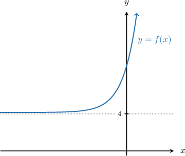
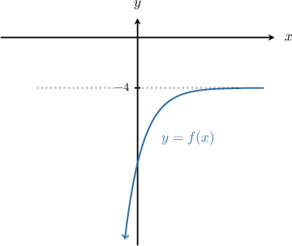
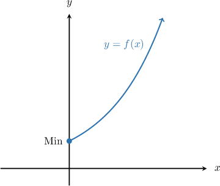
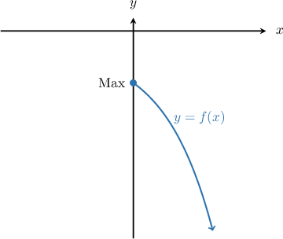
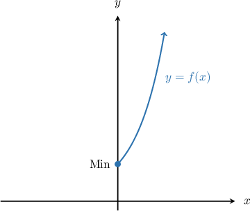
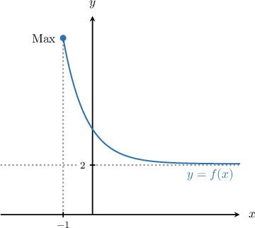
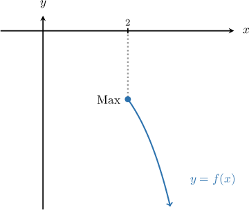

# Extrema of Exponential Functions

Source: https://www.mathacademy.com/topics/6328?courseId=120
Topic ID: 6328

## Prerequisites

- [Vertical Reflections of Exponential Functions](../algebra-ii/1682-vertical-reflections-of-exponential-functions.md)

## Lesson

### Introduction

In this lesson, we'll discuss global extrema of exponential functions.

On the domain $x \in (-\infty, \infty),$ an exponential function $f(x)$ always

- approaches, *but never reaches*, a horizontal asymptote on one side, and

- increases (or decreases) *without bound* on the other.

As a result, exponential functions on this domain *have no extrema.* In other words, exponential functions defined on $x\in(-\infty,\infty)$ have neither a global maximum nor a global minimum.

To demonstrate, consider the function $f(x) = 5\cdot 2^x + 4.$ We start by sketching the graph of $y=f(x)$ below.

From the graph, we note the following:

- Looking at the end-behavior on the left-hand side, we see that $f(x) > 4.$ Since $f(x)$ approaches the horizontal asymptote $y=4$ from above but never reaches $4,$ $f$ does NOT have a minimum value.

- Looking at the end-behavior on the right-hand side, we see that $f(x) \to \infty$ as $x \to \infty.$ Hence, it does NOT have a maximum value.

Similarly, all exponential functions defined on the domain $x \in (-\infty, \infty)$ have no extrema.

### Example: Identifying True Statements Regarding Extrema of Exponential Functions Over the Reals

#### Question

Consider the function $f(x) = -6\left(\dfrac12\right)^{x} - 4.$ Which of the following statements are true?

1. $f$ has a minimum value.

2. $f$ does **** have a maximum value.

3. The range of $f$ is $(-\infty,-4).$

#### Explanation

On the domain $x\in(-\infty,\infty),$ an exponential function $f(x)=a\cdot b^x+c$ approaches, but never reaches, a horizontal asymptote on one side, and increases (or decreases) without bound on the other.

Let's start by sketching the graph of $y=f(x)$ below.

From the graph, we note the following:

- Looking at the end-behavior on the left-hand side, we see that $f(x) \to -\infty$ as $x \to -\infty.$

- Looking at the end-behavior on the right-hand side, we see that $f(x) < -4.$

With this in mind, let's consider each statement in turn.

- Statement I is false. The function decreases without bound as $x\to -\infty,$ so it does not have a minimum value.

- Statement II is true. Since $f(x)$ approaches the horizontal asymptote $y=-4$ from below but never reaches $-4,$ $f$ does not have a maximum value.

- Statement III is true. Since $f(x)$ can be made arbitrarily negative and approaches $-4$ from below, the range is $(-\infty,-4).$

Therefore, the correct statements are “II and III only”.

### Extrema of Exponential Functions Over the Non-Negative Reals

When modeling with exponential functions, we often need to *restrict the domain* to $x \geq 0.$ But what effect does changing the domain have on the presence of extreme values?

We have the following general principle:

*On the domain $x\geq 0,$ an exponential function $f(x) = a \cdot b^x + c$ has an extremum at $x=0.$ Which type depends on the values of $a$ and $b.$*

For example, consider the function

$$

f(x)=6\cdot 4^x-2

$$

on the **restricted domain** $x\geq 0.$ Let's determine the extrema of this function.

We start by sketching the graph of $y=f(x),$ remembering the domain restriction $x\geq 0.$

Note that we have ignored all values of $f(x)$ for $x < 0$ to accommodate the domain restriction.

Now, from the graph, we note the following:

- On $x\ge 0,$ the function $f$ attains a *minimum* at $x=0,$ with a minimum value of

- Looking at the end-behavior on the right-hand side, we see that $f(x)\to\infty$ as $x\to\infty.$ So, the function has *no maximum* on $x\geq0.$

- Since the minimum value is $f(0)=4$ and there is no maximum, the range of $f$ in $x \geq 0$ is

It is also possible that an exponential function attains a *maximum* at $x=0$ on the domain $x\geq0.$ We'll see how this works in the next example.

### Example: Identifying True Statements Regarding Extrema of Exponential Functions Over the Non-Negative Reals

#### Question

Consider the function $f(x) = -4\cdot 4^x - 2$ on the domain $x\geq 0.$ Which of the following statements are true?

1. The maximum value of $f$ is $-6.$

2. $f$ is increasing on its domain.

3. The range of $f$ is $(-\infty,-6].$

#### Explanation

On the domain $x\in(-\infty,\infty),$ an exponential function $f(x)=a\cdot b^x+c$ approaches, but never reaches, a horizontal asymptote on one side, and increases (or decreases) without bound on the other.

Let's start by sketching the graph of $y=f(x)$ for the function

$$

f(x) = -4\cdot 4^x - 2

$$

with the domain restriction $x\geq 0.$

With this in mind, let's consider each statement in turn.

- Statement I is true. The function attains a maximum at the left endpoint $x=0,$ with $f(0)=-4\cdot 1-2=-6.$

- Statement II is false. We can see from the graph that $f$ is decreasing on its domain.

- Statement III is true. Because $f(0)=-6$ is the largest value and $f(x)\to -\infty$ as $x\to\infty,$ the range is $(-\infty,-6]$ on it domain.

Therefore, the correct statements are “I and III only”.

### Example: Calculating Extrema of Exponential Functions Over the Non-Negative Reals

#### Question

What is the minimum value of $f(x)=5\cdot 4^x+1$ for $x \geq 0?$

#### Explanation

Let's start by sketching the graph of $y=f(x)$ for the function

$$

f(x) = 5\cdot 4^x+1

$$

with the domain restriction $x\geq 0.$

Evaluating $f$ at $x=0,$ we have

$$

\begin{aligned}𝑓(0) & =5⋅4^{0}+1 \\ & =5⋅1+1 \\ & =6.\end{aligned}

$$

Therefore, the minimum value of $f$ on the domain $x \geq 0$ is $6.$

### Extrema of Exponential Functions Over Other Restricted Domains

When working with exponential functions, we may sometimes restrict the domain to sets other than the usual $x \in (-\infty, \infty)$ and $x\geq 0.$

For instance, consider the function

$$

f(x)=7\left(\dfrac15\right)^x+2

$$

on the restricted domain $x \geq -1.$ What extreme values, if any, does $f$ have?

Let's start by sketching the graph of $y=f(x)$ with the domain restriction $x\geq -1.$

Note that we have ignored all values of $f(x)$ for $x < -1$ to accommodate the domain restriction.

From the graph, we see that, on the domain $x \geq -1,$

- $f$ attains its *maximum* at $x=-1,$ and

- $f$ does not have a minimum value, because it approaches (but never reaches) $y=2$ from above as $x\to\infty.$

Evaluating $f$ at $x=-1,$ we have

$$

\begin{aligned}𝑓(−1) & =7(\frac{1}{5})^{−1}+2 \\ & =7⋅5+2 \\ & =35+2 \\ & =37.\end{aligned}

$$

Therefore, on the domain $x \geq -1,$

- the maximum value of $f$ is $37,$ and

- the range of the function is given by

### Example: Finding Extrema of Exponential Functions Over Other Restricted Domains

#### Question

What is the maximum value of $f(x)=-2\cdot 3^x-5$ for $x \geq 2?$

#### Explanation

Let's start by sketching the graph of $y=f(x)$ for the function

$$

f(x) = -2\cdot 3^x-5

$$

with the domain restriction $x\geq 2.$

On the domain $x \geq 2,$ $f$ attains its ** at $x=2.$

Evaluating $f$ at $x=2,$ we have

$$

\begin{aligned}𝑓(2) & =−2⋅3^{2}−5 \\ & =−2⋅9−5 \\ & =−18−5 \\ & =−23.\end{aligned}

$$

Therefore, the maximum value of $f$ on the domain $x \geq 2$ is $-23.$
