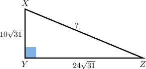
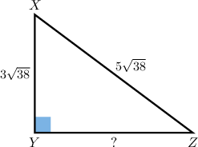

# Solving Geometry Problems by Manipulating Radicals

Source: https://www.mathacademy.com/topics/6330?courseId=120
Topic ID: 6330

## Prerequisites

- [The Power of Product Rule for Exponents](../grade-8/2012-the-power-of-product-rule-for-exponents.md)
- [The Area of an Isosceles Right Triangle](../geometry/2885-the-area-of-an-isosceles-right-triangle.md)
- [Comparing Radicals](./6329-comparing-radicals.md)

## Lesson

### Introduction

Radicals occur often in geometry problems involving right triangles. We can often streamline the solutions to these problems using strategies for manipulating radicals.

For example, let's figure out the length of the hypotenuse in the following right triangle:

Notice the following:

- The legs of the triangle are $\overline{XY}$ and $\overline{YZ}.$

- The lengths of both legs are integer multiples of $\sqrt{31}$ (this will help to simplify our calculations).

- The hypotenuse is $\overline{XZ}.$

The Pythagorean theorem states that

$$

XZ^2 = XY^2 + YZ^2.

$$

We are given that

$$

XY = 10\sqrt{31}, \qquad YZ = 24\sqrt{31}.

$$

Substituting these values into the formula above and using the power of the product rule for exponents, we obtain

$$

\begin{aligned}𝑋𝑍^{2} & =(10\sqrt{√31})^{2}+(24\sqrt{√31})^{2} \\ & =10^{2}⋅(\sqrt{√31})^{2}+24^{2}⋅(\sqrt{√31})^{2} \\ & =100⋅31+576⋅31\end{aligned}

$$

Now, instead of computing these two products explicitly, we can take out a common factor $31{:}$

$$

\begin{aligned}𝑋𝑍^{2}=(100+576)⋅31\end{aligned}

$$

which simplifies as

$$

XZ^2 = 676 \cdot 31.

$$

Finally, taking the square root and using the product rule for radicals, we get

$$

\begin{aligned}𝑋𝑍 & =\sqrt{√676⋅31} \\ & =\sqrt{√676}⋅\sqrt{√31} \\ & =26\sqrt{√31}.\end{aligned}

$$

**Watch out!** A common approach in problems like this is to square the legs separately and add the results immediately, without first noticing the common factor. This method is correct, but less streamlined.

In our example above, this would give

$$

\begin{aligned}𝑋𝑍^{2} & =(10\sqrt{√31})^{2}+(24\sqrt{√31})^{2} \\ & =10^{2}⋅(\sqrt{√31})^{2}+24^{2}⋅(\sqrt{√31})^{2} \\ & =100⋅31+576⋅31 \\ & =3,100+17,856 \\ & =20,956.\end{aligned}

$$

Therefore,

$$

XZ = \sqrt{20{,}956}.

$$

While this is correct, it is not immediately apparent that this is equivalent to $26\sqrt{31}$. Recognizing and factoring out the common factor of $31$ earlier simplifies the arithmetic.

### Example: Using the Pythagorean Theorem Given Radical Side Lengths

#### Question

In a triangle $\triangle{XYZ},$ angle $\angle{Y}$ is a right angle. The length of side $\overline{XY}$ is $3\sqrt{38}$ and the length of side $\overline{XZ}$ is $5\sqrt{38}.$ What is the length of side $\overline{YZ}?$

#### Explanation

We start by sketching the triangle, as shown below.

Notice that the legs of the right triangle $\triangle{XYZ}$ are $\overline{XY}$ and $\overline{YZ},$ while the hypotenuse is $\overline{XZ}.$ So, for $\triangle{XYZ},$ the Pythagorean theorem states that

$$

XZ^2 = XY^2 + YZ^2.

$$

We are given $XZ = 5\sqrt{38}$ and $XY = 3\sqrt{38}.$ Substituting these values into the formula above and using the power of the product rule for exponents, we obtain

$$

\begin{aligned}𝑋𝑍^{2} & =𝑋𝑌^{2}+𝑌𝑍^{2} \\ 𝑌𝑍^{2} & =𝑋𝑍^{2}−𝑋𝑌^{2} \\ & =(5\sqrt{√38})^{2}−(3\sqrt{√38})^{2} \\ & =25⋅38−9⋅38 \\ & =(25−9)⋅38 \\ & =16⋅38.\end{aligned}

$$

Finally, taking the square root and using the product rule for radicals, we get

$$

\begin{aligned}𝑌𝑍 & =\sqrt{√16⋅38} \\ & =\sqrt{√16}⋅\sqrt{√38} \\ & =4\sqrt{√38}.\end{aligned}

$$

### Example: Finding Areas of Isosceles Right Triangles by Comparing Radicals

#### Question

An isosceles right triangle has a side of length $10\sqrt{14}\,\textrm{mm}$ and another side of length $\sqrt{700}\,\textrm{mm}.$ In square millimeters, what is the area of the triangle?

#### Explanation

To determine which side is the hypotenuse (i.e., the longest side), we rewrite the radicals as single square roots:

$$

\begin{aligned}10\sqrt{√14} & =\sqrt{√100}⋅\sqrt{√14} \\ & =\sqrt{√100⋅14} \\ & =\sqrt{√1400}\end{aligned}

$$

Now, we compare the square roots directly:

$$

\sqrt{1400} > \sqrt{700}

$$

So, the hypotenuse is $10\sqrt{14},$ and the legs are $\sqrt{700}$ and $\sqrt{700}.$

Next, we apply the formula for the area of a $45^\circ$-$45^\circ$-$90^\circ$ triangle

$$

\mathcal A = \dfrac{1}{2} s^2,

$$

where $s$ is a leg. Substituting the values, we obtain

$$

\begin{aligned}A & =\frac{1}{2}⋅(\sqrt{√700})^{2} \\ & =\frac{1}{2}⋅700 \\ & =\frac{700}{2} \\ & =350.\end{aligned}

$$

Therefore, the area of the triangle is ${350}\,\textrm{mm}^2.$

### Example: Finding Areas of a Right Triangles by Comparing Radicals

#### Question

A right triangle has side lengths $\dfrac{3\sqrt{14}}{\sqrt{2}},$ $\sqrt{42},$ and $\dfrac{\sqrt{84}}{2}$ units. What is the area of the triangle, in square units?

#### Explanation

To determine which side is the hypotenuse (i.e., the longest side), we rewrite the radicals as single square roots:

$$

\begin{aligned}\frac{3\sqrt{√14}}{\sqrt{√2}} & =\frac{\sqrt{√9}⋅\sqrt{√14}}{\sqrt{√2}} \\ & =\sqrt{√\frac{9⋅14}{2}} \\ & =\sqrt{√63} \\ \frac{\sqrt{√84}}{2} & =\frac{\sqrt{√84}}{\sqrt{√4}} \\ & =\sqrt{√\frac{84}{4}} \\ & =\sqrt{√21}\end{aligned}

$$

Now, we compare the square roots directly:

$$

\sqrt{63} > \sqrt{42} > \sqrt{21}

$$

So, the hypotenuse is $\sqrt{63}$, and the legs are $\sqrt{21}$ and $\sqrt{42}.$

Next, we apply the formula for the area of a right triangle

$$

\mathcal A = \dfrac{1}{2} ab,

$$

where $a$ and $b$ are the legs. Substituting the values, we obtain

$$

\begin{aligned}A & =\frac{1}{2}⋅\sqrt{√21}⋅\sqrt{√42} \\ & =\frac{1}{2}⋅\sqrt{√21⋅42} \\ & =\frac{1}{2}⋅\sqrt{√882} \\ & =\frac{1}{2}⋅\sqrt{√441⋅2} \\ & =\frac{1}{2}⋅\sqrt{√441}⋅\sqrt{√2} \\ & =\frac{1}{2}⋅21⋅\sqrt{√2} \\ & =\frac{21\sqrt{√2}}{2}.\end{aligned}

$$

Therefore, the area of the triangle is $\dfrac{21\sqrt{2}}{2}$ square units.
