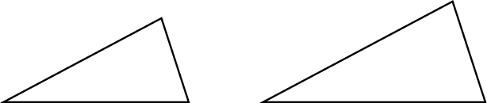
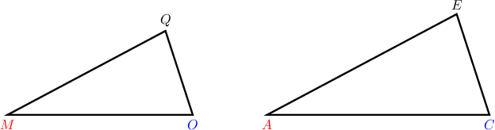
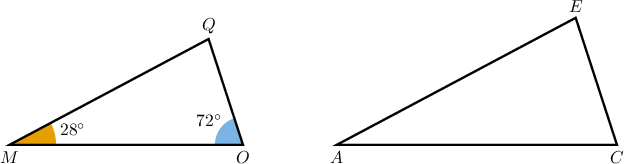
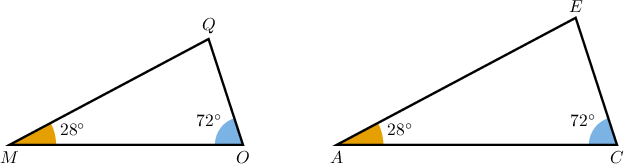
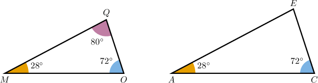
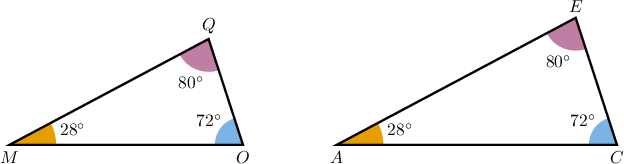
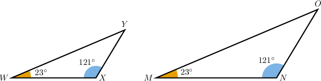
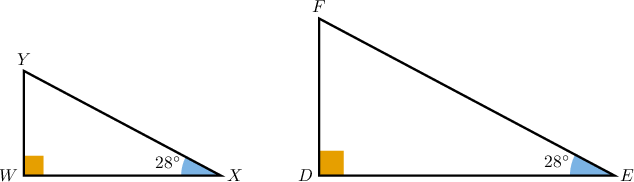
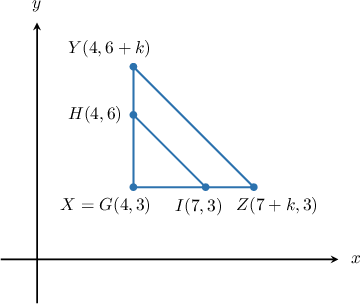

# Solving Angle Problems From Descriptions of Similar Triangles

Source: https://www.mathacademy.com/topics/6331?courseId=120
Topic ID: 6331

## Prerequisites

- [Horizontal and Vertical Lines](../grade-8/97-horizontal-and-vertical-lines.md)
- [Distances Between Points in the Coordinate Plane](../grade-6/573-distances-between-points-in-the-coordinate-plane.md)
- [The SAS Similarity Criterion](../geometry/1366-the-sas-similarity-criterion.md)

## Lesson

### Introduction

In this lesson, we will learn how to solve problems involving similar triangles using a description. Often, the key to solving these problems is to draw a sketch.

For example, suppose we're given the following description:

*Triangles $MOQ$ and $ACE$ are similar, where $M,$ $O,$ and $Q$ correspond to $A,$ $C,$ and $E,$ respectively. The measure of angle $M$ is $28^{\circ}$ and the measure of angle $O$ is $72^{\circ}.$*

Let's draw a sketch of this situation, including as much information as possible.

First, we're told that we have two similar triangles, $MOQ$ and $ACE.$ So, let's start by drawing two triangles that have the same shape (equal corresponding angles) while allowing a scale factor between them.

From the statement, we have

$$

\triangle {\color{red}{M}}{\color{blue}{O}}{\color{black}{Q}} \sim \triangle {\color{red}{A}}{\color{blue}{C}}{\color{black}{E}}.

$$

This means we must have the following vertex correspondence:

$$

{\color{red}{M}} \leftrightarrow {\color{red}{A}}, \qquad {\color{blue}{O}} \leftrightarrow {\color{blue}{C}}, \qquad {\color{black}{Q}} \leftrightarrow {\color{black}{E}}

$$

Let's add some vertex labels to our diagram. Since we're only sketching, it doesn't really matter which label we apply to the vertices, *provided that* the vertex correspondence is respected. We can always redraw the image later if we need to.

Next, we're told that the measures of $\angle M$ and $\angle O$ are $28^\circ$ and $72^\circ,$ respectively. Let's add this information to our diagram.

Now, since the triangles are similar, and we have the vertex correspondences $M \leftrightarrow A$ and $O \leftrightarrow C,$ we can immediately deduce that

$$

m\angle A = 28^\circ, \qquad m\angle C = 72^\circ.

$$

Let's add this to the picture.

Now, the sum of the angles in $\triangle MOQ$ must sum to $180^\circ.$ Therefore, we can calculate the measure of angle $Q$ as follows:

$$

\begin{aligned}𝑚∠𝑄 & =180^{∘}−𝑚∠𝑀−𝑚∠𝑂 \\ & =180^{∘}−28^{∘}−72^{∘} \\ & =80^{∘}.\end{aligned}

$$

Let's add this to our diagram.

Finally, since the triangles are similar and we have the angle correspondence $Q\leftrightarrow E,$ corresponding angles are equal; hence,

$$

m\angle E = m\angle Q = 80^\circ.

$$

Let's add this to our diagram.

### Example: Identifying Corresponding Angles in Similar Triangles

#### Question

Triangles $\triangle WXY$ and $\triangle MNO$ are similar, where $W,$ $X,$ and $Y$ correspond to $M,$ $N,$ and $O,$ respectively. The measure of angle $W$ is $23^{\circ}$ and the measure of angle $X$ is $121^{\circ}.$ What is the measure of angle $N?$

#### Explanation

First, let's sketch the two triangles described.

Since $\triangle WXY \sim \triangle MNO,$ with the vertex correspondence

$$

W \leftrightarrow M, \qquad X \leftrightarrow N, \qquad Y \leftrightarrow O,

$$

their corresponding angles must be congruent.

Therefore, the measure of angle $N$ is

$$

m \angle N = m \angle X = 121^\circ.

$$

### Example: Identifying Corresponding Angles in Similar Triangles Using Sums of Interior Angles

#### Question

Triangles $\triangle WXY$ and $\triangle DEF$ are similar, where $W,$ $X,$ and $Y$ correspond to $D,$ $E,$ and $F,$ respectively. The measure of angle $W$ is $90^{\circ}$ and the measure of angle $X$ is $28^{\circ}.$ What is the measure of angle $F?$

#### Explanation

First, let's sketch the two triangles described.

We find the measure of $\angle Y$ using the fact that the sum of interior angles in a triangle equals $180^\circ{:}$

$$

\begin{aligned}𝑚∠𝑊+𝑚∠𝑋+𝑚∠𝑌 & =180^{∘} \\ 90^{∘}+28^{∘}+𝑚∠𝑌 & =180^{∘} \\ 118^{∘}+𝑚∠𝑌 & =180^{∘} \\ 𝑚∠𝑌 & =180^{∘}−118^{∘} \\ & =62^{∘}\end{aligned}

$$

Now, since $\triangle WXY \sim \triangle DEF,$ with the vertex correspondence

$$

W \leftrightarrow D, \qquad X \leftrightarrow E, \qquad Y \leftrightarrow F,

$$

their corresponding angles must be congruent.

Therefore, the measure of angle $F$ is

$$

m \angle F = m \angle Y = 62^\circ.

$$

### Example: Identifying Corresponding Angles in Similar Triangles in the Coordinate Plane

#### Question

Triangles $\triangle GHI$ and $\triangle XYZ$ are plotted in the $xy$-plane. Triangle $\triangle GHI$ has vertices $G,$ $H,$ and $I$ at $(4,3),$ $(4,6),$ and $(7,3),$ respectively. Triangle $\triangle XYZ$ has vertices $X,$ $Y,$ and $Z$ at $(4,3),$ $(4,6+k),$ and $(7+k,3),$ respectively, where $k$ is a positive constant. By which similarity criterion are the two triangles similar? If $m\angle H = w^\circ + 12^\circ,$ find $m\angle Z.$

#### Explanation

First, let's sketch the two triangles described.

Notice that

- the segments $\overline{GH}$ and $\overline{XY}$ both lie on the vertical line $x=4,$ and

- the segments $\overline{GI}$ and $\overline{XZ}$ both lie on the horizontal line $y=3.$

So, the angles $\angle G$ and $\angle X$ in $\triangle GHI$ and $\triangle XYZ,$ respectively, are both enclosed by these perpendicular lines; hence, they are right angles.

We find the measure of $\angle I$ using the fact that the sum of interior angles in a triangle equals $180^\circ{:}$

$$

\begin{aligned}𝑚∠𝐺+𝑚∠𝐻+𝑚∠𝐼 & =180^{∘} \\ 90^{∘}+(𝑤^{∘}+12^{∘})+𝑚∠𝐼 & =180^{∘} \\ 102^{∘}+𝑤^{∘}+𝑚∠𝐼 & =180^{∘} \\ 𝑚∠𝐼 & =180^{∘}−102^{∘}−𝑤^{∘} \\ & =78^{∘}−𝑤^{∘}\end{aligned}

$$

Next, the measures of the legs of the triangle $\triangle GHI$ are

$$

\begin{aligned}𝐺𝐻 & =6−3=3, \\ 𝐺𝐼 & =7−4=3,\end{aligned}

$$

and the measures of the legs of the triangle $\triangle XYZ$ are

$$

\begin{aligned}𝑋𝑌 & =(6+𝑘)−3=3+𝑘, \\ 𝑋𝑍 & =(7+𝑘)−4=3+𝑘.\end{aligned}

$$

Hence, we have a pair of congruent angles,

$$

m\angle G = m\angle X = 90^\circ,

$$

and the lengths of the sides enclosing the congruent angles are in proportion:

$$

\dfrac{GH}{XY} = \dfrac{3}{3+k} = \dfrac{GI}{XZ}

$$

Consequently, $\triangle GHI \sim \triangle XYZ$ by the SAS similarity criterion, with the vertex correspondence

$$

G \leftrightarrow X, \qquad H \leftrightarrow Y, \qquad I \leftrightarrow Z.

$$

Therefore, the measure of angle $Z$ is

$$

m\angle Z = m\angle I = 78^\circ - w^\circ.

$$
