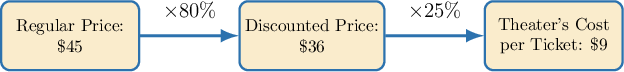

# Solving Multipart Commerce and Finance Percentage Problems

Source: https://www.mathacademy.com/topics/6337?courseId=120
Topic ID: 6337

## Prerequisites

- [Further Percentages in Commerce and Finance](../grade-7/2563-further-percentages-in-commerce-and-finance.md)

## Lesson

### Introduction

When a price changes over several steps—like a discount followed by a cost calculation—we can compute each stage one at a time. We then solve it step by step. First, we find the discounted or marked-up price. Then, we apply the next percentage (such as cost or tax) to that result.

Solving multi-part percentage problems in steps makes them much easier to handle.

To illustrate, consider the following example:

A movie ticket has a regular price of $45.00.$ During a special promotion, the ticket is sold at a discounted price that is $80\%$ of the regular price. The theater’s cost per ticket is $25\%$ of the discounted price. What is the theater’s cost for each ticket?

First, let's find the discounted price. The discounted price is given as $80\%$ of the regular price. Here, the regular price is $45.00.$ So, to calculate the discounted price, we multiply $45$ by $80\%{:}$

$$

\begin{aligned}80\%×45 & =\frac{80}{100}×45 \\ & =0.8×45 \\ & =36\end{aligned}

$$

Hence, the discounted price of a ticket is $36.00.$ Now, we can find the theater's cost per ticket.

We're also told that the theater’s cost per ticket is $25\%$ of the discounted price. So, to calculate the theater’s cost per ticket, we multiply $36$ by $25\%{:}$

$$

\begin{aligned}25\%×36 & =\frac{25}{100}×36 \\ & =0.25×36 \\ & =9\end{aligned}

$$

Therefore, the theater’s cost per ticket is $9.00.$

The following diagram provides a schematic overview of the steps involved in solving this problem.

Let's see another example.

### Example: Applying Two Successive Discounts or Markups

#### Question

A bike shop buys helmets at a wholesale cost of $20.00$ each and sells them at a retail price that is $180\%$ of the wholesale cost. During clearance, each remaining helmet is sold at a $40\%$ discount from the retail price. What is the discounted price of a helmet?

#### Explanation

First, we are told that the retail price is $180\%$ of the wholesale cost. Here, the wholesale cost is $20.00.$ So, to calculate the retail price, we multiply $20$ by $180\%{:}$

$$

\begin{aligned}180\%×20 & =\frac{180}{100}×20 \\ & =1.8×20 \\ & =36\end{aligned}

$$

Hence, the retail price of a helmet is $36.00.$

Now, we're also told that there is a $40\%$ discount on the retail price. So, to calculate the amount of the discount, we need to find $40\%$ of $36.00.$

To do this, we multiply $36$ by $40\%{:}$

$$

\begin{aligned}40\%×36 & =\frac{40}{100}×36 \\ & =0.40×36 \\ & =14.4\end{aligned}

$$

So, the amount of the discount is $14.40.$ We subtract this amount from the retail price:

$$

36 - 14.4 = 21.6

$$

Therefore, the discounted price of a helmet is $21.60.$

### Example: Applying Two Successive Discounts or Markups When One Percentage is Reversed

#### Question

A pair of gloves has a regular price of $35.$ During a weekend sale, the gloves are sold at a price that is $40\%$ less than the regular price. This sale price is also $40\%$ more than what the retailer paid per pair. What was the retailer’s cost for each pair of gloves?

#### Explanation

There is a $40\%$ discount on the regular price. Here, the regular price is $35.$ So, to calculate the amount of the discount, we need to find $40\%$ of $35.$

To do this, we multiply $35$ by $40\%{:}$

$$

\begin{aligned}40\%×35 & =\frac{40}{100}×35 \\ & =0.40×35 \\ & =14\end{aligned}

$$

So, the amount of the discount is $14.$ We subtract this amount from the regular price:

$$

35 - 14 = 21

$$

Hence, the sale price of a pair of gloves is $21.$

Now, we're also told that the sale price is $40\%$ more than the retailer’s cost per pair. So, the sale price is $100\% + 40\% = 140\%$ of the retailer’s cost.

We found that the sale price is $21.$ So, if $p$ was the retailer’s cost for each pair, then we have the following equation, which we can solve for $p{:}$

$$

\begin{aligned}140\%×𝑝 & =21 \\ \frac{140}{100}×𝑝 & =21 \\ 1.4𝑝 & =21 \\ 𝑝 & =\frac{21}{1.4} \\ & =15\end{aligned}

$$

Therefore, the retailer’s cost per pair of gloves was $15.$

### Example: Finding an Initial Value Given Two Successive Discounts or Markups

#### Question

A craft store sells cutting mats at a retail price that is $180\%$ of the wholesale cost. During a seasonal sale, each mat is discounted by $25\%$ from the retail price. If the final selling price of a mat is $33.75,$ what is the wholesale cost per mat?

#### Explanation

Let $p$ be the wholesale cost per mat.

First, we are told that the retail price is $180\%$ of the wholesale cost. So, to calculate the retail price, we multiply $p$ by $180\%{:}$

$$

\begin{aligned}180\%×𝑝 & =\frac{180}{100}×𝑝 \\ & =1.8𝑝\end{aligned}

$$

Hence, the retail price is $1.8p$ dollars.

Now, we're also told that the mat is discounted by $25\%$ from the retail price. The amount of the discount is:

$$

\begin{aligned}25\%×(1.8𝑝) & =\frac{25}{100}×1.8𝑝 \\ & =0.45𝑝\end{aligned}

$$

Therefore, the final selling price is the retail price minus the discount:

$$

1.8p - 0.45p = 1.35p

$$

We are told this equals $33.75,$ so we solve for $p{:}$

$$

\begin{aligned}1.35𝑝 & =33.75 \\ 𝑝 & =\frac{33.75}{1.35} \\ & =25\end{aligned}

$$

Therefore, the wholesale cost per mat is $25.00.$

### Example: Finding an Initial Value Given Two Successive Discounts and One Percentage is Reversed

#### Question

A luggage store lists a travel backpack with a set regular price. During a holiday promotion, the backpack is sold at a price that is $20\%$ less than the regular price. The discounted price is $140\%$ of the final selling price. If the final selling price is $32.00,$ what is the regular price?

#### Explanation

Let $p$ be the regular price.

There is a $20\%$ discount on the regular price. Subtract this from the regular price:

$$

p - 0.20p = 0.80p.

$$

Hence, the discounted price is $0.80p$ dollars.

We are also told that the discounted price is $140\%$ of the final selling price. Here, the final selling price is $32.00.$ So,

$$

\begin{aligned}140\%×32 & =\frac{140}{100}×32 \\ & =1.4×32 \\ & =44.8.\end{aligned}

$$

Thus, the discounted price is $44.80.$ Since the discounted price also equals $0.80p,$ we solve for $p{:}$

$$

\begin{aligned}0.80𝑝 & =44.8 \\ 𝑝 & =\frac{44.8}{0.80} \\ & =56.\end{aligned}

$$

Therefore, the regular price is $\boxed{56.00}.$
