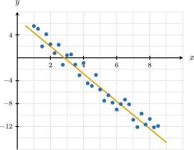
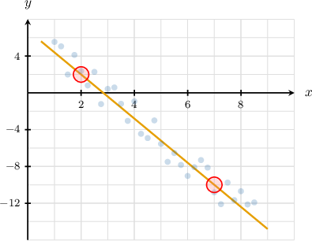

# Statistical Effects of Data Transformations

Source: https://www.mathacademy.com/topics/6343?courseId=120
Topic ID: 6343

## Prerequisites

- [Factoring Linear Expressions](../grade-7/87-factoring-linear-expressions.md)
- [Trend Lines](../algebra-i/2609-trend-lines.md)
- [Finding Equations of Translated Functions](./6085-finding-equations-of-translated-functions.md)
- [Comparing Effects of Data Change on Measures of Centrality](./6344-comparing-effects-of-data-change-on-measures-of-centrality.md)
- [Comparing Data Sets Using Standard Deviation and MAD](../grade-7/6363-comparing-data-sets-using-standard-deviation-and-mad.md)

## Lesson

### Introduction

In this lesson, we'll learn how transformations of a dataset affect its statistics.

For example, consider the following dataset:

$$

{\color{red}{4}}, \quad 6, \quad 7, \quad 8, \quad 9

$$

Some statistics for this dataset are as follows:

- The mean is

- The median is $7.$

- The range is $9 - 4 = 5.$

Now, suppose we discover that the smallest value $({\color{red}{4}})$ was incorrect, and the correct dataset is

$$

{\color{blue}6}, \; 6, \; 7, \; 8, \; 9.

$$

Let's discuss how this affects the statistics we found earlier:

- The mean *increases* since the corrected total is larger. Indeed,

- The median *remains unchanged* because the middle value $(7)$ remains unchanged.

- The range is *smaller* because we replaced the smallest value with a slightly larger one. Indeed, the new range is

- The standard deviation *decreases* because the new data set is less spread out.

Different transformations affect the statistics of a data set in different ways. Let's explore some more examples.

### Another Transformation

Let's go back to our original dataset:

$$

4, \quad 6, \quad 7, \quad 8, \quad 9

$$

Recall that:

- The mean is $6.8.$

- The median is $7.$

- The range is $5.$

Now, suppose that we "push away from the median" by adding $2$ to every value above the median and subtracting $2$ from every value below the median, so the new dataset is

$$

{\color{blue}2}, \; {\color{blue}4}, \; 7, \; {\color{blue}10}, \; {\color{blue}11}.

$$

Let's discuss how this transformation affects the statistics we found earlier:

- The *mean* remains the same! This is because the change in the sum is balanced on either side of the median. So, if we compute the net change between the old dataset and the new one, we have Computing the new mean explicitly, we have

- The *median* also remains the same. Each value is pushed away from the median ($7$), so their order relative to it does change, and neither does the middle value.

- The *range* increases because the new data set is formed by pushing away from the median, increasing the dataset's spread. Note that the new range is

- The *standard deviation* increases since the data are more spread out.

Let's see an example where we multiply each member of a data set by a fixed number.

### Example: Determining Which Statistics Are Unaffected by a Data Transformation

#### Question

A dataset of $19$ different grocery basket totals (in dollars) has a mean of $50$ and a median of $50.$ A new dataset is created by multiplying each total by $2.$ Which of the following measures has the same value in both the original and new datasets?

1. Mean

2. Median

3. Range

4. Standard deviation

#### Explanation

When every data value is multiplied by a constant, each statistic responds as follows:

- For $19$ ** values, there is exactly one middle value (the $10$th value) of $50.$ Multiplying every value by $2$ will also scale the middle value by $2.$ So, the median changes.

- The mean depends on every value, so multiplying every value by the same constant scales the mean by the same factor. If we denote the $19$ different totals by $t_1, t_2, \ldots, t_{19}$ and multiply each by $2,$ then the new mean is: So, the mean also changes.

- The range depends only on the difference between the largest and the smallest values. Multiplying both by the same positive constant multiplies that difference by the same constant. Thus, the range is scaled by $2,$ so it changes.

- The standard deviation measures the spread about the mean. Since every value (and thus the mean) is multiplied by $2,$ each deviation from the mean is also multiplied by $2;$ hence the variance scales by $4$ and the standard deviation by $2.$

Therefore, the correct answer is "None".

### Example: Determining Which Statistics Are Affected by a Data Transformation

#### Question

A dataset of $29$ different shipment weights (in kg) has a mean of $3.4$ and a median of $3.4.$ A new dataset is created by adding $0.3$ to each weight. Which of the following measures does **** have the same value in both the original and new datasets?

1. Mean

2. Median

3. Range

4. Standard deviation

#### Explanation

When a fixed constant is added to every data value, each statistic responds as follows:

- For $29$ ** values, there is exactly one middle value (the $15$th value) of $3.4.$ Adding $0.3$ to every value shifts the median to $3.7.$ So, the median increases by $0.3.$

- The mean depends on every value, so adding the same number to all values will increase the mean by the same number. If we denote the $29$ different weights by $w_1, w_2, \ldots, w_{29}$ and add $0.3$ to each, then the new mean is: So, the mean also increases by $0.3.$

- The range depends only on the difference between the largest and the smallest values. Since both of these values are shifted by the same amount, the range remains unchanged.

- The standard deviation measures the spread about the mean. Since adding the same constant to every value (and thus to the mean) does not change the deviations from the mean, the standard deviation is unchanged.

Therefore, the correct answer is "I and II only".

### Example: Determining Trend Lines After Data Transformations

#### Question

The scatter plot above shows an approximate trend line for the relationship between two variables $x$ and $y$ in a dataset $R.$

A new dataset $S$ is formed by multiplying the $y$-coordinate of every data point of $R$ by $2.5.$ Which of the following could be an equation of a trend line for dataset $S?$

#### Explanation

First, we find an approximate trend line for $R$ from the plot.

It seems that the trend line passes through the points $(x_1,y_1) \approx (2,2)$ and $(x_2,y_2) \approx (7,-10).$

So, an estimate of the slope $m$ of the line is

$$

\begin{aligned}𝑚 & ≈\frac{𝑦_{2}−𝑦_{1}}{𝑥_{2}−𝑥_{1}} \\ & =\frac{−10−2}{7−2} \\ & =\frac{−12}{5} \\ & =−2.4.\end{aligned}

$$

So, an approximate trend line, in slope-intercept form, is

$$

y=-2.4x+b,

$$

where $b$ is the $y$-intercept to be estimated. We do this by substituting in the coordinates of a point on the line, say $(2,2){:}$

$$

\begin{aligned}𝑦 & =−2.4𝑥+𝑏 \\ 2 & =−2.4(2)+𝑏 \\ 2 & =−4.8+𝑏 \\ 6.8 & =𝑏\end{aligned}

$$

Therefore, the equation of the trend line for dataset $R$ is

$$

y=-2.4x+6.8.

$$

We're told that dataset $S$ is formed by multiplying the $y$-coordinate of every data point of $R$ by $2.5.$

This means we scale the entire right-hand side of the equation by $2.5{:}$

$$

\begin{aligned}𝑦_{𝑆} & =2.5(−2.4𝑥+6.8) \\ & =−6𝑥+17\end{aligned}

$$

Therefore, a suitable line of best fit for $S$ is $y=-6x+17.$
