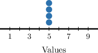
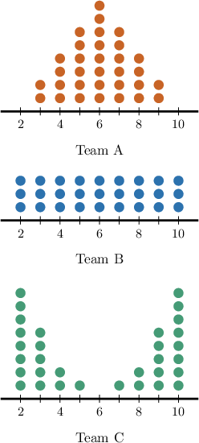

# Comparing Data Sets Using Standard Deviation and MAD

Source: https://www.mathacademy.com/topics/6363?courseId=120
Topic ID: 6363

## Prerequisites

- [Comparing Data Set Visualizations Using Standard Deviation and MAD](../grade-7/6188-comparing-data-set-visualizations-using-standard-deviation-and-mad.md)

## Lesson

### Introduction

Both mean absolute deviation (MAD) and standard deviation are statistical measures that indicate how much the values in a dataset deviate from the mean.

Often, we can compare the deviation of two datasets simply by inspecting their values.

For example, suppose two friendship groups in a class record their test scores, out of $10.$ The results of individual students' scores in each group are given below.

$$

\begin{aligned}Group A: & \,1,\,2,\,4,\,5,\,9 \\ Group B: & \,6,\,6,\,7,\,7,\,7\end{aligned}

$$

How do the standard deviations of each group compare?

A larger standard deviation means the data points are more spread out, while a smaller standard deviation indicates that the data points are clustered more closely around the mean.

Notice that the dataset corresponding to group A is more spread out, while the dataset corresponding to group B is clustered closer together. As a result, we conclude that the standard deviation of Group A is greater than that of Group B.

### Example: Comparing Data Sets Using MAD and Standard Deviation

#### Question

A courier company recorded delivery times, in minutes, for two routes. The times for individual deliveries are given below.

$$

\begin{aligned}Route 1: & \,18,\,22,\,27,\,35,\,44,\,50,\,63,\,70 \\ Route 2: & \,38,\,39,\,39,\,40,\,40,\,41,\,41,\,42\end{aligned}

$$

Compare the mean absolute deviations of both groups.

#### Explanation

Mean absolute deviation (MAD) quantifies how far data typically vary from the mean.

A larger MAD indicates greater spread, while a smaller MAD indicates values are tightly clustered around the mean.

Therefore, since the dataset corresponding to Route 1 is more spread out, the MAD of Route 1 is ** the MAD of Route 2.

### Example: Comparing Two Data Sets by Computing MAD

#### Question

In their last $5$ baseball games, Team $B$ scored a mean of $5$ home runs per game. The number of home runs scored by Team $B$ in each game is given below:

$$

7, \: 5, \: 8, \: 4, \: 1

$$

On the other hand, Team $A$ completed their last five games with a mean absolute deviation (MAD) of $1.5$ home runs.

Which of the following statements are true?

1. The MAD of Team $B$'s scores was $1$ home run.

2. A comparison of the MADs suggests Team $A$'s home run scores had a smaller spread than Team $B$'s.

3. A comparison of the MADs suggests Team $A$'s home run scores had the same spread as Team $B$'s.

#### Explanation

Let's compute the mean absolute deviation for Team B's scores.

Since we are given Team B's mean (${\color{blue}5}$), we subtract it from each number in the data set, find the absolute value of the results, and add all these together:

$$

\begin{aligned}|7−5|+|5−5|+|8−5|+|4−5|+|1−5| & = \\ |\,2\,|+|\,0\,|+|\,3\,|+|−1|+|−4| & = \\ 2+0+3+1+4 & = \\ 10 & \end{aligned}

$$

Finally, to calculate the mean absolute deviation (MAD), we divide the sum obtained above (${\color{red}10}$) by the total number of data points ($5$):

$$

\text{MAD} = \dfrac{\color{red}10}{5} = 2

$$

So, Team B's scores have a mean absolute deviation of $2$ home runs.

Let's now examine the statements one by one.

- Statement I is false.

- Statement II is true, while statement III is false. Since $1.5 < 2$, Team $A$'s home run scores had a smaller spread than Team $B$'s.

Therefore, the correct answer is "II only."

### Facts About Standard Deviation and MAD

Before we move on, there are a couple of facts about standard deviation and MAD we need to note.

- If a data set has no spread at all (such as the data set above), then both its MAD and standard deviation are zero.

- Standard deviation and MAD are always nonnegative.

To see why the first fact is true, let's consider the data set shown in the image above.

$$

5, \qquad 5, \qquad 5,\qquad 5, \qquad

$$

It's easy to see that the mean of this data set is $5{:}$

$$

\begin{aligned}mean=\frac{5+5+5+5}{4}=\frac{4⋅5}{4}=5\end{aligned}

$$

Therefore, the MAD of the data set must be zero, since every deviation from the mean equals zero:

$$

\begin{aligned}MAD & =\frac{|5−5|+|5−5|+|5−5|+|5−5|}{4} \\ & =\frac{0+0+0+0}{4} \\ & =\frac{0}{4} \\ & =0.\end{aligned}

$$

We can demonstrate that this is true for any dataset with no spread, and a similar argument applies to the standard deviation as well.

To see why the second fact is true, note that a sum of absolute values is always nonnegative, and since the number of data set elements is always positive, this means that the MAD is always nonnegative. A similar argument holds for the standard deviation, too.

### Example: Ordering Data Sets

#### Question

Consider the following datasets:

$$

\begin{aligned}𝐴: & \,4,\,4,\,4,\,4,\,6 \\ 𝐵: & \,12,\,12,\,12,\,12,\,12 \\ 𝐶: & \,1,\,3,\,5,\,7,\,9\end{aligned}

$$

List the datasets in order of their standard deviations, from smallest to largest.

#### Explanation

Standard deviation is a statistical measure that indicates how much the values in a dataset deviate from the mean.

A larger standard deviation means the data points are more spread out, while a smaller standard deviation indicates that the data points are clustered more closely around the mean.

With that in mind, let’s examine the given options.

- First, notice that the dataset $B$ contains the value $12$ only. Thus, it has a standard deviation of zero.

- Now, notice that the dataset $A$ contains two distinct values, $4$ and $6.$ So, it has a positive standard deviation that is greater than that of $B$ but smaller than that of a more spread-out dataset. The dataset $C$ is more spread out than the dataset $A.$ Thus, the standard deviation of $C$ is greater than the standard deviation of $A.$

Therefore, the list of datasets ordered with respect to their standard deviations from smallest to largest is the following:

$$

B, \: A, \: C.

$$

### Example: Ordering Data Sets Presented Visually

#### Question

Three robotics teams recorded how many tasks each member completed in a $30$-minute trial. The information is summarized on the dot plots above. Put the corresponding standard deviations in order.

#### Explanation

Standard deviation is a statistical measure that indicates how much the values in a dataset deviate from the mean.

A larger standard deviation means the data points are more spread out, while a smaller standard deviation indicates that the data points are clustered more closely around the mean.

In our case:

- The most spread-out dataset corresponds to Team $\text{C}.$

- A slightly less spread-out dataset corresponds to Team $\text{B}.$

- Finally, the data corresponding to Team $\text{A}$ is mostly concentrated near the mean.

Therefore, we can put the standard deviations in order from the smallest to the largest, as follows:

$$

\boxed{\text{Team A}} < \boxed{\text{Team B}} < \boxed{\text{Team C}}

$$
