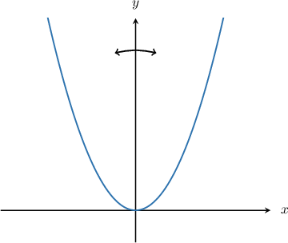
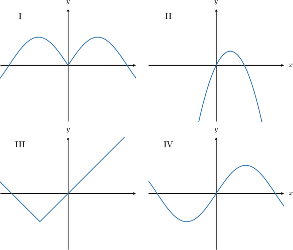
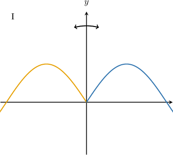
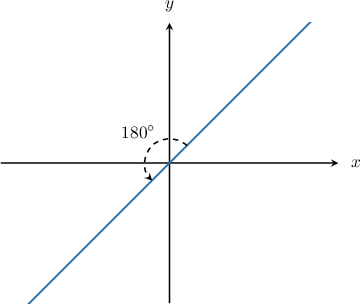
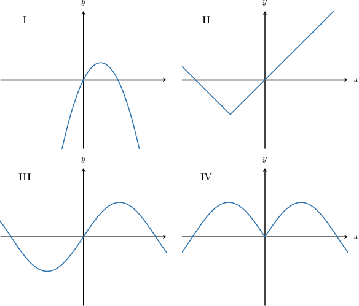
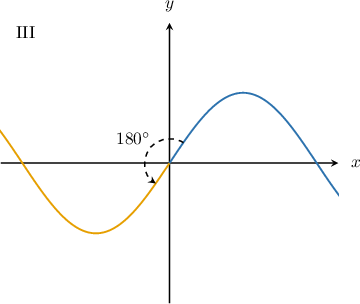
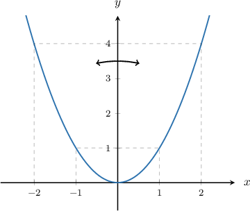
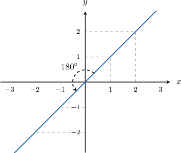

# Even and Odd Functions

Source: https://www.mathacademy.com/topics/725?courseId=120
Topic ID: 725

## Prerequisites

- [Rules of Absolute Value](../algebra-i/75-rules-of-absolute-value.md)
- [Graphing Elementary Quadratic Functions](../algebra-i/453-graphing-elementary-quadratic-functions.md)
- [Reflective Symmetry](../geometry/2226-reflective-symmetry.md)
- [Rotational Symmetry](../geometry/2227-rotational-symmetry.md)
- [Describing Function Composition](../algebra-i/3817-describing-function-composition.md)

## Lesson

### Introduction

A function is said to be an **even function** if it is symmetric about the $y$-axis.

For example, the function

$$

f(x) = x^2,

$$

whose graph is depicted below, is an example of an even function. It is symmetric about the $y$-axis, meaning that if we reflect the graph over the $y$-axis, we get the same picture.

### Example: Classifying Even Functions Graphically

#### Question

Which of the above could be the graph of an even function?

#### Explanation

Recall that the graph of an even function must be symmetric about the $y$-axis.

- Graphs II, III, and IV are not symmetric about the $y$-axis. So, they are **** even functions.

- On the other hand, graph I is symmetric about the $y$-axis. That is to say, if we reflect graph I over the $y$-axis, we get the same picture. This means that graph I is an even function.

Therefore, the correct answer is "I only."

### Classifying Odd Functions Graphically

A function is said to be an **odd function** if it has **rotational symmetry of order $2$ about the origin**. That is to say, if we rotate the graph of an odd function by $180^\circ$ about the origin, we end up with the same picture.

For example, the function

$$

g(x)=x,

$$

whose graph is shown below, is an example of an odd function. It has rotational symmetry of order $2$ about the origin, meaning that if we rotate the graph of an odd function by $180^\circ$ about the origin, we end up with the same picture.

### Example: Classifying Odd Functions Graphically

#### Question

Which of the above show the graph of an odd function?

#### Explanation

Recall that the graph of an odd function must have rotational symmetry of order $2$ about the origin.

- Graphs I, II, and IV do not have rotational symmetry of order $2$ about the origin. So, they are **** odd functions.

- On the other hand, graph III does have rotational symmetry about the origin. If we rotate the graph $180^\circ$ around the origin, we get the same picture. This means that graph III shows an odd function.

Therefore, the correct answer is "III only."

### The Algebraic Definition of Even Functions

Recall that the graph of the even function $f(x) = x^2$ is symmetric about the $y$-axis.

Notice the following:

$$

\begin{aligned}𝑓(−1) & =1=𝑓(1) \\ 𝑓(−2) & =4=𝑓(2) \\ 𝑓(−3) & =9=𝑓(3) \\ & =\,\,\,⋮\end{aligned}

$$

So, for every $x$ in the domain, both $x$ and $-x$ give the same value of the function. Algebraically, this fact can be written as follows: $f(-x) = f(x).$

In general, a function $f(x)$ is said to be **even** if

$$

f(-x) = f(x)

$$

for each $x$ in the domain of the function.

### The Algebraic Definition of Odd Functions

Now, recall that the graph of the odd function $g(x)=x$ has rotational symmetry of order $2$ about the origin.

Notice the following:

$$

\begin{aligned}𝑓(−1) & =−1=−𝑓(1) \\ 𝑓(−2) & =−2=−𝑓(2) \\ 𝑓(−3) & =−3=−𝑓(3) \\ & =\,\,\,\,\,⋮\end{aligned}

$$

So, for every $x$ in the domain, $x$ and $-x$ give opposite values of the function. Algebraically, this fact can be written as $f(-x) = -f(x).$

In general, a function $f(x)$ is said to be **odd** if

$$

f(-x) = -f(x)

$$

for each $x$ in the domain of the function.

### Example: Classifying Even and Odd Functions Using the Algebraic Definition

#### Question

Is the function $f(x)=|x| -1$ even, odd, both, or neither?

#### Explanation

Remember that

- a function is even if $f(-x) = f(x)$ for all $x,$ while

- a function is odd if $f(-x) = -f(x)$ for all $x.$

Computing $f(-x)$ for the given function and comparing it to $f(x),$ we have

$$

\begin{aligned}𝑓(−𝑥) & =|(−𝑥)|−1 \\ & =|𝑥|−1 \\ & =𝑓(𝑥).\end{aligned}

$$

Since $f(-x) = f(x),$ the function is even.

Lastly, we compute $-f(x)$ and get

$$

\begin{aligned}−𝑓(𝑥) & =−(|𝑥|−1) \\ & =−|𝑥|+1.\end{aligned}

$$

Since $f(-x) \neq -f(x),$ the function is not odd.

Therefore, the function is only even.

### Example: Evaluating an Expression Given the Table for an Even or Odd Function

#### Question

The table below defines the function $g(x).$ Given that $g(x)$ is an even function, find the value of $a+b.$

#### Explanation

Since $g(x)$ is an even function, we must have that $g(-x)=g(x).$

Using the fact that $g(-1) = g(1),$ we obtain

$$

\begin{aligned}𝑔(−1) & =𝑔(1) \\ −4 & =𝑎−3 \\ 𝑎 & =−1.\end{aligned}

$$

Using the fact that $g(-5) = g(5),$ we obtain

$$

\begin{aligned}𝑔(−5) & =𝑔(5) \\ 20 & =𝑏+5 \\ 𝑏 & =15.\end{aligned}

$$

Finally,

$$

a+b = -1 + 15 = 14.

$$
