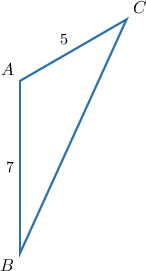
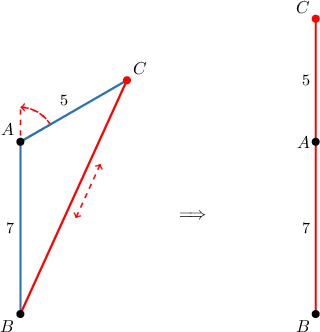
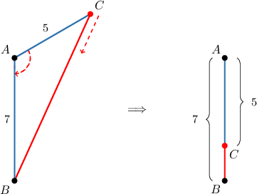
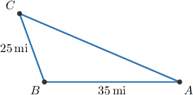
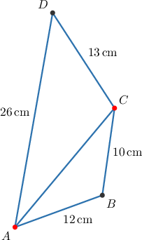

# The Triangle Inequality

Source: https://www.mathacademy.com/topics/766?courseId=120
Topic ID: 766

## Prerequisites

- [Right, Straight, Full, and Null Angles](../grade-4/1509-right-straight-full-and-null-angles.md)
- [Compound Inequalities](../grade-7/2310-compound-inequalities.md)
- [Rational Numbers as Finite or Repeating Decimals](../grade-7/7011-rational-numbers-as-finite-or-repeating-decimals.md)

## Lesson

### Introduction

Let $\triangle{ABC}$ be a triangle where the lengths $AB=7$ and $AC=5$ are fixed. For example, consider the triangle shown below.

Now, suppose that we vary the angle $\angle{A}$, making it either very small or very large. What would be the maximum possible length of the side $\overline {BC}$ for which the figure is still a triangle?

We make the longest possible segment $\overline{BC}$ by increasing the angle $\angle{A}$ as shown in the sketches below. Here, we fix vertices $A$ and $B$, and then "rotate" the side $\overline{AC}$ about the vertex $A$ until $\angle{A}$ measures $180^\circ.$

From the picture, we can see that when $m\angle{A}=180^\circ,$ we will not have a triangle anymore and the length of $\overline{BC}$ will be $7+5=12.$ Therefore, if we would like to have a triangle, $\overline{BC}$ must be shorter than the sum of the other sides:

$$

\begin{aligned}𝐵𝐶 & <𝐴𝐵+𝐴𝐶 \\ & <7+5 \\ & <12\end{aligned}

$$

This is true for all triangles:

In every triangle, the length of any one side must be smaller than the sum of the other two sides.

The above statement is one part of the **triangle inequality theorem**, which we will continue building upon in this lesson.

### Example: Identifying Impossible Sides of a Triangle

#### Question

Is it possible that the lengths of the sides of a triangle are $10, 15,$ and $25?$

#### Explanation

The triangle inequality theorem states that the length of any one side must be smaller than the sum of the other two sides.

In particular, for the numbers $10,15,25$ to represent the sides of a triangle, the number $25$ must be smaller than the sum of the numbers $10$ and $15.$ But this is not the case:

$$

10 + 15 = 25 \not> 25

$$

Therefore, the three numbers $10,15,25$ cannot represent the sides of a triangle.

### The Difference of Two Sides

Consider the same triangle as before, with sides $5$ and $7.$ This time, what is the shortest possible length of the side $\overline {BC},$ for which the figure is still a triangle?

We make the shortest possible segment $\overline{BC}$ by decreasing the angle $\angle{A}.$ Again, we fix $A$ and $B$, and then "rotate" the side $\overline{AC}$ about the vertex $A$ towards the side $\overline{AB}.$

From the picture, we can see that for $m\angle{A}=0^\circ$ we will not have a triangle anymore and the length of $\overline{BC}$ will be $7-5=2.$ Therefore, if we would like to have a triangle, $\overline{BC}$ must be longer than the difference of the other sides:

$$

\begin{aligned}𝐵𝐶 & >𝐴𝐵−𝐴𝐶 \\ & >7−5 \\ & >2\end{aligned}

$$

This is true for all triangles:

In every triangle, the length of any one side must be larger than the difference of the other two sides.

The above statement is the other part of the **triangle inequality theorem**.

### The Triangle Inequality Theorem

All of the discussion so far can be summarized in the following statement that is called the **triangle inequality theorem**.

*In a triangle, the length of a side must be greater than the difference of the lengths of the other two sides and less than the sum of those lengths.*

Let's write that down using mathematical notations. Suppose that in a triangle the length of a side equals $a$ and the other two sides have length $b$ and $c$ with $b>c.$ Then, we must have

$$

b - c < a < b + c.

$$

If we would like to omit the assumption that $b>c$, we can still use the same inequality, as long as we include an absolute value on the left-hand side:

$$

| b - c | < a < b + c

$$

### Example: Finding the Possible Lengths for a Side of a Triangle Given the Other Sides

#### Question

A triangle has sides of length $1,7,$ and $x.$ Use the triangle inequality to determine all possible values of $x.$

#### Explanation

According to the triangle inequality theorem, the length of any side must be

- greater than the difference between the lengths of the other two sides, and

- less than the sum of those lengths.

Therefore, we have

$$

\begin{aligned}Difference & <𝑥<Sum \\ 7−1 & <𝑥<7+1 \\ 6 & <𝑥<8.\end{aligned}

$$

### Example: Finding the Maximum or Minimum Length of a Side of a Triangle: Word Problems

#### Question

Paul knows that the distance between cell tower $A$ and cell tower $B$ is $35\,\textrm{miles},$ and the distance between cell tower $B$ and cell tower $C$ is $25\,\textrm{miles},$ but he does not know their exact locations. Assuming that the three locations form a triangle, what is the range of possible values for the distance between cellphone towers $A$ and $C?$

#### Explanation

First, we let:

- $A$ be the position of the tower $A$

- $B$ be the position of the tower $B$

- $C$ be the position of the tower $C$

Let's draw $\triangle ABC.$

We know that

$$

AB = 35\,\textrm{mi}, \qquad BC = 25\,\textrm{mi}.

$$

According to the triangle inequality theorem,

$$

\begin{aligned}𝐴𝐵−𝐵𝐶 & <𝐴𝐶<𝐴𝐵+𝐵𝐶 \\ 35−25 & <𝐴𝐶<35+25 \\ 10 & <𝐴𝐶<60.\end{aligned}

$$

Therefore, the distance from the tower $A$ to the tower $C$ must be **.

### Example: Finding an Upper Bound for a Length

#### Question

Using the triangle inequality theorem only, what is the best upper bound that can be obtained for the length of $\overline{AC}?$ (**)

#### Explanation

The triangle inequality theorem states that the length of any one side must be smaller than the sum of the other two sides.

- Applying the triangle inequality theorem to $\triangle{ADC}$, we get

- Applying the triangle inequality theorem to $\triangle{ABC}$, we get

Since both $AC < 39\,\textrm{cm}$ and $AC < 22\,\textrm{cm}$ must be satisfied, we conclude that

$$

AC < 22\,\textrm{cm}.

$$
