# The Cartesian Coordinate System

Source: https://www.mathacademy.com/topics/92?courseId=120
Topic ID: 92

## Prerequisites

- [Describing the Coordinate Plane](../grade-5/2410-describing-the-coordinate-plane.md)
- [Negative Numbers](../grade-5/2442-negative-numbers.md)

## Lesson

### Introduction

The **Cartesian coordinate system** (or **Cartesian plane**) is a grid that we can use to understand where certain objects lie, similar to a map. This grid looks as follows:

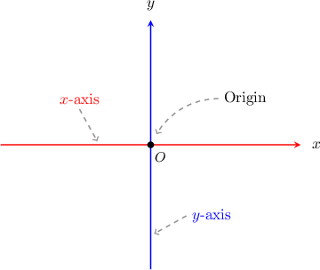

It consists of a horizontal number line called the **$x$-axis** and a vertical number line called the **$y$-axis**.

The **origin** is the location where the $x$ and $y$ axes meet and is given the symbol $O.$

### Coordinates and Ordered Pairs

Every location on the Cartesian plane is called a **point**. Every point is identified using an $x$**-coordinate** and a $y$**-coordinate**. Together, points are expressed using an **ordered pair** of **coordinates** $(x,y).$

For example, we can mark (or **plot**) the point $A$ with coordinates $({\color{red}{3}},{\color{blue}{2}})$ by starting from $O$ and then traveling $\color{red}3$ units towards the right, followed $\color{blue}2$ units up.

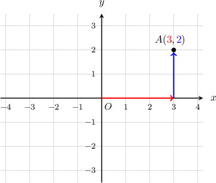

We say that

- the $x$-coordinate of $A$ is $3$,

- the $y$-coordinate of $A$ is $2$,

- the $xy$-coordinates (or just "the coordinates") of $A$ are $(3,2).$

The letter $A$ is just a label for our point. It's usually a good idea to label points!

### Extending the Coordinate Plane to Negative Numbers

Remember that a coordinate plane is made by two number lines that meet at $0.$ Since these are number lines, we can extend both to include negative numbers.

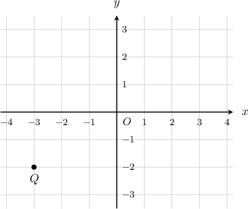

We plot an ordered pair $({\color{red}x},{\color{blue}y})$ similar to before, but if the number is negative, we reverse the direction. So, starting at the origin:

- if the first number is positive, move that number of places *right* along the $\color{red}x$-axis. If its negative, move *left*.

- if the second number is positive, move that number of places *up* along the $\color{blue}y$-axis. If its negative, move *down*.

To demonstrate, let's find the coordinates of the point $Q$ above.

To find the coordinates of $Q,$ we start at the origin, move $\color{red}3$ units *left*, and then $\color{blue}2$ units *down*.

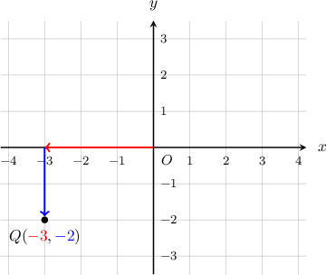

Since we move left, the $\color{red}x$-coordinate is negative, and since we move down, the $\color{blue}y$-coordinate is negative.

Therefore, the coordinates of $Q$ are $({\color{red}{-3}},{\color{blue}{-2}}).$

### Example: Determining the X- or Y-Coordinate of a Point in the Coordinate Plane

#### Question

What is the $x$-coordinate of the point $P?$

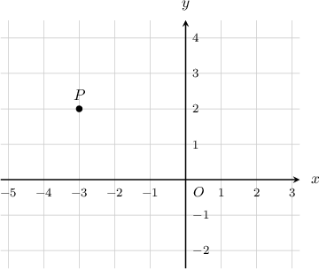

#### Explanation

To find the coordinates of $P,$ we start at the origin, move $3$ units **, and then $2$ units **.

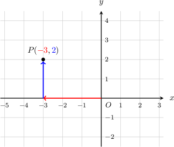

The coordinates of $P$ are $({\color{red}{-3}},{\color{blue}{2}}).$ Therefore, the $x$-coordinate of $P$ is ${\color{red}{-3}}.$

### Example: Identifying the Coordinates of a Point

#### Question

What are the $xy$-coordinates of the point $D$ shown below?

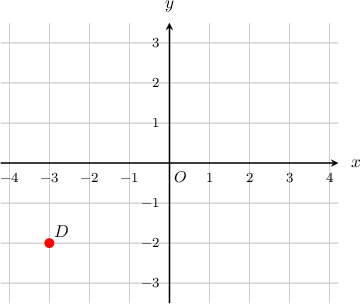

#### Explanation

To find the coordinates of $D,$ we inspect its position along the $x$ and $y$ axes.

The point $D$ is $3$ units to the ** of the origin, in the ** direction of the $x$-axis. So, $D$ has an $x$-coordinate of $-3.$

Additionally, the point $D$ is $2$ units ** the origin, in the ** direction of the $y$-axis. So, $D$ has a $y$-coordinate of $-2.$

The point $D$ has an $x$-coordinate of $-3$ and a $y$-coordinate of $-2,$ so its coordinates are $(-3,-2).$

### Example: Plotting a Point in the Coordinate Plane

#### Question

Plot the point $C$ with coordinates $(1,-2)$ on the Cartesian plane.

#### Explanation

Starting at the origin $O,$ we move along the $x$ and $y$ axes to get to the point $C.$

First, we move along the $x$-axis. The point $C$ has an $x$-coordinate of $1,$ so we move $1$ unit to the **, in the ** direction of the $x$-axis.

Then, we move along the $y$-axis. The point $C$ has a $y$-coordinate of $-2,$ so we move $2$ units **, in the ** direction of the $y$-axis.

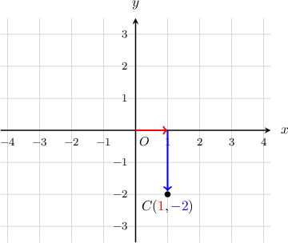

### Quadrants in the Coordinate Plane

The axes split the coordinate plane into four parts, called **quadrants**.

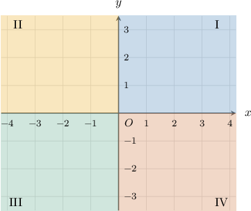

Going counter-clockwise, it's common to call

- the top-right quadrant the first quadrant (I),

- the top-left is the second quadrant (II),

- the bottom-left is the third quadrant (III),

- and and bottom-right is the fourth quadrant (IV).

To remember the order of the quadrants, it's helpful to think about writing the letter "C" in the graph:

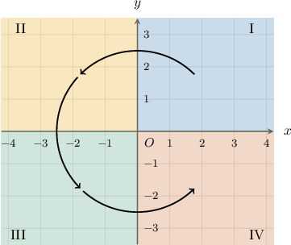

### Example: Identifying the Quadrant of a Given Point

#### Question

To which quadrant does the point $(4,-2)$ belong?

#### Explanation

In order to identify the quadrant to which the point $(4,-2)$ belongs, we start by plotting the point.

- The $x$-coordinate of the point is $4,$ so we move $4$ units to the right of the origin.

- The $y$-coordinate of the point is $-2,$ so we move $2$ units down from the origin.

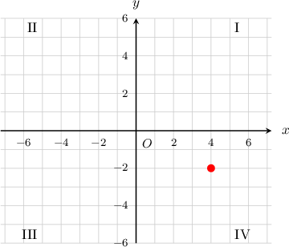

Based on the graph, we can tell that the point belongs to quadrant $\textrm{IV}$, the fourth quadrant.
