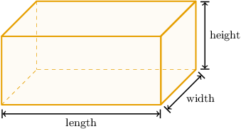
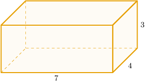
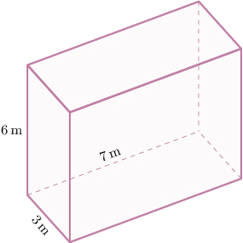
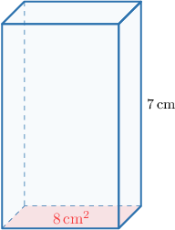
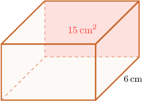
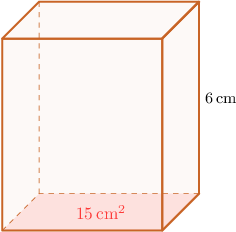

# Volumes of Right Rectangular Prisms

Source: https://www.mathacademy.com/topics/2404?courseId=31
Topic ID: 2404

## Prerequisites

- [Units of Area and Volume](./3872-units-of-area-and-volume.md)
- [Modeling With Rectangles](../../../elementary-school/lessons/grade-4/3960-modeling-with-rectangles.md)

## Lesson

### Introduction

When we need to find the volume of large shapes, it might take a long time to pack the shape with unit cubes and then count them all.

Instead, many standard shapes have **formulas** that we can use to quickly calculate their volume. One such shape that has a volume formula is a **rectangular prism**, such as the one below:

The formula for the volume $V$ of a rectangular prism is

$$

V = \text{length} \times \text{width} \times \text{height} .

$$

Let's use this formula to find the volume of the rectangular prism below.

This rectangular prism has a length of $7$, a width of $4$, and a height of $3.$

So, the volume of the rectangular prism can be found as

$$

\begin{aligned}𝑉 & =length×width×height=7×4×3=84.\end{aligned}

$$

Therefore, the volume is $84$ cubic units.

### Example: Finding the Volume of a Rectangular Prism Given Its Dimensions

#### Question

A rectangular prism has a length of $7 \, \text{ft}$, a width of $12 \, \text{ft}$, and a height of $2 \, \text{ft}.$ What is the volume of the prism?

#### Explanation

The volume of the rectangular prism can be found as

$$

\begin{aligned}𝑉 & =length×width×height \\ & =7×12×2 \\ & =168.\end{aligned}

$$

Finally, note the following:

- The lengths of the prism are measured in feet $(\text{ft}).$

- Therefore, the volume is measured in **** $(\text{ft}^3).$

So, we conclude that the prism's volume is $168\, \text{ft}^3.$

### Example: Finding the Volume of a Rectangular Prism Given Its Dimensions in a Diagram

#### Question

What is the volume of the rectangular prism given below?

#### Explanation

In the picture, we have a rectangular prism with a length of $7 \, \text{m}$, a width of $3 \, \text{m}$, and a height of $6 \, \text{m}.$

The volume of the rectangular prism can be found as

$$

\begin{aligned}𝑉 & =length×width×height \\ & =7×3×6 \\ & =126.\end{aligned}

$$

Finally, note the following:

- The lengths of the prism are measured in meters $(\text{m}).$

- Therefore, the volume is measured in cubic meters $(\text{m}^3).$

So, the volume is $126 \, \text{m}^3.$

### Volumes of Right Rectangular Prisms Given Base and Height

Another formula for the volume of a rectangular prism is

$$

V = \text{area of base} \times \text{height} .

$$

Let's use this formula to find the volume of the figure shown below.

The picture shows a rectangular prism, where the area of the base is $8 \, \text{cm}^2$ and the height is $7 \, \text{cm}.$

The volume of the rectangular prism can be found as

$$

\begin{aligned}𝑉 & =area of base×height \\ & =8×7 \\ & =56.\end{aligned}

$$

So, the volume is $56 \, \text{cm}^3.$

### Example: Finding the Volume of a Rectangular Prism Given Its Base Area and Height in a Diagram

#### Question

Find the volume of the rectangular prism shown above.

#### Explanation

Notice that the given prism will have the same volume as the prism shown below.

The rectangular prism above has a base of area $15 \, \text{cm}^2$ and a height of $6 \, \text{cm}.$

The volume of the rectangular prism can be found as

$$

\begin{aligned}𝑉 & =area of base×height \\ & =15×6 \\ & =90.\end{aligned}

$$

Finally, note the following:

- The lengths of the prism are measured in centimeters $(\text{cm}).$

- Therefore, the volume is measured in cubic centimeters $(\text{cm}^3).$

So, the volume is $90 \, \text{cm}^3.$

### Example: Finding the Volume of a Rectangular Prism Given Its Base Area and Height

#### Question

A rectangular prism has a base of area $15$ square units and a height of $5$ units. What is the volume of the prism?

#### Explanation

The volume of the rectangular prism can be found as

$$

\begin{aligned}𝑉 & =area of base×height \\ & =15×5 \\ & =75.\end{aligned}

$$

So, the volume is $75$ cubic units.
