# Dividing Whole Numbers by Fractions Using Models: Whole Number Results

Source: https://www.mathacademy.com/topics/2437?courseId=31
Topic ID: 2437

## Prerequisites

- [Dividing Whole Numbers by Unit Fractions Using Models](../../../elementary-school/lessons/grade-5/529-dividing-whole-numbers-by-unit-fractions-using-models.md)
- [Writing Unit Fractions in Words](../../../elementary-school/lessons/grade-4/3951-writing-unit-fractions-in-words.md)

## Lesson

### Introduction

Remember that a *unit fraction* contains $\color{blue}1$ in the numerator.

For example, the following fractions are unit fractions since they each contain ${\color{blue}{1}}$ in the numerator:

$$

\dfrac{\color{blue}{1}}{2}, \qquad \dfrac{\color{blue}{1}}{5}, \qquad \dfrac{\color{blue}{1}}{8}

$$

However, the following fractions are *not-unit* fractions since they do *not* contain ${\color{blue}{1}}$ in the numerator:

$$

\dfrac{\color{red}{2}}{3}, \qquad \dfrac{\color{red}{5}}{8}, \qquad \dfrac{\color{red}{7}}{12}

$$

In this lesson, we will use models to divide whole numbers by *non-unit* fractions.

**Note**: Throughout this lesson, we'll be drawing numerous fraction models. It is highly recommended that you draw these models on a piece of paper to better understand their workings.

### A Worked Example

Let's use a model to find the result of the following division problem:

$$

{\color{blue}{1}} \div \dfrac26

$$

We start with a model that represents ${\color{blue}{1}}$ whole:

We need to determine how many times $\dfrac26$ fits into ${\color{blue}{1}}$ whole. So, we proceed as follows:

- First, we split our whole into *sixths* (the denominator of our fraction):

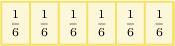

- Next, we create groups, where each group contains $\dfrac26{:}$

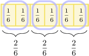

- Finally, we count the groups. We see that there are $\color{purple} 3$ groups in total.

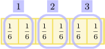

So, if we divide $\color{blue}1$ whole into groups of ${\color{black}{\dfrac26}},$ we get ${\color{purple}{3}}$ groups in total.

Therefore, we conclude that

$$

{\color{blue}{1}} \div {\color{black}\dfrac26} = {\color{purple}3}.

$$

### Example: Finding a Missing Number

#### Question

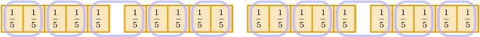

Use the model above to determine the missing number in the following division problem.

$$

\,\frac{0}{0}\,

$$

#### Explanation

Let's start by interpreting our model:

- The model shows $\color{blue}4$ wholes. Each whole is split into **.

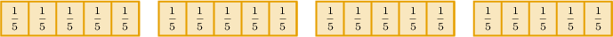

- The fifths are grouped, and each group contains ${\color{red}{\dfrac{2}{5}}}.$

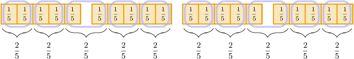

- There are $\color{purple} 10$ groups in total.

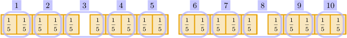

So, if we divide $\color{blue}4$ wholes into groups of ${\color{red}{\dfrac{2}{5}}},$ we get ${\color{purple}{10}}$ groups in total.

Therefore, the model represents the following division problem:

$$

\frac{2}{5}

$$

So, the missing number is $\boxed{\color{red}\dfrac{2}{5}}.$

### Example: Finding Two Missing Numbers

#### Question

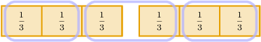

Use the model above to determine the missing numbers in the following division problem.

$$

\,0^{2}

$$

#### Explanation

Let's start by interpreting our model:

- The model shows $\color{blue}2$ wholes. Each whole is split into **.

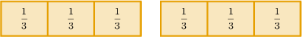

- The thirds are grouped, and each group contains ${\color{red}{\dfrac23}}.$

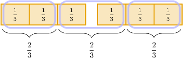

- There are $\color{purple} 3$ groups in total.

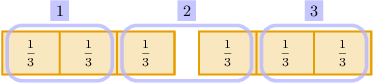

So, if we divide $\color{blue}2$ wholes into groups of ${\color{red}{\dfrac23}},$ we get ${\color{purple}{3}}$ groups in total.

Therefore, the model represents the following division problem:

$$

\,2\,

$$

Therefore, the missing numbers are $\boxed{\color{blue}2}$ and $\boxed{\color{purple}3}.$

### Example: Dividing a Whole Number by a Non-Unit Fraction

#### Question

The model above represents $3$ wholes. Use the model to determine the missing number in the following division problem.

$$

\,0\,

$$

#### Explanation

We proceed as follows:

- First, we split each whole into fifths.

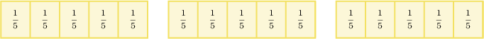

- Next, we create groups of ${\color{red}{\dfrac3{5}}}.$

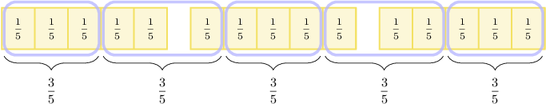

- Then, we count the groups.

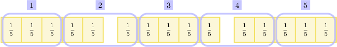

So, if we divide $\color{blue}3$ wholes into groups of ${\color{red}{\dfrac3{5}}},$ we get ${\color{purple}{5}}$ groups in total.

Therefore, we conclude that

$$

3 \div \dfrac{3}{{5}} = \fbox{5}.

$$

So, the missing number is $\boxed{\color{purple}5}.$
