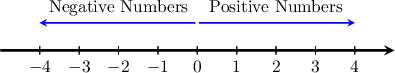
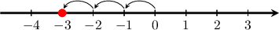
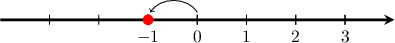
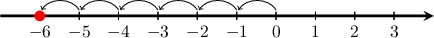
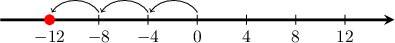
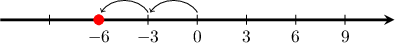
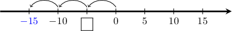
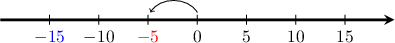

# Negative Numbers

Source: https://www.mathacademy.com/topics/2442?courseId=31
Topic ID: 2442

## Prerequisites

- [Plotting Decimals on Number Lines](../../../elementary-school/lessons/grade-4/3915-plotting-decimals-on-number-lines.md)

## Lesson

### Introduction

**Negative numbers** are numbers to the *left* of on the number line.

We write a negative number as a number with a sign in front of it.

To find the number, we count the number of jumps between zero and the point on the line.

For example, to represent on a number line, we start at zero and move places to the left:

So the red dot on the number line above represents the number

### Example: Interpreting Points on a Number Line as Negative Numbers

#### Question

What number is represented by the red dot on the number line below?

#### Explanation

The number is negative because it is to the ** of zero.

To find the number, we count the number of jumps between zero and the red circle.

There is jump between zero and the red circle. So the number shown is

### Example: Representing Negative Numbers on a Number Line

#### Question

Represent the number on a number line.

#### Explanation

The number is negative, so it is to the ** of zero.

To plot the number we start at zero and move places to the left.

So the red dot on the number line below represents the number

### Representing Negative Numbers on a Number Line Using Steps Larger Than One

Sometimes, each jump on the number line can represent a distance greater than For example, what number is represented by the red dot on the number line below?

To find the number, we count the number of jumps between zero and the red circle.

There are jumps between zero and the red circle, and each jump represents a distance of So the number shown is

### Example: Interpreting Points on a Number Line Using Steps Larger Than One

#### Question

What number is represented by the red dot on the number line below?

#### Explanation

The number is negative because it is to the ** of zero.

To find the number, we count the number of jumps between zero and the red circle.

There are jumps between zero and the red circle, and each jump represents a distance of So the number shown is

### Example: Finding Missing Values on a Number Line Using Steps Larger Than One

#### Question

From left to right, what are the missing numbers in the number line below?

#### Explanation

The first number is negative because it is to the ** of zero. To find this number, we count the number of jumps between zero and the number.

Each jump represents a distance of and we have jumps. Therefore, this number

The second number is also negative because it is to the ** of zero. To find this number, we count the number of jumps between zero and the number.

Each jump represents a distance of and we have jump. Therefore, this number

Therefore, the numbers are and
