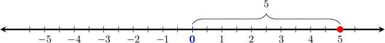
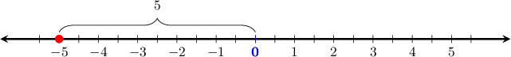
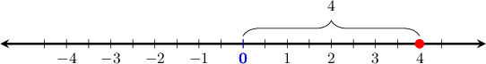
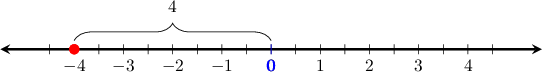
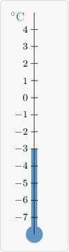
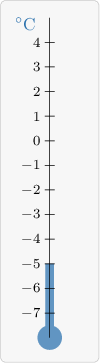
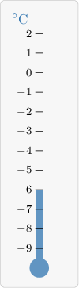
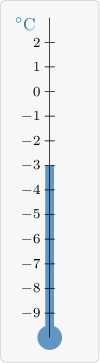
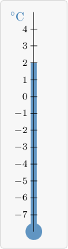

# Interpreting Negative Numbers

Source: https://www.mathacademy.com/topics/2443?courseId=31
Topic ID: 2443

## Prerequisites

- [Absolute Value](./2281-absolute-value.md)

## Lesson

### Introduction

When we place a negative sign in front of a number, we're finding the **opposite** number. This number has the same distance from zero, but is on the opposite side of zero.

To demonstrate, let's $-(5),$ the opposite of $5.$

The number $5$ is a distance of $5$ from zero, as shown on the number line.

We want to find $-(5),$ which is the *opposite* of the number $5.$ The opposite number has the same distance from zero, but is on the opposite side:

Therefore, $-(5) = -5$.

### Example: Finding the Opposite of a Number

#### Question

What is the opposite number to $4?$

#### Explanation

The number $4$ is a distance of $4$ from zero, as shown on the number line.

When we place a negative sign in front of a number, we're finding the **** number. The opposite number has the same distance from zero, but is on the opposite side of zero:

Therefore, $-(4) = -4.$

### Using Negative Numbers to Measure Temperature

Negative numbers appear often in real life.

For instance, we can use *negative numbers* to measure temperature. Water freezes at $0^\circ\text{C},$ but the scale can go even lower. For example, the temperatures at the North Pole can reach $-40^\circ\text{C}\,!$

To read a thermometer, find where the fluid level aligns with the scale.

On the thermometer above, the fluid is at the same level as $-3$ on the scale, and the temperature is measured in degrees Celsius. Therefore, the thermometer shows $-3^\circ\text{C}.$

### Example: Interpreting Negative Numbers on a Thermometer

#### Question

What temperature is shown on the thermometer?

#### Explanation

The fluid in the thermometer is at the same level as $-5$ on the scale, and the temperature is measured in degrees Celsius. Therefore, the thermometer shows $-5^\circ\text{C}.$

### Increasing the Temperature on a Thermometer

To increase the temperature in a thermometer, we *raise* the fluid level by the desired number of units. So, what temperature is *$3^\circ\text{C}$ warmer* than $-6^\circ\text{C}?$

Let's locate $-6^\circ\text{C}$ on a thermometer.

To find a temperature that is $3^\circ\text{C}$ *warmer*, the fluid needs to *move up* by $3$ units. This gives:

The new fluid level is at $-3^\circ\text{C}.$

Therefore, $-3^\circ\text{C}$ is $3^\circ\text{C}$ warmer than $-6^\circ\text{C}.$

### Example: Finding a Temperature Warmer than a Negative Temperature

#### Question

Which temperature is $5^\circ\text{C}$ warmer than $-3^\circ\text{C}?$

#### Explanation

Let's imagine $-3^\circ\,\text{C}$ on a thermometer.

To find a temperature that is $5^\circ\,\text{C}$ warmer, the fluid needs to move up by $5$ units. This gives:

Therefore, $2^\circ\text{C}$ is $5^\circ\text{C}$ warmer than $-3^\circ\text{C}.$

### Example: Understanding Positive and Negative Values, and Zero

#### Question

In a bank account, deposits are presented by positive numbers and withdrawals by negative numbers. Which of the following statements are true?

- A transaction of $-4$ means that $4$ were withdrawn.

- If the balance changes from $-3$ to $2,$ it increases by $5.$

- A balance cannot be less than $0.$

#### Explanation

Let's examine our statements in turn.

- A negative transaction means the number is on the left side of zero on the number line. The number $-4$ is $4$ units to the left of zero, which represents removing $4$ dollars from the account. Therefore, this statement is **

- To find the increase, we count how many units the balance moves upward on the number line. From $-3$ to $0$ is an increase of $3$ dollars. From $0$ to $2$ is another increase of $2$ dollars. So, the total increase is $3 + 2 = 5$ dollars. Therefore, this statement is **

- The number $0$ is on the number line exactly between positive and negative numbers. It represents a balance that is not below zero and not above zero. Since there could be negative balances, a balance could be less than $0.$ Therefore, this statement is **
